# Week3
## Classification with logistic regression

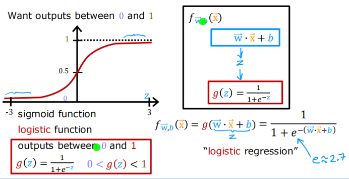

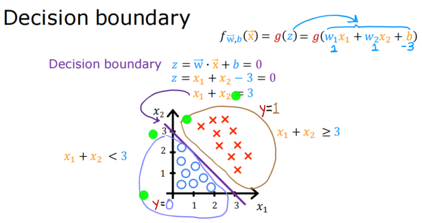

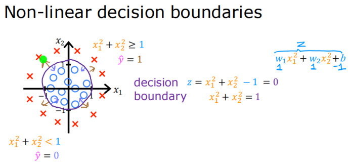

## Cost function for logistic regression

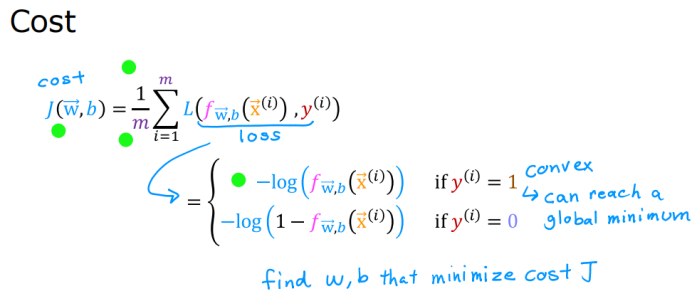

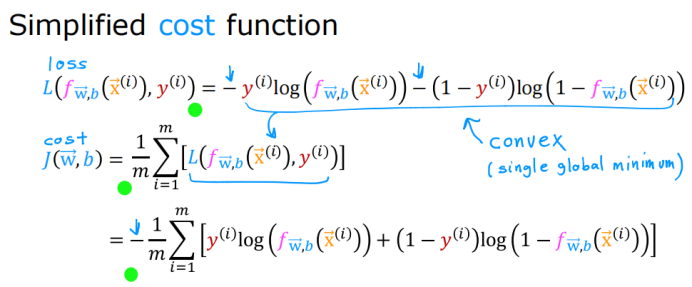

## Gradient descent for logistic regression

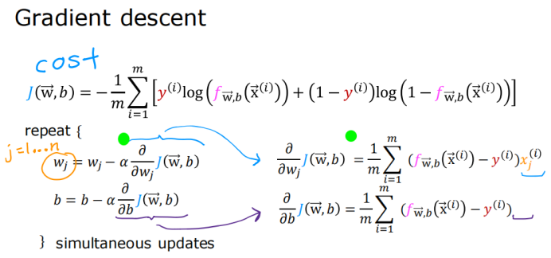

## The problem of overfitting

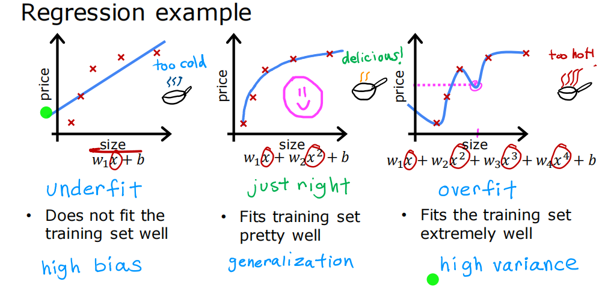

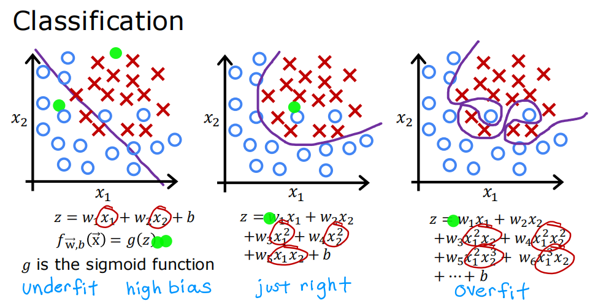

Addressing Overfitting
1. Collect more data
2. Select features（相当于让某些 w 为 0）
	- Feature selection
3. Reduce size of parameters（让某些 w 很小）
	- Regularization

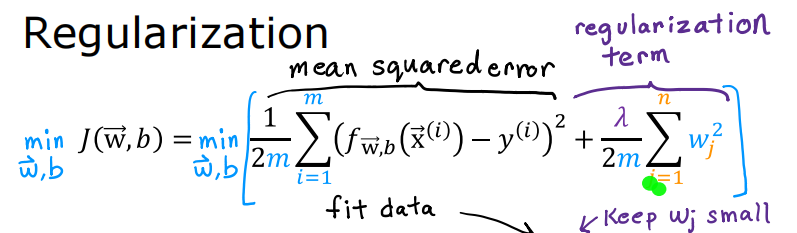

$\lambda$ 较大时，为了最小化 $J$，$w_j$ 会减小

Regularized Linear Regression

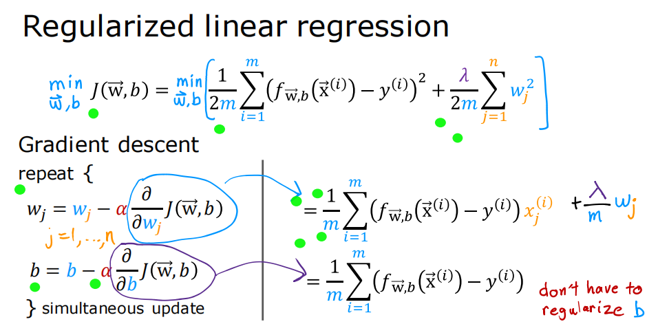

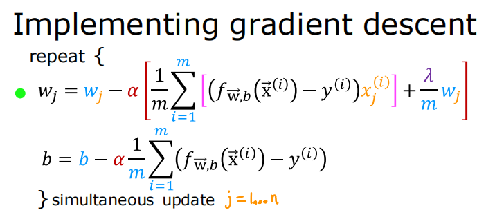

Regularized Logistic Regression

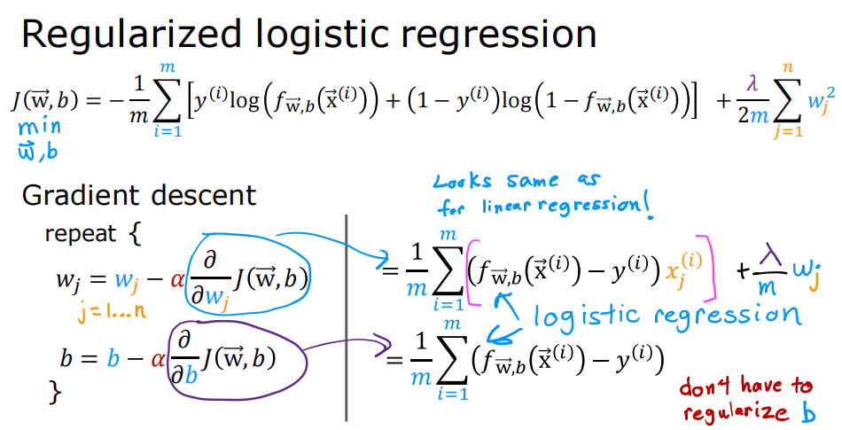