# Week 1
## Supervised vs Unsupervised Machine learning
### Supervised learning
Learns from data labeled with the "right answers"

Regression: House Price Prediction

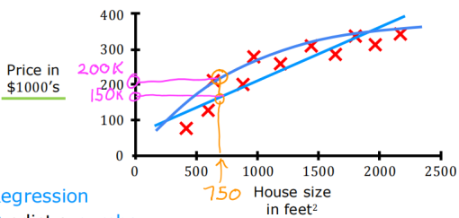

Classification: Breast Canser Detection

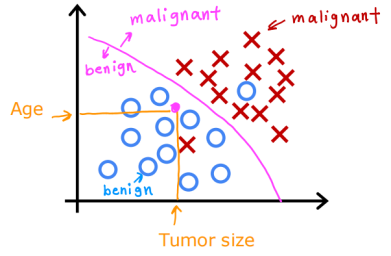

| Regression                       | Classification                     |
| -------------------------------- | ---------------------------------- |
| predict a number                 | predict categories                 |
| infinitely many possible outputs | small number   of possible outputs |

### Unsupervised learning
Find something interesting in unlabeled data

Clusting

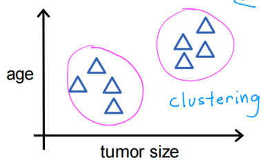

## Regression Model

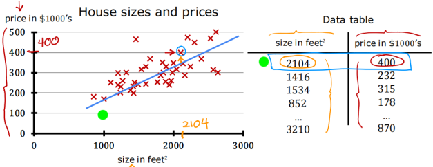

Training set : Data used to train the model

Notation:  
x : "input" variable (feature)  
y : "output" variable (target)  
(x, y) : single training example  
$(x^{(i)},y^{(i)})$ : $i^{th}$ training example  
m : number of training examples

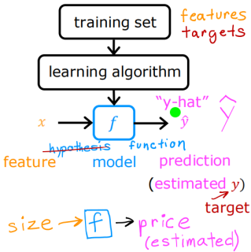

How to represent f ?  
linear regression

## Cost Function
$J(w,b) = \frac{1}{2m} \sum^m_{i=1} (f_{w,b} (x^{(i)}) - y^{(i)})^2$  
goal : minimize J (w, b)

why 2m? why not just m?  
之后的梯度下降求导时，后面的平方求导会得一个 2，正好可以约掉，更好看

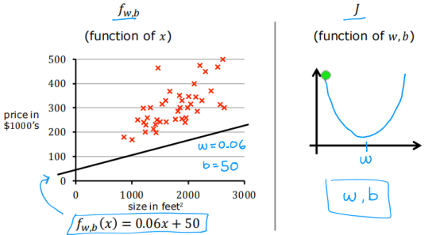

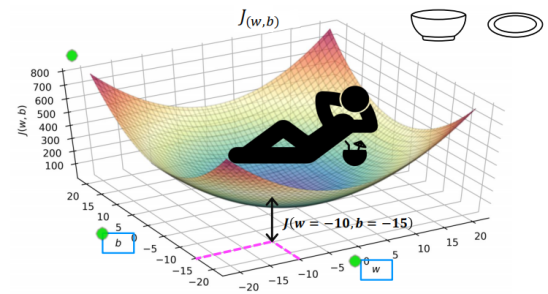

## Train the model with gradient descent

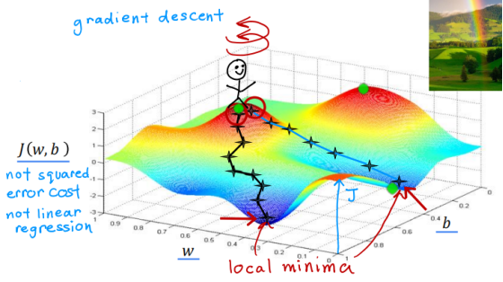

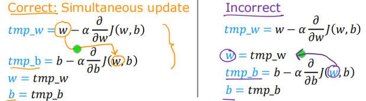

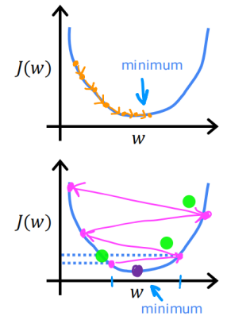

if $\alpha$ is too small, gradient descent may be slow  
if $\alpha$ is too large, gradient descent may overshoot, never reach minimum

Gradient Descent for Linear Regression

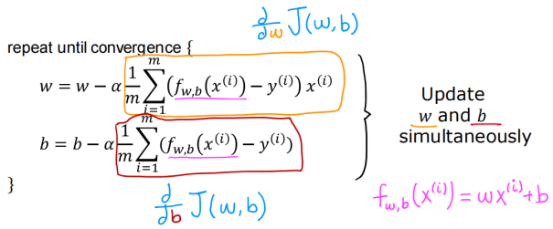

If J is a convex function (bowl shape), it has only one local minimum  
Some functions have more than one local minimum

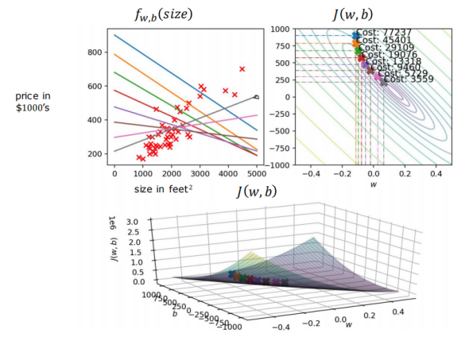

"Batch" gradient descent  
"Batch" : Each step of gradient descent uses all the training examples.

There are other versions of gradient descent that do not look at the entire training set, but instead looks at smaller subsets of the training data at each update step.