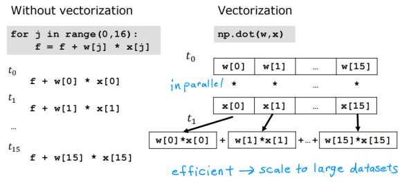
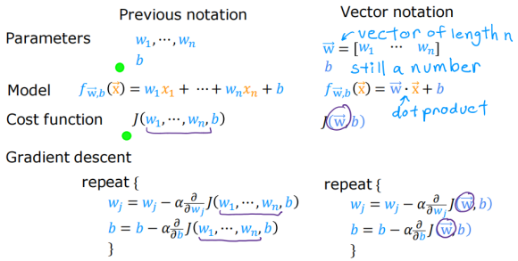
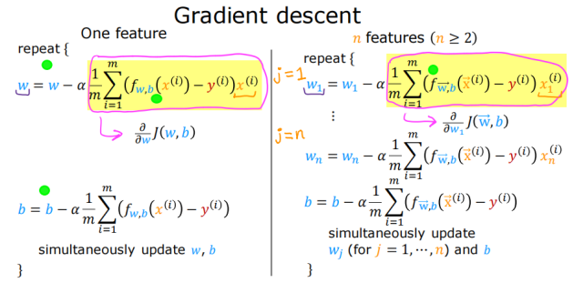

# Week 2
## Multiple linear regression
### Multiple features
| size in feet^2 | number of bedrooms | number of floors | age of home in years | price in $1000's |
| -------------- | ------------------ | ---------------- | -------------------- | ---------------- |
| 2104           | 5                  | 1                | 45                   | 460              |
| 1416           | 3                  | 2                | 40                   | 232              |
| 1534           | 3                  | 2                | 30                   | 315              |
| 852            | 2                  | 1                | 36                   | 178              |
| ...            | ...                | ...              | ...                  | ...              |
|                |                    |                  |                      |                  |

$x_j$ = $j^{th}$ feature  
$x^{i}$ = features of $i^{th}$ training example  
$x^i_j$ = value of feature j in $i^{th}$ training example

previously : $f_{w,b}(x)=wx+b$  
now : $f_{\vec{w},b}=\vec{w} \cdot \vec{x} + b = w_1 x_1 + \cdots + w_n x_n + b$

### Vectorization
$f_{\vec{w},b}=\vec{w} \cdot \vec{x} + b = \sum_{j=1}^n w_j x_j + b$

Without vectorization
```python
f = 0
for j in range(0,n):
	f = f + w[j] * x[j]
f = f + b
```

Vectorization
```python
f = np.dot(w,x) + b
```



### Gradient Descent for Multiple Regression





### An Alternative to Gradient Descent
Normal equation
- Only for linear regression
- Solve for w, b without iterations

Disadvantages
- Doesn’t generalize to other learning algorithms
- Slow when number of features is large (> 10,000)

What you need to know
- Normal equation method may be used in machine learning libraries that implement linear regression
- Gradient descent is the recommended method for finding parameters w,b

## Gradient descent in practice
