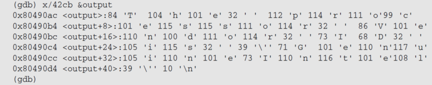

# 第3讲 编程初步
## 一、编写汇编程序
### 汇编过程
```
$ as -o cpuid.o cpuid.s
$ ld -o cpuid cpuid.o
```

若要链接库
```
$ as -o cpuid2.o cpuid2.s
$ ld -dynamic-linker /lib/ld-linux.so.2 -o cpuid2 -lc cpuid2.o
```

### Linux-32
```
#hello.S
.section .data
	output:	.ascii  "Hello World\n"
.section .text
.globl _start
_start:
/* output  like printf */
	movl    $4, %eax
	movl    $1, %ebx
	movl    $output, %ecx
	movl    $12, %edx
	int     $0x80
/* exit */
	movl    $1, %eax
	movl    $0, %ebx
	int     $0x80
```

```
.section .data
	output:	.ascii  "Hello World\n"
```

1. 数据定义在数据区，即 .section .data
2. 数据定义需要指定数据类型和值
	1. .ascii 定义 ASCII 字符串类型
	2. `Hello world\n` 是字符串的值
3. 数据定义通常需要一个符号名作为标号以方便引用
	1. <font color="#d99694">output 标号，为一个地址</font>

若 output 没有$

```
movl    output, %ecx
```

1. 从 output 地址处取数
2. 将取出的数送到 %ecx

```
.section .text
.globl _start
_start:
```

1. ld 默认的入口地址：`_start`，`_start` 必须是第一条指令的标号
2. ld -e entry 可改变入口地址
3. 入口地址必须定义为全局符号

1. 立即数操作数
	1. $number：表示立即数 number
	2. $symbol：表示标号地址
2. 寄存器
	1. 寄存器名加前缀%
3. 源操作数与目标操作数
	1. 左边是源操作数，最右边是目的操作数
4. 系统调用
	1. int $0x80
	2. Linux 系统调用的寄存器约定
		1. EAX：系统调用号，4 号是写文件，1 号是程序退出
		2. EBX、ECX、EDX、…：传递参数

### Linux -64 
```
#hello.S
.section .data
	output:	.ascii  "Hello World\n“
.section .text
.globl _start
_start:
/* output  like printf */
	movq    $1, %rax
	movq    $1, %rdi
	movq    $output, %rsi
	movq    $12, %rdx
	syscall
/* exit */
	movq    $60, %rax
	movq    $0, %rdi
	syscall
```

1. 系统调用指令不同
	1. syscall 代替 int $0x80
2. 系统调用号不同
	1. 1 号为写文件，60 号为程序退出 
3. 参数寄存器不同
	1. eax -> rax
	2. ebx、ecx、edx、esi、edi、ebp -> rdi、rsi、rdx、r10、r8、r9

### Intel 语法
```
#hello.S
	.intel_syntax noprefix
.section .data
	output: .ascii  "Hello World\n"
.section .text
.globl _start
_start:
/* output  like printf */
	mov    eax, 4
	mov    ebx, 1
	mov    ecx, offset output
	mov    edx, 12
	int    0x80
/* exit */
	mov    eax, 1
	mov    ebx, 0
	int    0x80
```

```
	.intel_syntax noprefix
```

1. .intel_syntax 表示采用 Intel 语法
2. noprefix 表示寄存器名前不加%

```
	mov    eax, 4
```

1. 指令不需要后缀，汇编器根据使用的寄存器和数据类型来区别
2. 目的寄存器在最左边
3. 立即数不加$

```
	mov    ecx, offset output
```
 
offset label：引用标号地址  
内存操作数需要显示的类型操作：byte ptr,  word ptr,  dword ptr, qword ptr 等

## 二、编译运行调试
### 编辑 shell 脚本
```
vi asm_sh
as -o $1.o $1.S
ld -o $1 $1.o
```

$0：命令行的第 1 个参数，即文件 asm_sh 自己  
$1：命令行的第 2 个参数，即文件 asm_sh 的第 1 个参数

```
$chmod +x asm_sh  # 增加可执行权限
$./asm_sh hello   
$./hello
Hello World
```

### objdump

```
gcc -c -o main.o main.c
objdump -s -d main.o > main.S
```

```
objdump [-option] hello. o
```

--all-headers  
-x  
显示所可用的头信息，包括符号表、重定位入口。-x 等价于-a -f -h -r -t 同时指定。

-s  
--full-contents  
显示所请求 section 的完整内容

--disassemble  
-d  
将代码段反汇编

--reloc  
-r  
显示文件的重定位入口

对 hello.o（目标代码） 反汇编，虚地址为 0  
对 hello （可执行程序）反汇编，虚地址不为 0  
链接前不知道地址，只有链接后<font color="#d99694">重定位</font>才能确定地址

注：内存地址，左低右高

objdump 可用于检查程序的正确性  
eg. 采用 intel 语法，将 “mov ecx, offset output” 写成了 ”mov ecx, output”  
汇编链接过程没问题，但结果不对  
可以用 objdump 看一看

```
# 错误
804807e:	8b 0d 98 90 04 08   	mov    0x8049098, %ecx

# 正确
804807e:	b9 98 90 04 08       	mov    $0x8049098, %ecx
```

| Opcode     | Instruction      | Description          |
| ---------- | ---------------- | -------------------- |
| 8B /r     | MOV r32, r/m32 | Move r/m32 to r32. |
| B8+ rd id | MOV r32, imm32 | Move imm32 to r32. |

### gdb
#### break
Break  label
Break  \*address
Break  line

```
(gdb) break _start
Breakpoint 1 at 0x8048074
```

```
(gdb) break *0x8048074
Breakpoint 1 at 0x8048074
```

#### info
```
(gdb) info registers 
eax    0x0  0
ecx    0x0	0
edx    0x0	0
ebx    0x0	0
esp    0xbffff130  0xbffff130
ebp    0x0	0x0
esi    0x0	0
edi    0x0	0
```

#### next & step
1. next 单步到下一行源代码，不进入函数
2. nexti 单步一条机器指令，不进入函数
3. step 单步到下一行源代码（包括进入函数） 
4. stepi 单步一条机器指令

#### print & display
print /FMT EXP 和 display /FMT EXP

| /fmt | 功能                       |
| ---- | -------------------------- |
| /x   | 以十六进制的形式打印       |
| /d   | 以有符号、十进制的形式打印 |
| /u   | 以无符号、十进制的形式打印 |
| /o   | 以八进制的形式打印         |
| /t   | 以二进制的形式打印         |
| /f   | 以浮点数的形式打印         |
| /c   | 以字符形式打印             |

```
(gdb) print /c output
$1 = 72 'H'
```

#### x
x /FMT Address

```
(gdb) x/x &output
0x8049096: 0x6c6c6548
```

x/nyz
1. n 显示多少个
2. y 输出的格式：c 字符，d 十进制数，x 十六进制数
3. z 显示的大小：b 字节，h 半字 (16 位)，w 字 (32位)



#### disassemble

```
(gdb) disassemble 
Dump of assembler code for function _start:
=> 0x08048074 <+0>:  	mov    $0x4,%eax
   0x08048079 <+5>:	    mov    $0x1,%ebx
   0x0804807e <+10>:	mov    $0x8049096,%ecx
   0x08048083 <+15>:	mov    $0xc,%edx
   0x08048088 <+20>:	int    $0x80
……
   0x08048094 <+32>:	int    $0x80
End of assembler dump.
```

#### 汇编带 Debug 信息的程序

```
as --gstabs -o hello.o hello.S
ld -o hello hello.o
```

