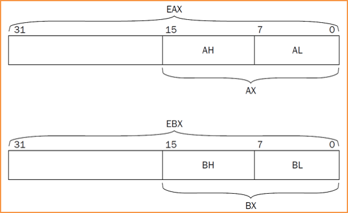
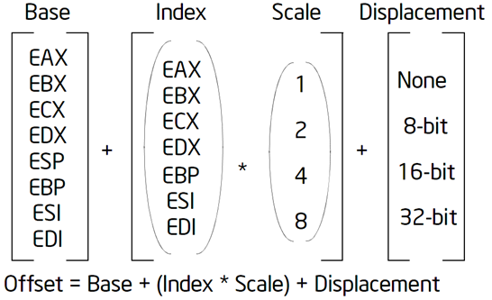
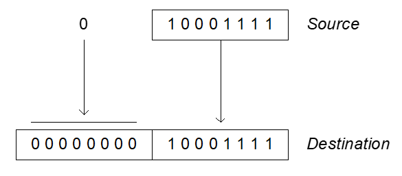
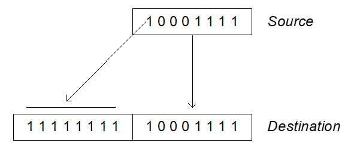

# 第4讲 基础指令



| 操作数类型助记符 | 说明                               |
| ---------------- | ---------------------------------- |
| r                | 通用寄存器，包括 8 位、16 位、32 位    |
| r8               | 8 位通用寄存器，如 AL, AH,……         |
| r16              | 16 位通用寄存器，如 AX, BX,……        |
| r32              | 32 位通用寄存器，如 EAX, EBX,……      |
| sreg             | 16 位段寄存器，如 CS, DS, SS, ES, FS, GS |
| imm              | 立即数，包含 8 位、16 位、32 位        |
| imm8             | 8 位立即数                          |
| imm16            | 16 位立即数                         |
| imm32            | 32 位立即数                         |
| m                | 内存操作数，包括 8 位、16 位、32 位    |
| m8               | 8 位内存操作数                      |
| m16              | 16 位内存操作数                     |
| m32              | 32 位内存操作数                     |
| r/m              | 通用寄存器或内存操作数             |
| r/m8             | 8 位通用寄存器或内存操作数          |
| r/m16            | 16 位通用寄存器或内存操作数         |
| r/m32            | 32 位通用寄存器或内存操作数         |

## 一、数据传输指令

### MOV

movx  source, destination  
x = b，w，l，q，用于指定内存操作数的大小

1. 源操作数与目的操作大小一致
2. 内存操作数最多只有一个
3. 立即数只能作为源操作数

内存操作数寻址方式



Index 没有 ESP

base_address (offset_address, indext, size)  
base_address + offset_address + index \* size

内存操作数指令示例  

movl  4(%ebx, %esi, 2), %eax        base+index \* scale+disp  
ebx+2 \* esi + 4

错误操作数指令示例

```
movl 4(,%esp,2), %eax  # esp 不能做 index
movl %eax, %bx         # 操作数大小不匹配
movl %eax, $4          # 立即数不能为目的操作数
movb bytevar, 4(%ebx)  # 太多内存操作数
```

80386 之后 IA-32，基址加变址（索引）寻址：

- 基址寄存器：eax, ebx, ecx, edx, esi, edi, ebp, esp
- 变址（索引）寄存器：eax, ebx, ecx, edx, esi, edi, ebp (没有esp)

### XCHG

xchg operand1, operand2  
在两个寄存器之间，或寄存器与内存之间交换数据（不能在内存与内存之间交换）

- 源与目的操作大小一致，即都是8位、16位、或32位
- 内存操作数最多只有一个

### MOVZX，MOVSX

movzx source, destination（move with zero-extension）



movsx source, destination（move with sign-extension）



- 目的操作数必须是寄存器，源操作数是寄存器或内存单元
- 目的操作数的大小大于源操作数

## 二、二进制算术指令

算术指令在 CPU 内部计算时不区分有符号数和无符号数，<font color="#d99694">都按照无符号数计算</font>  
根据指令和计算结果设置相应的标志位，供程序使用

EFLAGS 的状态标志位
- CF - Carry
	- <font color="#d99694">无符号</font>数运算溢出（最高位发生进位或借位）
- OF - Overflow
	- <font color="#d99694">有符号</font>数运算溢出（正+正=负, 负+负=正, 正-负=负, 负-正=正）
- SF - Sign
	- 结果为负数
- ZF - Zero
	- 结果为0

### INC，DEC

inc destination  
dec destination

1. CF 标志位不变，其他标志位根据计算结果改变  
2. 目的操作数必须是寄存器或内存单元

AT&T 指令后缀的正确使用

1. 内存操作数：内存地址无法判断操作数大小，必须用指令后缀指明
2. 寄存器操作数：如果操作数大小可以通过寄存器区分，则指令后缀可省略，汇编器自动识别

```
inc  bytevar  /*错误，无法确定操作数大小*/
```

```
# eax = 0x7fff

inc    %ax

# eax = 0x8000
# eflags = 0xa96 [PF AF SF IF OF]
# OF：有符号整数运算溢出
```

用 gdb 调试

```
(gdb) display $eflags
```

### ADD，SUB

add source, destination  
sub source, destination

destination = destination ± source  
根据计算结果改变标志位 CF、OF、SF、ZF

1. 源与目的操作数大小一致
2. 内存操作数最多只有一个
3. 立即数只能作为源操作数

### NEG

neg destination

1. 如果 destination =0，CF=0，否则 CF=1；
2. 其他标志位根据结果设置
3. 目的操作数必须是寄存器或内存单元

## 三、循环指令

### LOOP

loop address

1. 循环直到 <font color="#d99694">ecx</font> 寄存器为 0
2. 只支持 8 位偏移量，只能短跳转

.rept 汇编指导  
将.rept 和.endr 之间的行序列重复 count 次

```
.rept  count
…
.endr
```
