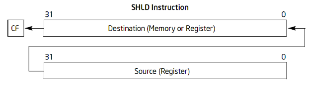
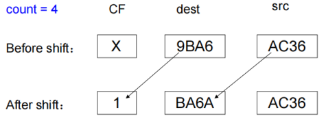
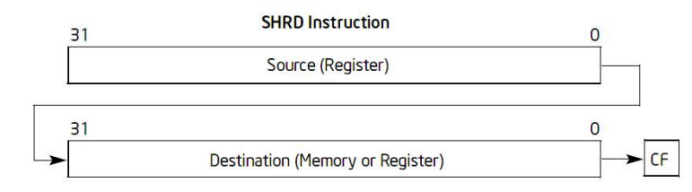
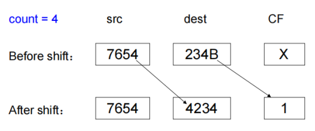

# 第7章 基础指令（二）
## 一、移位指令
### SHL/SAL ：逻辑左移/算术左移  
指令格式：shl count, dest / sal count, dest

### SHR ：逻辑右移  
指令格式：shr count, dest  

### SAR ：算术右移  
指令格式：sar count, dest  

### SHLD ：双精度左移  
指令格式：shld count, source, dest  
语义：将 dest 操作数向左移动 count 位，CF 位保存最后移出的一位，右侧低位补充来自 src 的 count 个高位





### SHRD ：双精度右移
指令格式：shrd count, source, dest  
语义：将 dest 操作数向右移动 count 位，CF 位保存最后移出的一位，左侧高位补充来自 src 的 count 个低位





### 标志位
1. 当 count = 0 时，所有标志位不受影响
2. 当 count > 0 时，CF 位等于最后移出的一位，SF、ZF、PF 根据移位结果设置，AF 未定义
3. 当 count = 1 时，
   1. 左移（逻辑左移/算术左移/双精度左移）：如果移位前后 dest 的符号位发生变化，OF = 1，否则 OF = 0
   2. 右移：
	   1. 逻辑右移，OF = 移位前 dest 的最高位；
	   2. 算术右移，OF = 0
	   3. 双精度右移：如果移位前后 dest 符号位发生变化，OF = 1，否则 OF = 0
4. 当 count > 1 时，OF 未定义

### 移位的位数
只使用低 5 位（模 32），即移位的位数是 0~31

## 二、乘除指令
### MUL ：无符号数乘法
指令格式：mul source  
问题：只有一个操作数，如何进行乘法？答案：目标操作数是隐含的  
标志位：如果高位部分为 0，CF=OF=0，否则，CF=OF=1，SF、ZF、PF、AF 未定义

| 源操作数 | 目标操作数 | 目标位置 | 高位 |
| -------- | ---------- | -------- | ---- |
| 8 位     | AL         | AX       | AH   |
| 16 位    | AX         | DX: AX   | DX   |
| 32 位    | EAX        | EDX: EAX | EDX  |

### DIV ：无符号数除法
指令格式：div divisor  
divisor 是除数，被除数是隐含的  
除法错例外：除数为 0 或者商的大小超过低位寄存器的大小  
标志位：CF、OF、SF、ZF、PF、AF 未定义

| 被除数   | 被除数长度 | 余数 | 商  |
| -------- | ---------- | ---- | --- |
| AX       | 16 位      | AH   | AL  |
| DX: AX   | 32 位      | DX   | AX  |
| EDX: EAX | 64 位      | EDX  | EAX |

### IMUL ：有符号数乘法
imul source  
单操作数：与 mul 相同

imul source, destination  
双操作数：source × destination，结果截断后存放于 destination  
source：r/m 16/32  
destination：r 16/32

imul multiplier, source, destination  
三操作数：source × multiplier，结果截断后存放于 destination  
multiplier：imm 8/16/32  
source：r/m 16/32  
destination：r 16/32

标志位  
SF：截断后结果的最高位  
ZF、PF、AF 未定义  
单操作数：如果高位寄存器的内容不是低位寄存器结果的符号扩展，则 CF = OF =1，否则 CF = OF = 0；  
双操作数/三操作数：如果中间计算结果不是 dest 存放结果的符号扩展，则 CF = OF =1，否则 CF = OF = 0

### IDIV ：有符号数除法
指令格式：idiv divisor  
与无符号数乘法相同  
余数的符号总是与被除数的符号相同  
注意
1. 8 位除法被除数是 16 位，16 位除法被除数是 32 位，32 位除法被除数是 64 位
2. 当不能整除时，<span style="background:#b1ffff">商的截取趋向 0</span>，如-5 ÷ 3，商 = -1，余数 = -2

### CBW ：字节扩展为字
指令格式 (AT&T)：CBTW，as 汇编器也能正确识别 CBW  
语义：signed-extend (AL) -> AX

### CWDE ：字扩展为双字
指令格式 (AT&T)：CWTL，as 汇编器也能正确识别 CWDE，E 代表 EAX  
语义：signed-extend (AX) -> EAX

### CWD ：字扩展为双字
指令格式 (AT&T)：CWTD，as 汇编器也能正确识别 CWD  
语义：signed-extend (AX) -> DX: AX

### CDQ ：双字扩展为四字
指令格式 (AT&T)：CLTD，as 汇编器也能正确识别 CDQ  
语义：signed-extend (EAX) -> EDX: EAX

## 三、杂项指令
### LEA ：装载有效地址
指令格式：lea source, destination  
语义：effective address (src) -> dest，src 是内存操作数，dest 是寄存器操作数  
<span style="background:#b1ffff">LEA 指令常被用作计算指令</span>  
`mov  (%ebx, %esi, 8), %edi` ：addr = 8 * %esi + %ebx，将存放于 addr 内的值送给 %edi  
`lea  (%ebx, %esi, 8), %edi` ：addr = 8 * %esi + %ebx，直接将 addr 送给 %edi  
`lea val(, 1), %eax` ：将 1 * 0 + val 送给 %eax，即直接将 val 送给 %eax（val 是 imm）

### NOP ：空操作指令
指令格式：nop / nop src  
语义：空操作，主要用于占据指令流的位置  
无操作数的 NOP 是单字节指令，带 src 操作数的 nop 指令用于产生多字节指令  
采用复杂寻址方式的内存操作数，可形成 9 字节的 NOP 指令

```
0:	8d 43 20             	lea    0x20(%ebx), %eax
3:	66 8d 4c 72 04      	lea    0x4(%edx, %esi, 2), %cx
8:	90                   	nop
9:	0f 1f 43 04          	nopl   0x4(%ebx)
d:	66 0f 1f 84 72 78 56 	nopw   0x12345678(%edx, %esi, 2)
14:	34 12 
```

## 四、字节指令
### SETcc ：根据条件码设置字节操作数
指令格式 (Intel)：SETcc dest  
语义：若条件码满足，则 dest = 1，否则 dest = 0
SETcc 用于消除逻辑赋值类的条件分支，相当于 Jcc+MOV，MOV 赋值的结果是 0/1
注：SETcc 是字节操作指令，操作数是 8位，如有需要，最后要扩展操作


```
int if_branch(int x, int y)
{
	if (x > y)
		return 1;
	else
		return 0;
}
```

```
gcc -S -O2 xx.c
```

```
.text
        .globl  if_branch
        .type   if_branch, @function
if_branch:
        movl    8(%esp), %eax      # y
        cmpl    %eax, 4(%esp)      # ? x>y
        setg    %al                # if(x>y) set 1 else 0
        movzbl  %al, %eax          # extend
        ret
```

## 五、程序实例