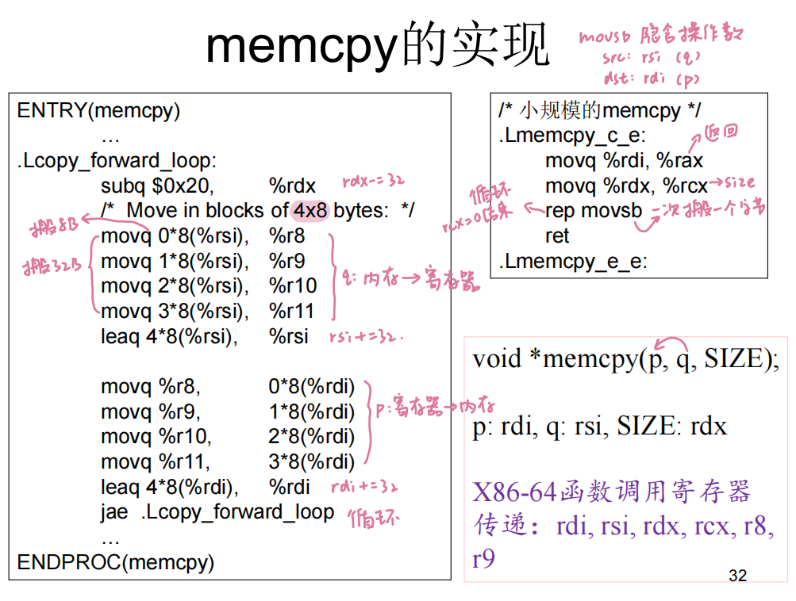
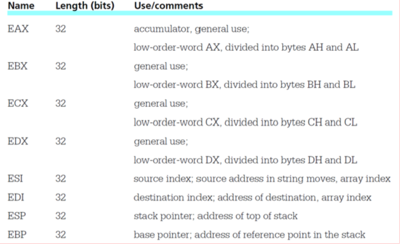
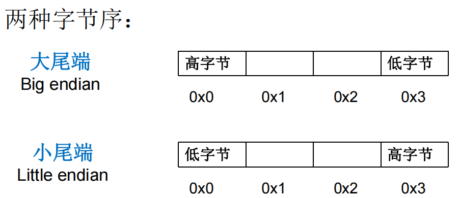

# 第1讲 基础知识
## 一、认识汇编语言
### 汇编语言是什么
#### C 程序编译  
`gcc  -o hello hello. c`

若想要显示详细信息，可以加上 -v 参数  
`gcc  -v -o hello hello. c`
```
cc1 hello.c -o xxx.s                // 编译器，生成汇编文件                 
as -o xxx.o xxx.s                   // 汇编器，生成目标代码
collect2 -o hello xxx.o crt*.o -lc  // 链接器，生成可执行文件
```

#### X86 与 MIPS 汇编
C 语言
```C
int C = A + B；
```

X86 汇编语言
```
movl    0xc(%ebp), %eax
addl    0x8(%ebp), %eax
movl    %eax, 0x8(%esp)
```

MIPS 汇编语言
```
lw	    $3, 40($fp)
lw	    $2, 44($fp)
addu    $2, $3, $2
sw	    $2, 24($fp)
```

X86 与 MIPS 不同
1. mips 只能通过 load、store 访存
2. X86: src, dst
	mips: dst, src

在 X86_64 的系统中，编译 32 位程序
1. as 为汇编器，需要--32 参数
2. ld 为链接器，需要-m elf_i386参数
```
$ as --32 -o cpuid.o cpuid.s
$ ld -m elf_i386 -o cpuid cpuid. o
$ ./cpuid
```

### 汇编语言的用途
#### memcpy 的优化
优化前
```C
for(i = 0; i < SIZE; i++)
	*p++ = *q++;
```

优化后：直接调用库函数 memcpy
```C
memcpy(p, q, SIZE);
```



## 二、指令集体系结构
### 寄存器



1. EAX-EDX 为通用寄存器，其中 EAX 还可以是累加寄存器
	- EAX 的分一半是 AX，AX 分一半是 AH 和 AL，其他寄存器类似
2. ESI 和 EDI 用于寻址，ESI 为源，EDI 为目的
3. ESP 和 EBP 用于栈

### 字节序


内存地址：左底右高

## 阅读资料
- [ ] x86 Assembly Language Reference Manual
- [ ] x86-64 Machine-Level Programming
- [ ] Power Struggles: Revisiting the RISC vs. CISC Debate on Contemporary ARM and x86 Architectures
