# 第6章 过程调用
## 一、栈与栈帧
函数调用使用栈以及 call 和 ret 等指令

栈：自顶向下生长的连续存储区间  
栈的单元大小固定，通常是机器的字长

栈的作用
1. 传递函数的参数、返回值等
2. 存放函数的局部变量、返回地址等
3. 保存寄存器的旧值以备将来恢复使用

程序的运行时，栈由操作系统在创建进程时创建

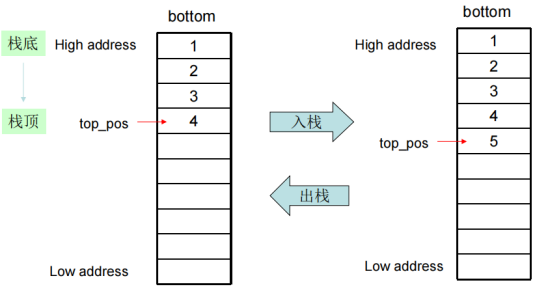

x86-Linux-32的程序栈
1. 自顶向下生长的栈
2. 栈底地址为0xbffffxxx
3. 栈顶指针是esp寄存器
4. 栈单元大小是4字节

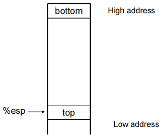

分配给一个过程使用的栈空间称为栈帧
1. 包括过程的局部变量
2. 子过程的形参地址单元
3. 调用子过程的返回地址
4. 临时保存的寄存器

当前的栈空间就是由嵌套调用的一系列过程的栈帧组成

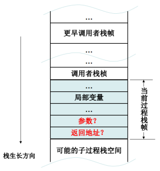

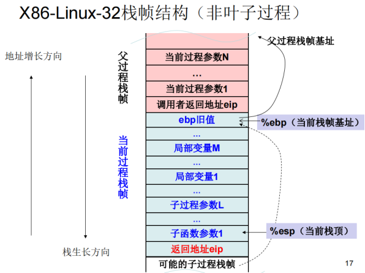

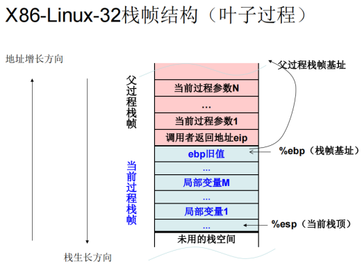

## 二、过程调用指令
### CALL
CALL：过程调用  
指令格式：CALL dest  
语义：将下一条指令的地址压入栈，跳转到 dest 所指示的目标地址执行  
等价：pushl %eip；jmp addr

若操作数是立即数，相对地址  
若操作数是寄存器或内存单元的值，绝对地址

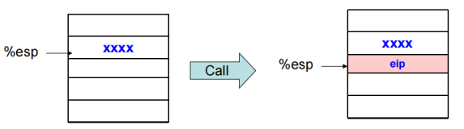

### RET  
RET：从过程返回  
指令格式：RET/RET src  
语义：从栈中弹出返回地址；如果有立即数操作数 src，则再退栈 src 字节  
等价：pop %eip

注：“RET imm16”可用于返回时清除形参占据的栈空间

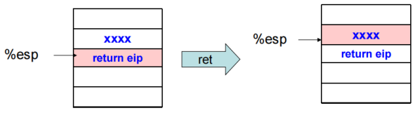

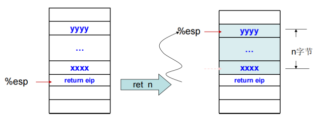

### PUSH
PUSH：压栈  
指令格式：PUSH src  
语义：栈指针下移一个单元，将操作数 src 的内容压入该栈单元中 
等价：subl $4, % esp；movl src, (%esp)

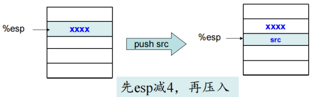

### POP
POP：退栈  
指令格式：POP dest  
语义：将栈顶单元的内容传输到dest所在单元，栈指针上移一个单元  
等价：movl (%esp), dest；addl $4, %esp

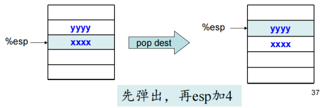

### LEAVE
LEAVE：释放当前栈帧  
指令格式：LEAVE  
语义：把ebp寄存器的值传输给esp，然后从栈顶单元恢复ebp寄存器的值。即esp = ebp；ebp = pop()  
等价：movl %ebp, %esp；popl %ebp

### 程序实例
函数：.type print_s, @function  
如何获取参数：用栈指针 + 偏移  
ret src：完成退栈

## 三、C语言函数调用
.CFI 指导

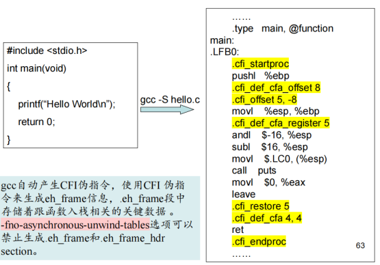

gcc 自动产生 CFI 伪指令，使用 CFI 伪指令来生成eh_frame 信息  
.eh_frame 段中存储着跟函数入栈相关的关键数据   
-fno-asynchronous-unwind-tables 选项可以禁止生成 .eh_frame 和 .eh_frame_hdr section。

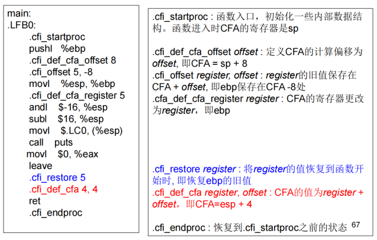

栈桢的分配
1. 栈桢的主体是局部变量和形参
2. 栈桢以16字节为单位分配
3. 以容纳所有局部变量和形参数量最多的子函数的形参为限
4. 局部变量分配在栈桢底部，形参分配在栈桢的顶部

## 四、ABI简介
ABI (Application binary interface) 应用程序二进制接口  
在不同情况编成二进制代码后互相调用的接口约定，与硬件平台和操作系统相关  
主要约定寄存器的使用方式，保存和恢复的义务，参数与返回值的传递方式，栈帧的格式和维护义务

### X86-Linux-32 abi
参数与返回值约定
1. 参数通过栈传递
2. 参数的传递顺序是从右向左
3. 参数由调用者维护，属于调用者栈帧
4. 返回值存放在的 eax 寄存器
5. 返回地址存放调用者的栈桢顶部

寄存器使用约定
1. eax 保存返回值
2. 调用者保存 eax、edx、ecx 寄存器，被调用者自由使用
3. 被调用者保存 ebx、esi、edi 寄存器，调用者自由使用
4. ebp 和 esp 是栈桢指针和栈顶指针

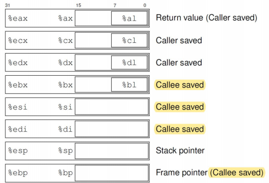

栈桢的约定
1. 栈桢的布局
   1. ebp 旧值寄存器
   2. 其他要保存的寄存器、局部变量
   3. 形参
   4. 返回地址
2. 栈帧主体部分以 16 字节为单位分配
3. 栈单元大小是 4 字节

### X86-Linux-64 ABI
参数与返回值约定
1. 前 6 个参数通过寄存器传递：%rdi，%rsi，%rdx，%rcx，%r8，%r9 
2. 第 7 个参数起通过栈传递，传递顺序是从右向左
3. 参数由调用者维护，属于调用者栈帧
4. 返回值存放在 rax 寄存器
5. 返回地址存放调用者的栈桢顶部

寄存器使用约定
1. rax 保存返回值
2. 被调用者保存 rbp, rbx, r12~r15 寄存器，调用者自由使用
3. 调用者保存其他寄存器 (rax, rcx, rdx, rsi, rdi, r8~r11)，被调用者自由使用
4. rsp 是栈顶指针，rbp 是栈桢指针

栈桢的约定
1. 栈帧主体部分16（32，64）字节对齐
2. 栈单元大小是 64 位
3. Red zone 区域可以用于临时数据（叶子函数不用开辟栈帧）

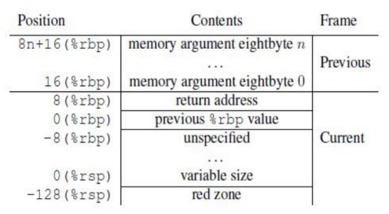

