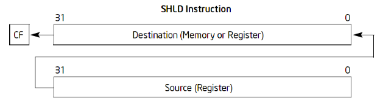
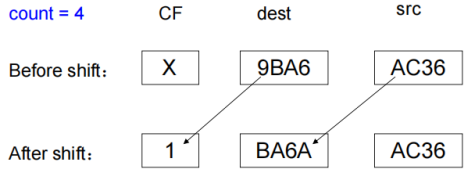

# 第7章 基础指令（二）

## 一、移位指令

SHL/SAL：逻辑左移/算术左移  
指令格式（Intel）：SHL dest, count / SAL dest, count  

SHR：逻辑右移  
指令格式（Intel）：SHR dest, count    

SAR：算术右移  
指令格式（Intel） ：SAR dest, count  

SHLD：双精度左移  
指令格式（Intel） ：SHLD dest, src, count  
语义：将 dest 操作数向左移动 count 位，CF 位保存最后移出的一位，右侧低位补充来自 src 的 count 个高位标志位影响  

标志位

1. 当 count = 0 时，所有标志位不受影响
2. 当 count > 0 时，CF 位等于最后移出的一位，SF、ZF、PF 根据移位结果设置，AF 未定义
3. 当 count = 1 时，
   1. 左移（逻辑左移/算术左移/双精度左移）：如果移位前后 dest 的符号位发生变化，OF = 1，否则 OF = 0
   2. 右移：逻辑右移，OF = 移位前 dest 的最高位；算术右移，OF = 0
4. 当 count > 1 时，OF 未定义

移位的位数：imm8 或者 cl 寄存器的内容只使用低 5 位，即移位的位数是 0~31

## 二、乘除指令

## 三、杂项指令

## 四、字节指令

## 五、程序实例