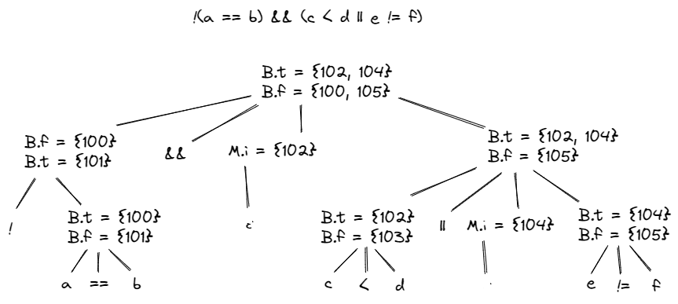

# 作业 11

练习6.2.1：假定图 6-26 中的函数 widen 可以处理图 6-25a 的层次结构中的所有类型，翻译下列表达式。假定 c 和 d 是 char 型，s 和 t 是 short 型，i 和 j 是 int 型，x 是 float 型。
1. j = s + d
2. x = s + d
3. x = ( s + d ) * ( t + c )

答：  
1. j = s + d
```
t1 = int(s)
t2 = int(d)
t3 = t1 + t2
j = t3
```

2. x = s + d
```
t1 = int(s)
t2 = int(d)
t3 = t1 + t2
x = float(t3)
```

3. x = ( s + d ) * ( t + c )
```
t1 = int(s)
t2 = int(d)
t3 = t1 + t2
t4 = int(t)
t5 = int(c)
t6 = t4 + t5
t7 = t3 * t6
x = float(t7)
```

练习6.2.2：在图 6-36 的语法制导定义中添加处理下列控制流构造的规则：
1. S→ repeat S1 until B，当 B 为真时结束循环
2. S→ for ( S1 ; B ; S2 ) S3

答：  
1. S→ repeat S1 until B
```
S -> repeat S1 until B  B.false = newlabel()
						S1.next = newlabel()
						B.true = S.next
						S.code = label(B.false) || S1.code || label(S1.next) || B.code
```

2. S→ for ( S1 ; B ; S2 ) S3
```
S -> for ( S1 ; B ; S2 ) S3     S1.next = newlabel()
								B1.true = newlabel()
								S3.next = newlabel()
								S2.next = S1.next
								B.false = S.next
								S.code = S1.code || label(S1.next) || B.code || 
								         label(B.true) || S3.code || label(S3.next) || 
								         S2.code || gen('goto' S1.next)
```

练习6.2.3：使用图 6-43 中的翻译方案翻译下列表达式  
!(a == b) && (c < d || e != f)  
给出分析过程给出带 truelist 和 falselist 的注释语法分析树。假设第一条被生成的指令的地址是100。

答：



将 a == b 归约为 B
```
100: if a==b goto _
101: goto _
```

将 !B1 归约为 B

将 c < d 归约为 B
```
102: if c<d goto _
103: goto _
```

将 e != f 归约为 B
```
104: if e!=f goto_
105: goto_
```

使用 B -> B1 || M B2 归约，调用 backpatch ({103}, 104)
```
100: if a==b goto _
101: goto _
102: if c<d goto _
103: goto 104
104: if e!=f goto_
105: goto_
```

使用 B -> B1 && M B2 归约，调用 backpatch ({101}, 102)
```
100: if a==b goto _
101: goto 102
102: if c<d goto _
103: goto 104
104: if e!=f goto_
105: goto_
```

整个表达式为真当且仅当控制流到达 102 和 104 位置上的跳转指令；表达式为假当且仅当控制流到达 100 和 105 位置上的跳转指令。在后续的编译过程中，当已知表达式为真或为假时分别应该做什么的时候，这些指令的目标将会被填写完整