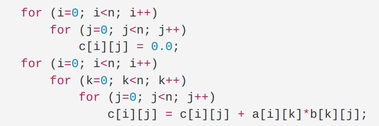

# 作业 14

练习8.2.1：考虑下面的矩阵乘法程序：

1. 假设每个矩阵元素占 4 字节，且矩阵按行存放，把程序翻译成本节中的三地址语句并标出基本块
2. 为 1. 中得到的代码构造流图
3. 找到 2. 中流图中的循环



答：

```
B1:
1) i = 0

B2:
2) j = 0

B3:
3) t1 = n * i
4) t2 = t1 + j
5) t3 = 4 * t2
6) c[t3] = 0.0
7) j = j + 1
8) if j < n goto (3)

B4:
9) i = i + 1
10) if i < n goto (2)

B5:
11) i = 0

B6:
12) k = 0

B7:
13) j = 0

B8:
14) t4 = n * i
15) t5 = t4 + j
16) t6 = t5 * 4
17) t7 = c[t6]
18) t8 = t4 + k
19) t9 = t8 * 4
20) t10 = a[t9]
21) t11 = n * k
22) t12 = t11 + j
23) t13 = t12 * 4
24) t14 = b[t13]
25) t15 = t10 * t14
26) t16 = t7 + t15
27) j = j + 1
28) if j < n goto (14)

B9:
29) k = k + 1
30) if k < n goto (13)

B10:
31)  i = i + 1
32) if i < n goto (12)
```


循环如下：
1. B3 自身
2. {B2, B3, B4}
3. B8 自身
4. {B7, B8, B9}
5. {B6, B7, B8, B9, B10}

练习 8.2.2：考虑右面的基本块

1. 构造 DAG
2. 假设只有 a 在基本块出口活跃，尝试优化右面的代码，并简述用到的技术

```
d = b + c
e = b + c
b = b * c
a = e + d
```

答：


```
d = b + c
a = d + d
```

死代码删除 b = b * c，公共子表达式删除 e = b + c


