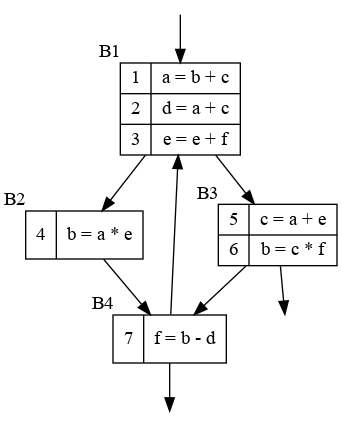

# 作业 15

2020K8009929017 侯昱帆

练习 8.3.1：为下面流图中的程序计算

1. ud 链和 du 链
2. 每块末尾的可用表达式
3. 每块的控制节点和后控制节点

答：

def-use:

1. a: {2, 4, 5}
2. b: {7}
3. e: {3, 4, 5}
4. b: {1, 7}
5. c: {1, 2, 6}
6. b: {1, 7}
7. f: {3, 6}

use-def:

1. b: {4, 6} c: {5}
2. a: {1} c: {5}
3. e: {3} f: {7}
4. a: {1} e: {3}
5. a: {1} e: {3}
6. c: {5} f: {7}
7. b: {4, 6} d: {2}

可用表达式

| block | gen       | kill                | in       | out       |
| ----- | --------- | ------------------- | -------- | --------- |
| B1    | b+c; a+c  | b-d; a\*e; a+e; e+f |          | b+c; a+c  |
| B2    | a\*e      | b+e; b-d            | b+c; a+c | a+c;a\*e  |
| B3    | a+e; c\*f | b+c; a+c; b-d       | b+c; a+c | a+e; c\*f |
| B4    | b-d       | c\*f; e+f           |          | b-d       |

