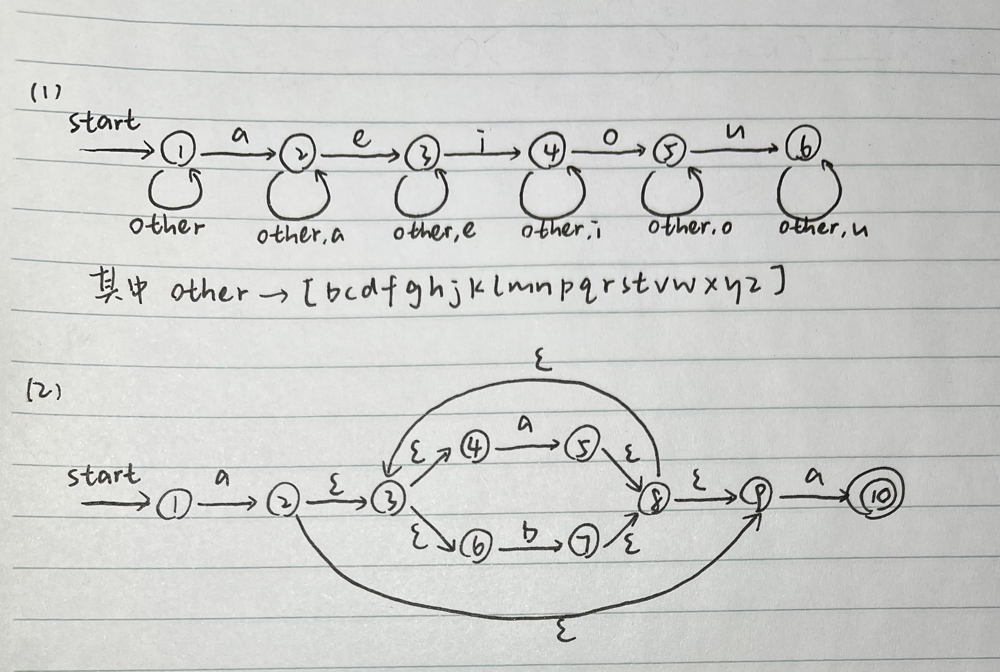
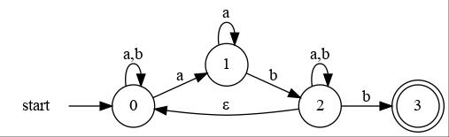
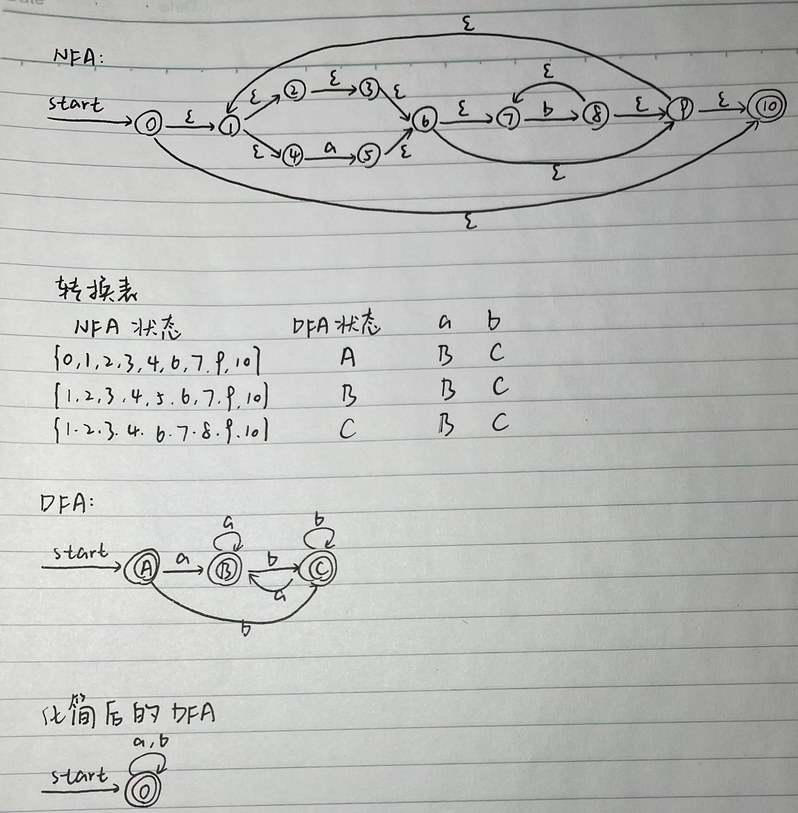

# 作业4

A+

练习3.2.1：为下面的语言设计一个 DFA 或 NFA
1) 包含 5 个元音的所有小写字母串，这些串中的元音按顺序出现
2) 以 a 开头且以 a 结尾，中间由零个或多个 a 或 b 的实例构成的串

答：

练习3.2.2：模拟下图所示 NFA 处理输入 aabb 的过程

答：$start\rightarrow \{0\}\stackrel{a}{\rightarrow}\{0,1\}\stackrel{a}{\rightarrow}\{0,1\}\stackrel{b}{\rightarrow}\{0,2\}\stackrel{b}{\rightarrow}\{0,2,3\}$

练习3.2.3：使用算法3.23和3.20将下述正则表达式转换为 DFA，并尝试化简该 DFA
1) $((\epsilon|a)b^*)^*$
2) $(a | b)^*abb(a | b)^*$

答：(1)

(2)

