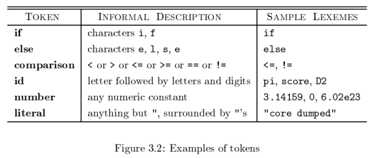
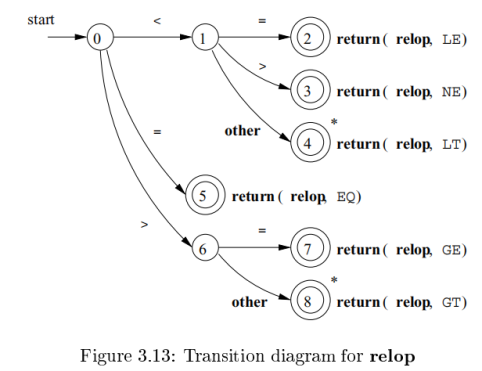
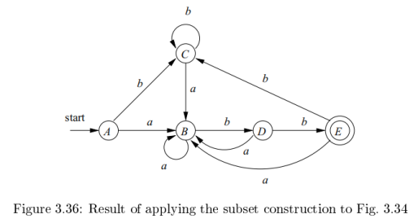

# 第3章 词法分析
## 3.1 词法分析的作用
### 3.1.1 词法分析及语法分析
划分词法分析和语法分析阶段的原因
1. 简化编译器的设计
2. 提高编译器的效率
3. 增强编译器的可以执行

### 3.1.2 词法单元、模式和词素
词法单元：词法单元名+可选的属性值  
模式：描述了一个词法单元的词素可能具有的形式  
词素：源程序中的一个字符序列，它和某个词法单元的模式匹配，并被词法分析器识别为该词法单元的一个实例

eg. 



C 语句 `printf("Total = %d\n", score);`  
`printf` 和 `score` 是和词法单元 **id** 的模式匹配的词素  
`"Total = %d\n"` 是和 **literal** 匹配的词素

下面的类别覆盖了大部分或所有的词法单元
1. 每个关键字都有一个词法单元，一个关键字的模式就是该关键字本身
2. 表示运算符的词法单元，可以表示单个运算符，也可以像 **comparison** 表示一类运算符
3. 一个表示所有标识符的词法单元
4. 一个或多个表示常量的词法单元，比如数字和字面值字符串
5. 每个标点符号都有一个词法单元，比如左右括号、逗号和分号

### 3.1.3 词法单元的属性
我们假设一个词法单元至多有一个相关的属性值，这个属性值可能是一个组合了多种信息的结构化数据

eg. **id**，通常会将很多信息和它关联  
和标识符有关的信息都保存在符号表，如词素、类型、第一次出现的位置  
一个标识符的属性值是一个<span style="background:#b1ffff">指向符号表中该标识符对应条目的指针</span>

eg. 


### 3.1.4 词法错误
错误情况：所有词法单元的模式都无法和剩余输入的某个前缀相匹配  
恐慌模式恢复：从剩余的输入中不断删除字符，直到词法分析器能够在剩余输入的开头发现一个正确的词法单元为止

可能采取的其他错误恢复动作：
1. 从剩余的输入中删除一个字符
2. 向剩余的输入中插入一个遗漏的字符
3. 用一个字符来替换另一个字符
4. 交换两个相邻的字符

## 3.2 输入缓冲
常常需要查看一个词素之后的若干字符才能够确定是否找到了正确的词素

### 3.2.1 缓冲区对
利用两个交替读入的缓冲区


每个缓冲区容量都是 N 个字符，通常 N 是一个磁盘块的大小，如 4096 字节  
可以一次将 N 个字符读入到缓冲区  
eof 标识源文件的结束

两个指针
1. lexemeBegin：指向当前词素的开始处
2. forward：一直向前扫描，直到发现某个模式被匹配为止

一旦确定了下一个词素，  
1. forward 指向该词素结尾的字符
2. 词法分析器将这个词素作为某个返回给语法分析器的词法单元的属性值记录下来
3. lexemeBegin 指向刚刚找到的词素之后的一个字符

forward指针前移要求我们首先检查是否已经到达某个缓冲区的末尾  
如果是，必须将 N 个新字符读到另一个缓冲区，且将 forward 指向这个新载入字符的缓冲区的头部

词素长度加上我们向前看的距离不能大于 N ，否则可能在识别词素之前覆盖掉尚在缓冲区的词素  
eg. 词素第一段在第一个缓冲区的末尾，第二段占据第二缓冲区，第三段被加载时又放到第一个缓冲区，这样就覆盖了词素的第一段

### 3.2.2 哨兵标记
上一节描述的方案，每次向前移动 forward指针时，都必须检查是否到达了缓冲区的末尾，若是，必须加载另一个缓冲区 

每读一个字符，必须做两次测试
1. 检查是否到达缓冲区的末尾
2. 确定读入的字符是什么

扩展每个缓冲区，使它们<span style="background:#b1ffff">在末尾包含一个 “哨兵” 字符 eof</span>，将对缓冲区末端的测试和对当前字符的测试合二为一


## 3.3 词法单元的规约
### 3.3.1 串和语言
略

### 3.3.2 语言上的运算


### 3.3.3 正则表达式
正则表达式的递归定义如下


一个可用正则表达式定义的语言叫做正则集合  
如果两个正则表达式 r 和 s 表示同样的语言，则称 r 和 s 等价，记作 r=s

正则表达式的代数定律


### 3.3.4 正则定义
为方便表示，希望给某些正则表达式<span style="background:#b1ffff">命名</span>，并在之后的正则表达式中像使用符号一样使用这些名字

如果 $\Sigma$ 是基本符号的集合，那么一个正则定义是具有如下形式的定义序列：  
$d_1\rightarrow r_1$  
$d_2\rightarrow r_2$  
$\cdots$  
$d_n\rightarrow r_n$  
其中：
- 每个 $d_i$ 都是一个新符号，不在 $\Sigma$ 中，并且各不相同
- 每个 $r_i$ 是字母表 $\Sigma \cup \{d_1,d_2,\cdots,d_{i-1}\}$ 上的正则表达式（避免递归定义）

eg. C 标识符对应的语言的正则定义


### 3.3.5 正则表达式的扩展
1. 一个或多个实例：+
2. 零个或一个实例：？
3. 字符类：$[a_1a_2\cdots a_n]$，$[a-z]$

## 3.4 词法单元的识别
如何根据各个需要识别的词法单元的模式来构造出一段代码  
这段代码能够检查输入字符串，并在输入的前缀中找出一个和某个模式匹配的词素

eg. 分支语句和条件表达式  
分支语句和条件表达式的文法如下


其中文法的终结符号，包括 **if**、**then**、**else**、**relop**、**id** 及 **number**，都是词法单元的名字，这些词法单元的模式使用下图的正则定义来表示


词法分析器还需要消除空白符，方法是识别如下定义的词法单元 ws  
$ws\rightarrow(blank$ | $tab$ | $newline)^+$  
词法单元 ws 与其他词法单元的不同之处在于：识别到 ws 时，并不将它返回给语法分析器，而是从这个空白之后的字符开始继续进行词法分析。返回给语法分析器的是下一个词法单元

词法分析器的目标如下


### 3.4.1 状态转换图



### 3.4.2 保留字和标识符的识别
id 和关键字的状态转换图如下


问题：关键字和标识符是不一样的，如何区分？  

可以用两种方法处理看起来很像标识符的保留字
1. 初始化时就将各个保留字填入符号表
2. 为每个关键字建立单独的状态转换图，如下例

eg. 为关键字 then 单独建立状态转换图


1. 转换图最后包含“非字母或数字测试”，否则碰到像 thennextvalue 这样以 then 为前缀的 id 词法单元时会出错
2. 设定词法单元之间的优先级，使得当一个词素同时匹配 id 的模式和关键字的模式时，优先识别保留字词法单元

### 3.4.3 完成我们的例子
无符号数字


空白


### 3.4.4 基于状态转换图的词法分析器的体系结构


对应的 C++ 代码


将代码集成到词法分析器中的方法
1. 让词法分析器顺序地尝试各个词法单元的状态转换图。当调用 fail() 时，重置 forward 指针并启动下一个状态转换图。为各个关键字使用各自的状态转换图，并且先用关键字的转换图，再用 id 的状态转换图
2. 并行地运行各个状态转换图，取最长的和某个模式相匹配的输入前缀
3. 将所有的状态转换图合并为一个图，尽量读取输入直到不存在下一个状态为止，取最长的和某个模式相匹配的输入前缀

## 3.5 词法分析器生成工具
Lex 支持使用正则表达式来描述各个词法单元的模式，由此给出一个词法分析器的规约
Lex 的输入：称为 Lex 语言  
Lex 工具：Lex 编译器  
Lex 编译器将输入的模式转换成一个状态转换图

### 3.5.1 Lex 的使用


a.out 通常是一个被语法分析器调用的子例程，这个子例程返回一个整数值，即可能出现的某个词法单元名的编码  
词法单元的<span style="background:#b1ffff">属性值都保存在全局变量 yylval 中</span>，这个变量由词法分析器和语法分析器共享  
这么做可以同时返回一个词法单元名字和一个属性值

### 3.5.2 Lex 程序的结构
一个 Lex 程序具有如下形式：  
```
声明部分
%%
转换规则
%%
辅助函数
```

声明部分
1. 变量和明示常量的声明（明示常量：表示一个常数的标识符，如一个词法单元名）
2. 正则定义

转换规则：模式 {动作}  
1. 模式：正则表达式，可以使用声明部分的正则定义
2. 动作：代码片段，通常是用 C 语言编写

辅助函数：各个动作需要使用的函数

当词法分析器被语法分析器调用时
1. 词法分析器从余下的输入中逐个读取字符，直到发现最长的与某个模式 $P_i$ 匹配的前缀
2. 词法分析器执行相关的动作 $A_i$
3. 通常 $A_i$ 会将控制返回给语法分析器，如果不返回控制（空白符），词法分析器就继续寻找其他的词素，直到某个动作将控制返回给语法分析器为止
4. 词法分析器只向语法分析器返回一个值，即词法单元名，但可以利用 yyval 传递有关这个词素的附加信息

eg. 


### 3.5.3 Lex 中的冲突解决
当输入的多个前缀与一个或多个模式匹配时，Lex 用如下规则选择正确的词素
1. 总是选择最长的前缀
2. 如果最长的可能前缀与多个模式匹配，总是选择在 Lex 程序中先被列出的模式

### 3.5.4 向前看运算符
Lex 自动地向前读入一个字符，它会读取到形成被选词素的全部字符之后的那个字符，然后再回退输入，使得只有词素本身从输入中消耗  
但某些时候，希望仅当词素的后面<span style="background:#b1ffff">跟随特定的其他字符</span>时，这个词素才能和某个特定的模式相匹配  
可以在模式中用斜线指明该模式中和词素之际匹配的部分的结尾

eg. Fortran 语言，关键字不是保留字  
`IF(I, J)=3`，IF 是数组名  
`IF (condition) THEN...`，IF 是关键字

关键字 IF 的 Lex 规则：`IF / \(. * \) {letter}`  
斜线后附加 `\(. * \) {letter}`  
`. *` 与“任何不包含换行符的字符串匹配”

## 3.6 有穷自动机
### 3.6.1 不确定的有穷自动机
$(a|b)^*abb$


### 3.6.2 转换表


### 3.6.3 自动机中输入字符串的接受
略

### 3.6.4 确定的有穷自动机


## 3.7 从正则表达式到自动机
### 3.7.1 从 NFA 到 DFA 的转换
子集构造法，略

### 3.7.2 NFA 的模拟
略

### 3.7.3 NFA 模拟的效率
O (k (n+m))，算法需要的时间与输入串的长度和转换图的大小（结点数+边数）的乘积成正比

### 3.7.4 从正则表达式构造 NFA
基本规则： $\epsilon$，$a$ 的图  
归纳规则：并，连接，闭包的图

### 3.7.5 字符串处理算法的效率
DFA 模拟：可以在 O(|x|) 的时间内处理字符串 x  
NFA 模拟：处理串 x 的时间开销与 |x| 和该 NFA 转换图的大小的乘积成正比  
DFA 的模拟更快，但其转换图可能更大（可能呈指数增长（子集构造法的最坏情况）），可能影响存储效率，进而影响性能

## 3.8 词法分析器生成工具的设计
### 3.8.1 生成的词法分析器的结构


构建自动机时
1. 把 Lex 程序中的每个正则表达式模式转换未一个 NFA
2. 把这些 NFA 合并为一个 NFA

eg. 


abb 同时满足第二个模式和第三个模式，但是第二个模式在前，所以会匹配它  
aabbb... 这样的输入串中有许多前缀都满足第三个模式，Lex 会接收最长的前缀

### 3.8.2 基于 NFA 的模式匹配
模拟 NFA 的运行过程
1. 到达一个没有后续状态的输入点，此后的状态集一直为空
2. 沿着状态集的顺序回头寻找，直到找到一个包含一个或多个接受状态的集合为止
3. 如果集合中有多个接受状态，选择 Lex 中最靠前的模式相关联的接受状态
4. 将 forward 指针移回到词素末尾，同时执行相关联的动作

eg. 字符串 aaba


1. 读入第四个输入符号后，处于空状态集  
2. 向前寻找一个包含了某个接受状态的状态集，找到 8
3. 选择 aab 作为被识别的词素，匹配模式 $a^*b^+$，执行相应的动作 $A_3$

### 3.8.3 词法分析器使用的 DFA
与 NFA 类似，略

### 3.8.4 实现向前看运算符
Lex 模式 $r_1/r_2$ 向前看运算符 /  
将模式 $r_1/r_2$ 转换为 NFA 时，将 / 看成 $\epsilon$

如何确定 $r_1$ 匹配的词素末尾状态 s
1. s 在 / 上有一个 $\epsilon$  转换
2. 有一条从 NFA 的开始状态到状态 s 的路径，其上标号序列为 x
3. 有一条从 s 到 NFA 的某个接受状态的路径，其上标号序列为 y
4. 在所有满足前述条件 1~3 的 xy 中，x 尽可能长

如果在前述的状态 s 上有多个 $\epsilon$ 转换，问题困难很多

eg. 识别关键字 **IF** 的 NFA


状态 6 表明关键字 IF 的出现，当进入状态 6，需要向回扫描到状态 2 才可以找到词素 **IF**

## 3.9 基于 DFA 的模式匹配器的优化
### 3.9.6 最小化一个 DFA 的状态数
下图两个 DFA 都识别语言 $L((a|b)^*abb)$




图 3-36 中，状态 A 和 C 实际上是等价的
1. 都不是接受状态
2. 对任意输入，总是转到同一状态
	1. 在输入 a 上转到 B 
	2. 在输入 b 上转到 C 
3. 它们的行为和图 3-63 中的状态 123 相似

任何正则语言都有一个唯一的状态数目最少的 DFA  
从任意一个接受相同语言的 DFA 出发，通过<span style="background:#b1ffff">分组合并等价的状态</span>，总是可以构建得到这个状态数目最少的 DFA

如果分别从状态 s 和 t 出发，沿着标号为 x 的路径到达的两个状态中只有一个是接受状态，我们说串 s 区分状态 s 和 t  
如果存在某个能够区分状态 s 和 t 的串，s 和 t 就是可区分的
