# 第4章语法分析

## 4.1 引论

### 4.1.1 语法分析器的作用

语法分析器：从词法分析器获得一个由词法单元组成的串，并验证这个串可以由源语言的文法生成  
方法：构造出一棵语法分析树，并把它传递给编译器的其他部分进一步处理

自顶向下：从根结点向叶子结点构造语法分析树（最左推导）  
自底向上：从叶子结点向根结点构造语法分析树（最左归约，即最右推导的逆过程）  

两种分析方法中，语法分析器的输入总是按照从左向右的方式被扫描，每次扫描一个符号

### 4.1.2 代表性的文法

指明了运算符的结合性和优先级的文法  
$E\rightarrow E+T$ | $T$  
$T\rightarrow T*F$ | $F$  
$F\rightarrow(E)$ | $id$

无左递归的文法
$E\rightarrow TE'$  
$E'\rightarrow +TE'$ | $\epsilon$  
$T\rightarrow FT'$  
$T'\rightarrow *FT'$ | $\epsilon$  
$F\rightarrow (E)$ | $id$

二义性的文法  
$E\rightarrow E+E$ | $E*E$ | $(E)$ | $id$

### 4.1.3 语法错误的处理

1. 词法错误
2. 语法错误
3. 语义错误
4. 逻辑错误

### 4.1.4 错误恢复策略

1. 恐慌模式的恢复
2. 短语层次的恢复
3. 错误产生式
4. 全局纠正

## 4.2 上下文无关文法

### 4.2.1 上下文无关文法的正式定义

上下文无关文法（简称文法）由终结符号、非终结符号、一个开始符号和一组产生式组成

### 4.2.2 符号表示的约定

略

### 4.2.3 推导

如果 $S\stackrel{*}{\Rightarrow}\alpha$，其中 $S$ 是文法 $G$ 的开始符号，称 $\alpha$ 是 $G$ 的一个句型  
文法 $G$ 的句子是不包含非终结符的句型

最左推导：总是替换句型中最左非终结符号  
最右推导：总是替换句型中最右非终结符号

### 4.2.4 语法分析树和推导

语法分析树过滤了推导过程中对非终结符号应用产生式的顺序

语法分析树每个内部结点表示一个产生式的应用  
该内部结点的标号：此产生式头中的非终结符号 $A$  
该结点的子结点标号：从左到右组成了在推导过程中替换这个 $A$ 的产生式体

### 4.2.5 二义性

二义性：一个文法可以为某个句子生成多棵语法分析树  
二义性文法对同一个句子有多个最左推导或多个最右推导

eg. 

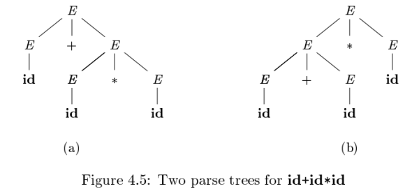

### 4.2.6 验证文法生成的语言

证明文法 $G$ 生成语言 $L$

1. 证明 $G$ 生成的每个串都在 $L$ 中
2. 证明 $L$ 中的每个串都确实能由 $G$ 生成

### 4.2.7 上下文无关文法和正则表达式

每个正则语言都是一个上下文无关语言，反之不成立

## 4.3 设计文法

### 4.3.1 词法分析和语法分析

略

### 4.3.2 消除二义性

eg. 悬空-else

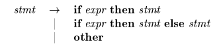

$if$ $E_1$ $then$ $if$ $E_2$  $then$ $S_1$ $else$ $S_2$ 有两棵语法分析树

但是一般都会选择第一种语法分析树  
通用规则：每个 $else$ 和最近的尚未匹配的 $then$ 匹配

改写成无二义性  
基本思想：在一个 $then$ 和一个 $else$ 之间出现的语句必须是”已匹配的“

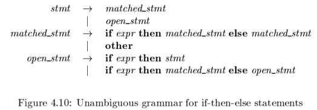

### 4.3.3 左递归的消除

自顶向下语法分析方法不能处理左递归的文法，因此需要一个转换方法来消除左递归

立即左递归  
$A\rightarrow A \alpha$ | $\beta$  
消除左递归后  
$A\rightarrow \beta A'$  
$A'\rightarrow \alpha A'$ | $\epsilon$  

立即左递归  
$A\rightarrow A \alpha_1$ | $A \alpha_2$ | ... | $A \alpha_m$ | $\beta_1$ | $\beta_2$ | ... | $\beta_n$  
消除左递归后  
$A\rightarrow \beta_1 A'$ | $\beta_2 A'$ | ... | $\beta_n A'$  
$A'\rightarrow \alpha_1 A'$ | $\alpha_2 A'$| ... | $\alpha_m A'$ | $\epsilon$

系统地消除左递归
输入：没有环或 $\epsilon$ 产生式的文法 $G$  
输出：一个等价的无左递归文法  
方法：

工作原理：
1. 通过 for 循环将所有产生式都变成 $A_k\rightarrow A_l \alpha$，$l\gt k$ 形式，即全部变成立即左递归
2. 消除立即左递归

eg. 文法  
$S\rightarrow Ab$ | $b$  
$A\rightarrow Ac$ | $Sd$ | $\epsilon$

经过 for 循环  
$S\rightarrow Ab$ | $b$  
$A\rightarrow  Ac$ | $Aad$ | $bd$ | $\epsilon$ 

消除立即左递归  
$S\rightarrow Ab$ | $b$  
$A\rightarrow bdA'$ | $A'$  
$A'\rightarrow cA'$ | $adA'$ | $\epsilon$ 

### 4.3.4 提取左公因子

提取左公因子可以产生适用于预测分析技术或自顶向下分析技术的文法  
不清楚应该在两个 A 产生式中如何选择时，可以通过改写产生式来推后这个决定，等读入了足够的输入后再做出正确选择

原产生式  
$A\rightarrow \alpha \beta_1$ | $\alpha \beta_2$  
提取左公因子  
$A\rightarrow \alpha A'$  
$A'\rightarrow \beta_1$ | $\beta_2$

原产生式  
$A\rightarrow \alpha \beta_1$ | $\alpha \beta_2$ | ... |$\alpha \beta_n$ | $\gamma$  
提取左公因子  
$A\rightarrow \alpha A'$ | $\gamma$  
$A'\rightarrow \beta_1$ | $\beta_2$ | ... | $\beta_n$ 

eg.

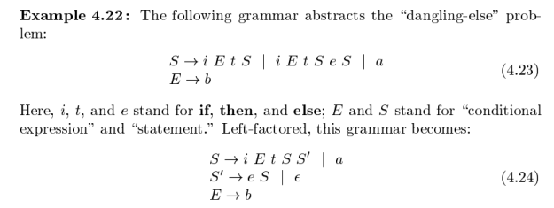

### 4.3.5 非上下文无关语言的构造

检查表示符在程序中先声明后使用的问题  
这个语言由形如 $wcw$ 的串组成
1. 第一个 $w$：某个标识符 $w$ 的声明
2. c：中间的程序片段
3. 第二个 $w$：对这个标识符 $w$ 的使用

抽象语言 $L_1=\{wcw$ | $w$ 在 $(a|b)^*$ 中 $\}$，不是上下文无关的  
这表明像 C 或 Java 这样的语言不是上下文无关的

## 4.4 自顶向下的语法分析

自顶向下语法分析：为输入串从上到下，按先根次序构造语法分析树  
相当于寻找输入串的最左推导  
关键：对于一个非终结符号 A 应该选择哪个产生式

### 4.4.1 递归下降的语法分析

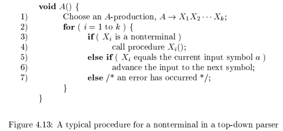

按照顺序逐个尝试产生式，如果失败了就回溯

eg. 文法   
$S\rightarrow cAd$  
$A\rightarrow ab$ | $a$  
输入串 $w=cad$  

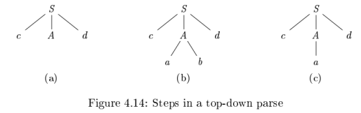

左递归文法会使递归下降语法分析器无限循环

### 4.4.2 FIRST 和 FOLLOW

FIRST($\alpha$)：可以从 $\alpha$ 推导得到的串的首符号的集合，其中 $\alpha$ 是任意的文法符号串  
FOLLOW($A$)：可能在某些句型中紧跟在 $A$ 右边的终结符号的集合，其中 $A$ 是非终结符

**计算文法符号 $X$ 的 FIRST($X$)**
1. $X$ 是终结符号，那么 FIRST($X$) = $X$
2. $X$ 是非终结符号，且 $X\rightarrow Y_1Y_2\cdots Y_k$ 是一个产生式
   1. 如果 $\epsilon$ 在 FIRST($Y_1$)、...、FIRST($Y_{i-1}$) 中，$a$ 在 FIRST($Y_i$)，就把 $a$ 加入 FIRST($X$)
   2. 如果 $\epsilon$ 在 FIRST($Y_1$)、...、FIRST($Y_k$) 中，就把 $\epsilon$ 加入 FIRST($X$)
3. 如果 $X\rightarrow \epsilon$，就把 $\epsilon$ 加入 FIRST($X$)

**计算串 $X_1X_2\cdots X_n$ 的 FIRST 集合**
1. 加入 FIRST($X_1$) 的所有非 $\epsilon$ 符号
2. 如果 $\epsilon$ 在 FIRST($X_1$)，加入 FIRST($X_2$) 所有非 $\epsilon$ 符号
3. 如果 $\epsilon$ 在 FIRST($X_2$)，加入 FIRST($X_3$) 所有非 $\epsilon$ 符号
4. 以此类推
5. 如果对所有的 $i$，$\epsilon$ 都在 FIRST($X_i$)，将 $\epsilon$ 加入 FIRST($X_1X_2\cdots X_n$) 中

**计算非终结符 $A$ 的 FOLLOW($A$) 集合**
1. 将 \$ 放到 FOLLOW($S$) 中，其中 $S$ 是开始符号
2. 如果 $A\rightarrow \alpha B \beta$，那么 FIRST($\beta$) 中非 $\epsilon$ 符号都在 FOLLOW($B$)
3. 如果 $A\rightarrow \alpha B$，或 $A\rightarrow \alpha B \beta$ 且 FIRST($\beta$) 包含 $\epsilon$，那么 FOLLOW($A$) 中所有符号都在 FOLLOW($B$)

### 4.4.3 LL(1) 文法

LL(1) 文法，可以构造预测分析器，不需要回溯  
L：从左向右扫描输入  
L：产生最左推导  
1：每一步向前看 1 个输入符号决定语法分析动作

LL(1) 文法条件：任意两个不同产生式 $A\rightarrow \alpha$ | $\beta$
1. FIRST($\alpha$) 和 FIRST($\beta$) 不相交
2. 如果 $\epsilon$ 在 FIRST($\beta$)，那么 FIRST($\alpha$) 和 FOLLOW($A$) 不相交，如果 $\epsilon$ 在 FIRST($\alpha$)，类似结论成立

预测分析表：对于文法 G 的每个产生式 $A\rightarrow \alpha$，
1. 对于 FIRST($\alpha$) 中的每个终结符号 $a$，将 $A\rightarrow \alpha$ 加入到 $M[A,a]$
2. 如果 $\epsilon$ 在 FIRST($\alpha$)，对于 FOLLOW($A$) 中的每个终结符号 $b$（包括 \$)，将 $A\rightarrow \alpha$ 加入到 $M[A,b]$

### 4.4.4 非递归的预测分析

根据预测分析表选择产生式

### 4.4.5 预测分析中的错误恢复

语法错误
1. 栈顶的终结符号和下一个输入符号不匹配
2. 非终结符号 $A$ 处于栈顶，$a$ 是下一个输入符号，但是 $M[A,a]$ 为 error

恐慌模式
短语层次的恢复

## 4.5 自底向上的语法分析

自底向上的语法分析：为一个输入串从底向上构造语法分析树

### 4.5.1 归约

归约：将串归约为文法开始符号  
归约是推导的反向操作  
自底向上反向构造一个最右推导

### 4.5.2 句柄剪枝

句柄：和某个产生式体匹配的子串  
句柄右边的串一定只包含终结符号（因为最右推导）  
句柄剪枝：得到反向的最右推导

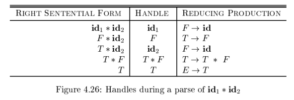

### 4.5.3 移入-归约语法分析技术

在对输入串的一次从左到右扫描过程中，语法分析器将零个或多个输入符号移到栈的顶端，直到它可以对栈顶的一个文法符号串 $\beta$ 进行归约为止。重复这个过程直到检测到语法错误，或栈中包含了开始符号且输入缓冲区为空为止。

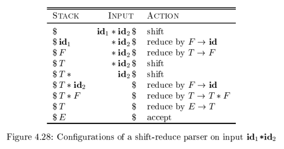

原理：句柄总是出现在栈的顶端，不会出现在栈的中间

### 4.5.4 移入-归约语法分析中的冲突

1. 移入/归约冲突
2. 归约/归约冲突

## 4.6 LR 语法分析技术介绍：简单 LR 技术

LR(k) 语法分析  
L：对输入进行从左到右的扫描  
R：反向构造出一个最右推导序列  
k：在做出语法分析决定时向前看 k 个输入符号

k=0 和 k=1 这两种情况具有实践意义，因此这里只考虑 k≤1 的情况  
省略 (k) 时，假设 k=1

### 4.6.1 为什么使用 LR 语法分析器

略

### 4.6.2 项和 LR(0) 自动机

一个 LR 语法分析器通过维护一些状态，用这些状态来表明我们在语法分析过程中所处的位置，从而做出移入-归约决定  
这些状态代表了 “项” 的集合

一个文法 G 的一个 LR(0) 项：G的一个产生式 + 一个位于它的体中某处的点

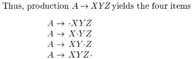

产生式 $A\rightarrow \epsilon$ 只生成一个项 $A\rightarrow \cdot$

项指明了在语法分析过程中的给定点上，我们已经看到了一个产生式的哪些部分  
$A\rightarrow \cdot XYZ$：希望看到一个从 XYZ 推导得到的串  
$A\rightarrow X\cdot YZ$：刚刚看到了可以由 X 推导得到串，希望看到一个从 YZ 推导得到的串  
$A\rightarrow XYZ\cdot$：已经看到了产生式体 XYZ，是时候归约成 A 了

增广文法  
如果 G 是一个以 S 为开始符号的文法，那么 G 的增广文法 G' 就是在 G 中加上新开始符号 S' 和产生式 $S' \rightarrow S$ 而得到的文法

项集的闭包

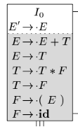

GOTO 函数  
GOTO(I, X)：I 是项集，X 是文法符号，GOTO(I, X) 表示 I 中所有形如 $[A\rightarrow \alpha \cdot X\beta]$ 的项对应的项 $[A\rightarrow \alpha X \cdot \beta]$ 的集合的闭包

LR(0) 自动机  
状态：规范 LR(0) 项集族中的元素  
转换：GOTO 函数  
开始状态：CLOSURE({$[S'\rightarrow \cdot S]$})，S' 是增广文法的开始符号  
接受状态：所有状态

LR(0) 的移入-归约：当前状态 j，下一个输入符号为 a
1. 状态 j 有一个在 a 上的转换，移入 a
2. 否则，归约

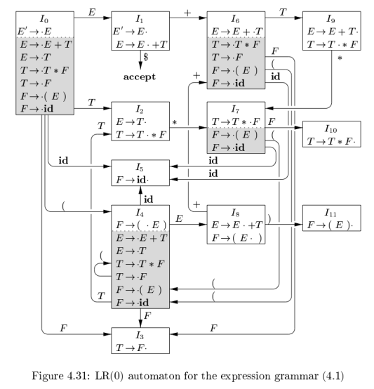

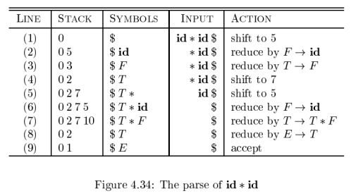

栈中存放的是状态，注意归约时，状态和符号同步变化

严格来说，这个语法不是 LR(0)  
LR(0)：若项目集中存在完整项（归约），则只有这一个项，不能有其他的完整项或移进项  
上图中的 I2 就不符合规则

### 4.6.3 LR 语法分析算法

LR 语法分析器模型

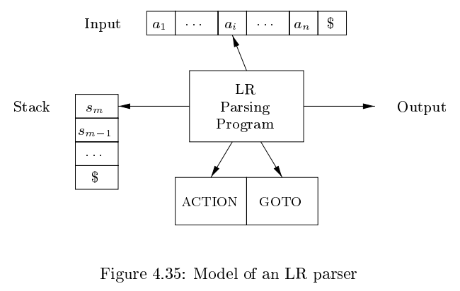

eg. 

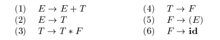

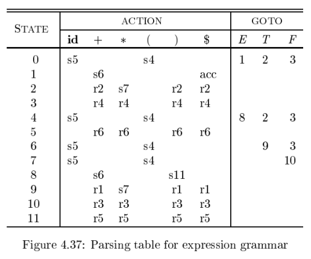

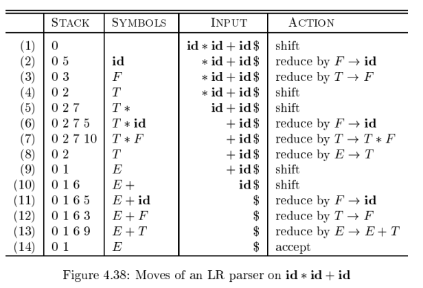

### 4.6.4 构造 SLR 语法分析表

语法分析表中，有 ACTION 函数和 GOTO 函数  
ACTION 针对于终结符号，GOTO 针对于非终结符号，它们的移入动作都可以通过自动机直接得到  
对于归约动作：如果 $[A\rightarrow \alpha\cdot]$ 在 $I_i$，对于 FOLLOW($A$) 中所有的 $a$，ACTION$[i,a]$ = $A\rightarrow \alpha$  
如果 $[S'\rightarrow S\cdot]$ 在 $I_i$，ACTION$[i,\$]$ = acc

SLR 分析器可能有移入/归约冲突，因为构造 SLR 分析器的方法功能不够强大，不能记住足够多的上下文信息  
接下来讨论的 LR 方法和 LALR 方法将可以成功地处理更大的文法类型

eg.  
$S\rightarrow L=R$ | $R$  
$L\rightarrow *R$ | $id$  
$R\rightarrow L$  

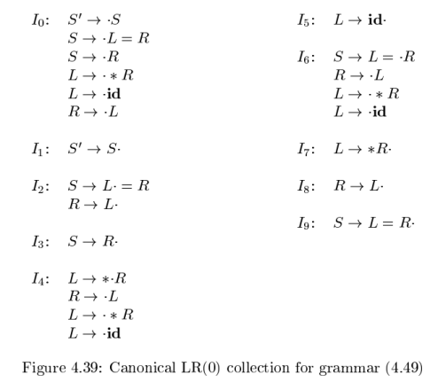

考虑 I2，= 属于 FOLLOW(R)  
故在 I2 遇到输入 = ，存在移入/归约冲突

### 4.6.5 可行前缀

可行前缀：可以出现在一个移入-归约语法分析器的栈中的最右句型前缀  
1. 可行前缀是一个最右句型的前缀
2. 可行前缀没有越过该最右句型的最右句柄的右端

总是可以在一个可行前缀之后增加一些终结符号来得到一个最右句型

如果存在一个推导过程 $S\stackrel{*}{\Rightarrow}_{rm} \alpha A \omega \Rightarrow_{rm} \alpha \beta_1 \beta_2 \omega$  
项 $A\rightarrow \beta_1 \cdot \beta_2$ 对于可行前缀 $\alpha \beta_1$ 有效

项 $A\rightarrow \beta_1 \cdot \beta_2$ 对于可行前缀 $\alpha \beta_1$ 有效包含很多信息  
当在语法分析栈中发现 $\alpha \beta_1$ 时，这些信息可以帮助我们选择归约还是移入  
1. $\beta_1 \ne \epsilon$，句柄还没有完全移入到栈，应选择移入
2. $\beta_1 = \epsilon$，归约

LR 语法分析理论的核心定理：如果在某个文法的 LR(0) 自动机中，从初始状态开始沿着标号为某个可行前缀 $\gamma$ 的路径到达一个状态，该状态对应的项集就是 $\gamma$ 的有效项集

$E + T *$ 是该文法的一个可行前缀，自动机读入 $E + T *$ 后位于状态 7，状态 7 的项

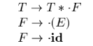

它们是 $E+T*$ 的有效项

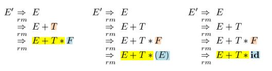

## 4.7 更强大的 LR 语法分析器

1. 规范 LR 方法，即 LR 方法
2. 向前看 LR，即 LALR 方法

### 4.7.1 规范 LR(1) 项

考虑 4.6.4 的移入/归约冲突例子  
其实文法中没有以 $R=\cdots$ 开头的最右句型，所以不应该执行归约  
如果在状态中包含更多的信息，就可能排除一些这样的不正确的 $A\rightarrow \alpha$ 归约

对项进行精化：$[A\rightarrow \alpha \cdot \beta,a]$  
$A\rightarrow \alpha \beta$：产生式  
$a$：一个终结符号或右端结束标记 $  
称这样的对象为 LR(1) 项，1 指第二个分量的长度，第二个分量称为这个项的向前看符号  
1. $[A\rightarrow \alpha \cdot \beta,a]$，且 $\beta \ne \epsilon$：向前看符号没有意义  
2. $[A\rightarrow \alpha \cdot,a]$：只有在下一个输入符号为 a 时，才按 $A\rightarrow \alpha$ 归约

之前可行前缀的定义  
项 $A\rightarrow \beta_1 \cdot \beta_2$ 对于可行前缀 $\alpha \beta_1$ 有效的条件：  
存在一个推导过程 $S\stackrel{*}{\Rightarrow}_{rm} \alpha A \omega \Rightarrow_{rm} \alpha \beta_1 \beta_2 \omega$  

可行前缀的新定义  
项 $[A\rightarrow \beta_1 \cdot \beta_2,a]$ 对于可行前缀 $\alpha \beta_1$ 有效的条件：  
1. 存在一个推导过程 $S\stackrel{*}{\Rightarrow}_{rm} \alpha A \omega \Rightarrow_{rm} \alpha \beta_1 \beta_2 \omega$
2. $a$ 是 $\omega$ 的第一个符号，或者 $\omega=\epsilon$ 且 $a=\$$

eg. 考虑文法  
$S\rightarrow BB$  
$B\rightarrow \alpha B$ | $b$  
1. 最右推导 $S\stackrel{*}{\Rightarrow}_{rm} aaBab \Rightarrow_{rm} aaaBab$，则 $[B\rightarrow a \cdot B,a]$ 对可行前缀 $aaa$ 有效
2. 最右推导  $S\stackrel{*}{\Rightarrow}_{rm} BaB \Rightarrow_{rm} BaaB$，则 $[B\rightarrow a \cdot B,\$]$ 对可行前缀 $Baa$ 有效 

### 4.7.2 构造 LR(1) 项集

起始：{$[S'\rightarrow \cdot S,\$]$} 的闭包  
对于 $[A\rightarrow \alpha \cdot B \beta,a]$，将 $[B\rightarrow \cdot \gamma,b]$ 加入闭包，其中 $b$ 属于 FIRST($\beta a$)

### 4.7.3 规范 LR(1) 语法分析表

如果 $[A \rightarrow \alpha \cdot, a]$ 在 $I_i$ 中且 $A \ne S'$，则 ACTION$[i,a]$ = 归约 $A \rightarrow \alpha$  
如果 $[S' \rightarrow S \cdot, \$]$ 在 $I_i$ 中，则 ACTION$[i,\$]$ = acc

规范 LR(1) 语法分析器的状态要比同一文法对应的 SLR 语法分析器的状态多

eg.

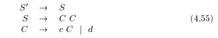

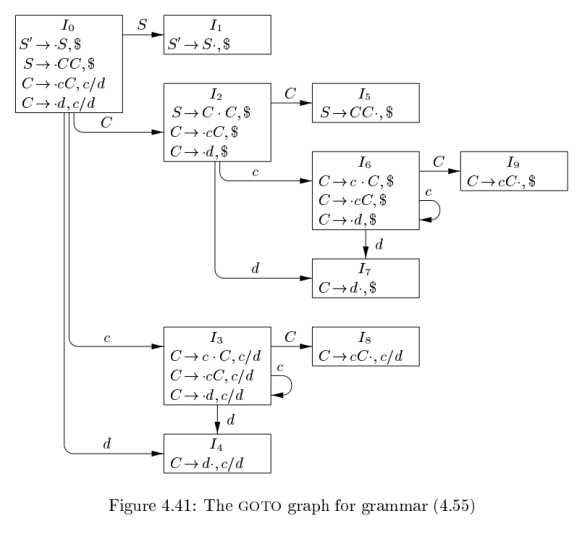

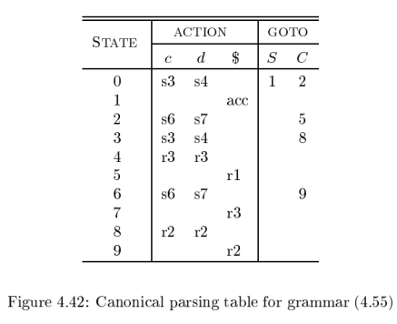

### 4.7.4 构造 LALR 语法分析表

项集的核心：第一分量的集合  
LALR（向前看-LR）技术：寻找具有相同核心的 LR(1) 项集，并将这些项集合并为一个项集

eg. 

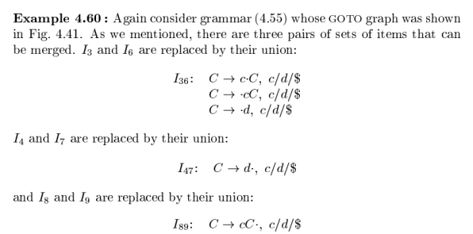

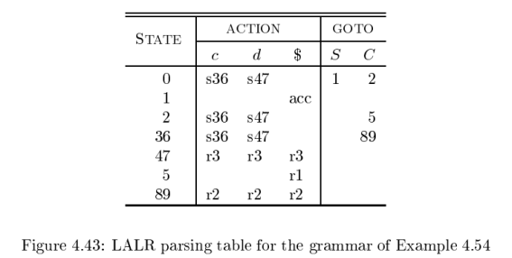

### 4.7.5 高效构造 LALR 语法分析表的方法

文法

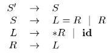

LR (0) 项

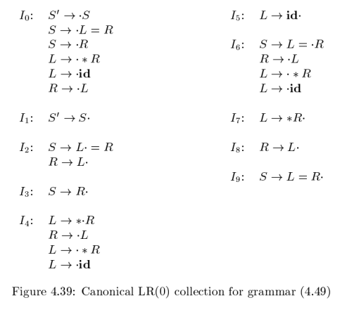

内核项

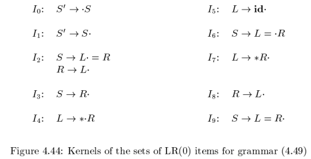

传播和自发生成向前看符号
1. $[S \rightarrow \cdot L=R,\cdots]$，$[L \rightarrow \cdot * R,=]$，则 “=” 是自发生成的
2. $[S \rightarrow L= \cdot R,\$]$，$[R \rightarrow \cdot * R,\$]$，则 “$” 是传播得到的

向前看符号的传播

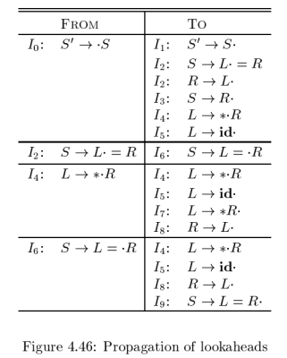

不断扫描所有内核项

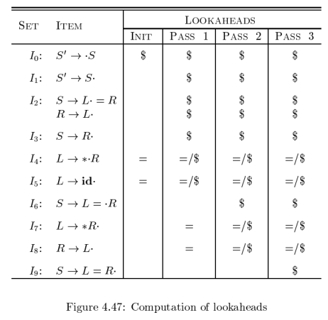

## 4.8 使用二义性文法

### 4.8.1 用优先级和结合性解决冲突

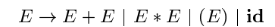

这个文法是二义性的，LR (0) 项集如下

**优先级解决冲突**
考虑输入 id + id * id  
语法分析器处理完 id + id 后进入状态 7，也就是处于如下格局

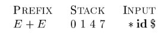

1. 若 $*$ 的优先级高于 +，应将 $*$ 移入栈，准备将这个 $*$ 和它两边的 id 符号归约为一个表达式
2. 若 + 的优先级高于 $*$，应将 E + E 归约为 E

**结合性解决冲突**  
假如输入是 id + id + id  
语法分析器处理完 id + id 后，栈内容也为 0147  
输入为 +，状态 7 中存在移入/归约冲突  
如果 + 是左结合的，应该按照 $E \rightarrow E + E$ 归约

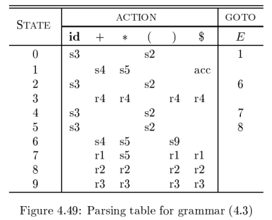

### 4.8.2 “悬空-else” 的二义性

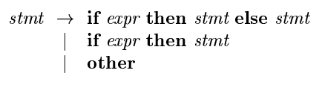

重写这个产生式
1. i 表示 if expr then
2. e 表示 else
3. a 表示“所有其他的产生式”

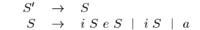

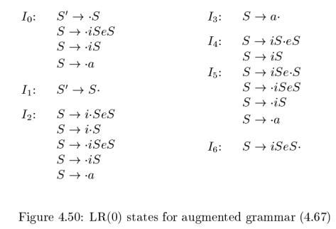

假设栈中内容为 if expr then stmt  
输入符号为 else  
此时有两个选择
1. 移入 e：将 else 移入栈中
2. $S \rightarrow iS$ 归约：将 if expr then stmt 归约

答案是移入 else，因为它和前一个 then 相关

I4 移入/归约冲突：
1. $S \rightarrow iS \cdot eS$：e 移入
2. $e \in FOLLOW(S)$：$S \rightarrow iS$ 归约

解决 I4 的移入/归约冲突：输入为 e 时执行移入动作

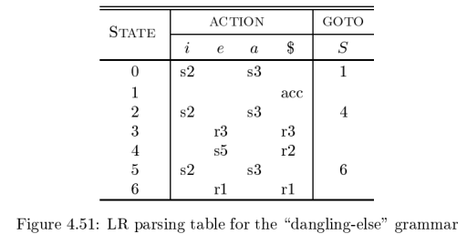

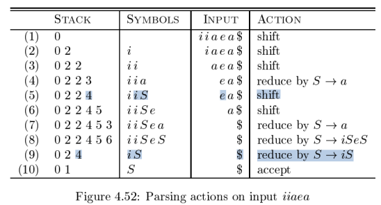

### 4.8.3 LR 语法分析中的错误恢复

当 LR 语法分析器在查询语法分析动作表并发现一个报错条目时，它就检测到了一个语法错误  
在查询 GOTO 表时不会发现语法错误

规范 LR 语法分析器不会做任何多余的归约动作，会立刻报告错误  
SL 和 LALR 语法分析器可能会在报错之前执行几次归约动作，但是不会把一个错误的输入符号移入到栈中

恐慌模式错误恢复
1. 从栈顶向下扫描，直到发现某个状态 s，它有一个对应于某个非终结符号 A 的 GOTO 目标
2. 丢弃零个或多个输入符号，直到发现一个可能合法地跟在 A 之后的符号 a 为止
3. 将 GOTO(s, A) 压入栈中，继续进行正常的语法分析

短语层次错误恢复：检查 LR 语法分析表中的每个报错条目，并根据语言的使用方法来决定程序员所犯的何种错误最有可能引起这个语法错误，然后构造出适当的恢复过程

在为一个 LR 语法分析器设计专门的错误处理例程时，可以在表的动作字段的每个空条目中填写一个指向错误处理例程的指针，该例程将执行编译器设计者所选定的恢复动作

eg. 考虑如下文法

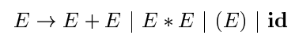

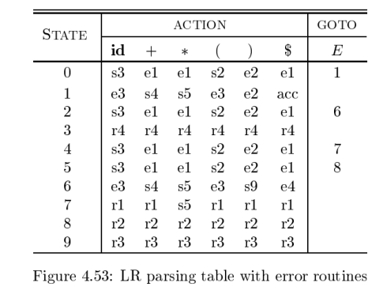

e1：在状态 0，2，4，5 上被调用，这些状态都期望读入一个运算分量的第一个符号，这个符号可能是 id 或左括号，但实际读入的却是 +、$*$、或输入结束标记
1. 将状态3（状态 0，2，4，5 在输入 id 上的 GOTO 目标）压入栈中
2. 发出诊断信息 “缺少运算分量”

e2：在状态 0，1，2，4，5 上发现输入为右括号时调用
1. 从输入中删除右括号
2. 发出诊断信息 “不匹配的右括号”

e3：在状态 1 和 6 上，期待读入一个运算符，却发现了一个 id 或左括号时调用
1. 把状态4（“+” 对应的状态）压入栈中
2. 给出诊断信息 “缺少运算符”

e4：在状态 6 上发现输入结束标记时调用
1. 将状态 9（对应右括号）压入栈中
2. 发出诊断信息 “缺少右括号”

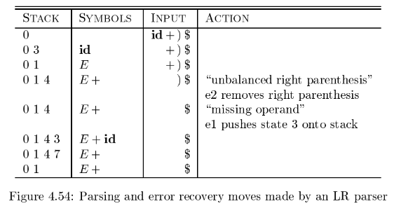

## 4.9 语法生成器工具

### 4.9.1 语法分析器生成工具 Yacc

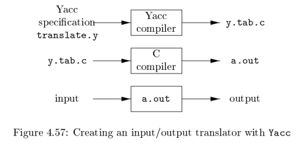

一个 Yacc 源程序由三个部分组成

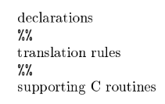

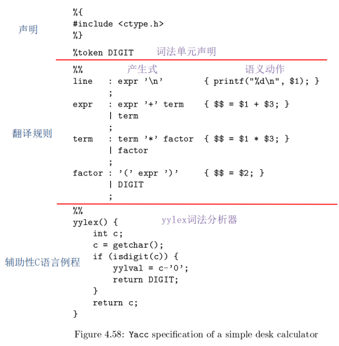

