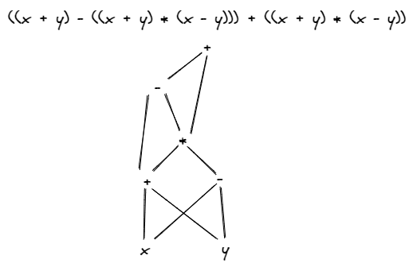
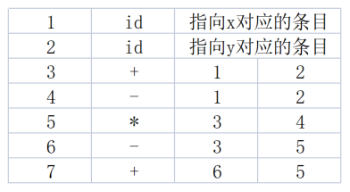
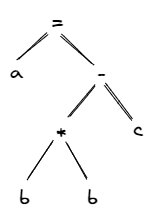
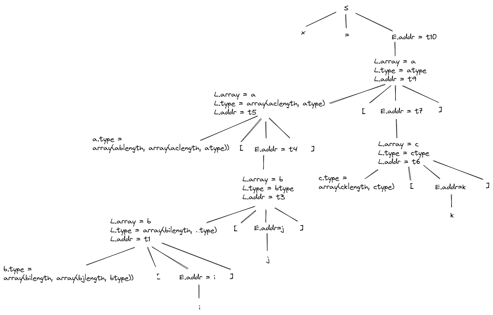

# 作业 10

练习6.1.1：为下列表达式构建 DAG 并指出每个子表达式的值编码  
$((x + y) - ((x + y) * (x - y))) + ((x + y) * (x - y))$

答：




练习6.1.2：将语句 a = b * b - c 翻译为
1. 抽象语法树
2. 四元式序列
3. 三元式序列
4. 间接三元式序列

答：
抽象语法树



四元式序列

|     | op  | arg1 | arg2 | result |
| --- | --- | ---- | ---- | ------ |
| 0   | *   | b    | b    | t1     |
| 1   | -   | t1   | c    | t2     |
| 2   | =   | t2   |      | a      |

三元式序列

|     | op  | arg1 | arg2 |
| --- | --- | ---- | ---- |
| 0   | *   | b    | b    |
| 1   | -   | (0)  | c    |
| 2   | =   | a    | (1)  |

间接三元式序列

|     | instruction |
| --- | ----------- |
| 0   | (0)         |
| 1   | (1)         |
| 2   | (2)         |

|     | op  | arg1 | arg2 |
| --- | --- | ---- | ---- |
| 0   | *   | b    | b    |
| 1   | -   | (0)  | c    |
| 2   | =   | a    | (1)  |

练习6.1.3：确定下列声明序列中各个标识符的类型和相对地址，这里我们使用龙书 6.3.2 中提到的文法。

```
float x;
record { float x; float y; } p;
record {
	record { int tag; float x; } m;
	float y;
} q;
```

答：

| line | id  | type   | offset | Evn |
| ---- | --- | ------ | ------ | --- |
| 1    | x   | float  | 0      | 1   |
| 2    | x   | float  | 0      | 2   |
| 2    | y   | float  | 8      | 2   |
| 2    | p   | record | 8      | 1   |
| 4    | tag | int    | 0      | 4   |
| 4    | x   | float  | 4      | 4   |
| 4    | m   | record | 0      | 3   |
| 5    | y   | float  | 12     | 3   |
| 6    | q   | record | 24     | 1   |

练习6.1.4：考虑龙书图 6-22 的翻译方案，翻译赋值语句  
$x = a[b[i][j]][c[k]];$  
并给出注释语法分析树。

答：

```
t1 = i * bi.width
t2 = j * bj.width
t3 = t1 + t2
t4 = b[t3]
t5 = t4 * ab.width
t6 = k * ck.width
t7 = c[t6]
t8 = t7 * ac.width
t9 = t5 + t8
t10 = a[t9]
x = t10
```

