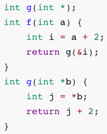
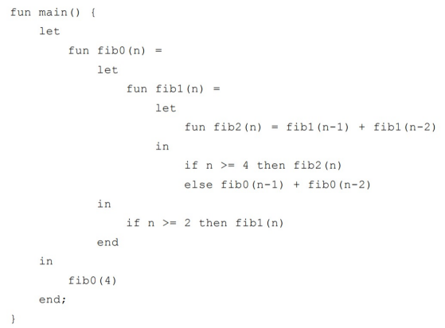
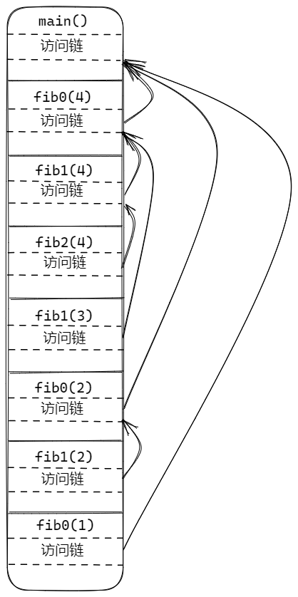
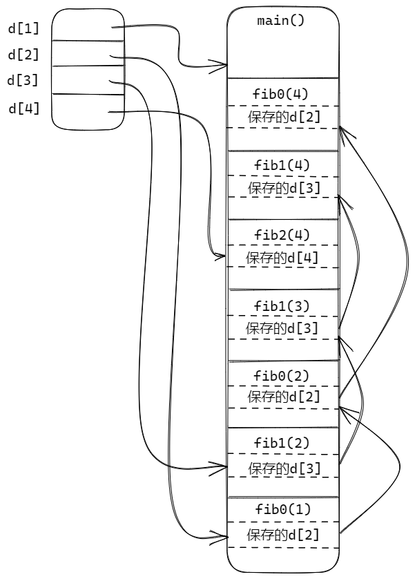

# 作业 12

2020K8009929017 侯昱帆

练习7.1.1：考虑 C 语言的函数 f 和 g：按照图 7-7 的约定，不考虑编译器优化，讨论当 f 调用 g 而 g 即将返回时运行时栈的状态，其中 f 的参数 a = 3 。只需要讨论返回值、参数、控制链和代码中体现的局部数据。指出
1. 哪个函数在栈中为各个元素创建了所使用的空间？
2. 哪个函数写入了各个元素的值？参数、返回值和局部变量的值是什么？
3. 这些元素属于哪个活动记录？

答：

| 符号       | 创建者     | 写入者     | 值       | 所属活动记录 |
| ---------- | ---------- | ---------- | -------- | ------------ |
| int a      | f 的调用者 | f 的调用者 | 3        | f            |
| f 的返回值 | f 的调用者 | f          |          | f            |
| f 的控制链 | f 的调用者 | f 的调用者 |          | f            |
| int i      | f          | f          | 5        | f            |
| int \*b    | f          | f          | i 的地址 | g            |
| g 的返回值 | f          | g          | 7        | g            |
| g 的控制链 | f          | f          |          | g            |
| int j      | g          | g          | 5        | g            |

练习7.1.2：考虑下面的 Fibonacci 函数：
嵌套在 fib0 中的是 fib1，它假设 n >= 2 并计算第 n 个 Fibonacci 数。
嵌套在 fib1 中的是 fib2，它假设 n >= 4。
请注意，fib1 和 fib2 都不需要检查基本情况。我们考虑从对 main 的调用开始，直到（对 fib0(1) 的）第一次调用即将返回的时段。
1. 请描述出当时的活动记录栈，并给出栈中的各个活动记录的访问链。
2. 假设我们使用 display 表来实现下图中的函数。请给出 fib0(1) 的第一次调用即将返回时的 display 表。同时指明那时在栈中的各个活动记录中保存的 display 表条目。

答：

