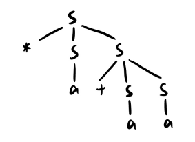
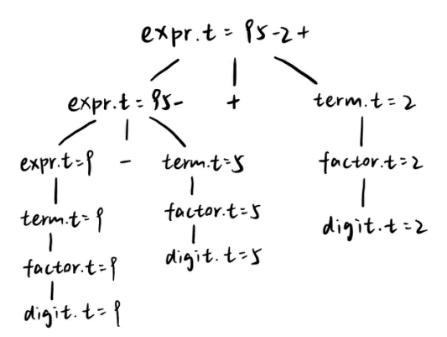
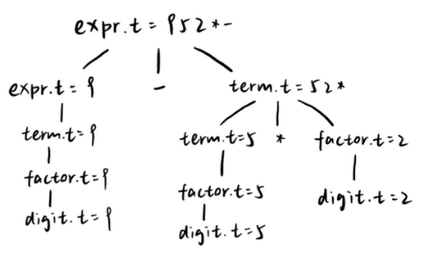

2020K8009929017 侯昱帆

练习2.1.1：考虑下面的上下文无关文法：

$S\rightarrow+SS\,|\,*SS\,|\,a$

1. 试说明如何使用文法生成串 $*a+aa$
2. 试为这个串构造一颗语法分析树
3. 该文法生成的语言是什么？
4. 该文法具有二义性吗？为什么？


答：

1. $S\Rightarrow*SS\Rightarrow*aS\Rightarrow*a+SS\Rightarrow*a+aS\Rightarrow*a+aa$
2. 如下图
  
3. 由 $a,*,+$ 构成的前缀表达式
4. 没有二义性


练习2.1.2：考虑文法
$num\rightarrow 101\,|\,1111\,|\,num\,0\,|\,num\,num$
1. 证明：用该文法生成的所有二进制串的值都能被5整除（提示：对语法分析树的结点数目，即推导步数，使用数学归纳法）
2. 上面的文法是否能够生成所有能被5整除的二进制串？


答：
1. 令推导步数为k，

   当k=1时

   - $num\Rightarrow101$，$101_2=5_{10}$，能被5整除 

   - $num\Rightarrow1111$，$1111_2=15_{10}$，能被5整除假

   设k≤n-1时，生成的所有二进制串的值都能被5整除

   当k=n，推导的第一步有两种情况

   - $num\Rightarrow num_1\,0$，因为 $num_1$ 经过n-1步推导形成的串能被5整除，故 $num$ 也能被5整除
   - $num\Rightarrow num_1\,num_2$，因为 $num_1$ 和 $num_2$ 经过不超过n-1步推导形成的串能被5整除，故 $num$ 也能被5整除

   综上，用该文法生成的所有二进制串的值都能被5整除

2. 不能，该文法不能生成0


练习2.1.3：构建一个语法制导翻译方案，该方案把算术表达式从中缀表示方式翻译为运算符在运算分量之后的后缀表示方式。例如，xy− 是表达式 x−y 的后缀表示。给出输入 9−5+2 和 9−5∗2 的注释分析树。


答：
$expr\rightarrow expr+term\,\,\{print('+')\}$
$expr\rightarrow expr-term\,\,\{print('-')\}$
$expr\rightarrow term$
$term\rightarrow term*factor\,\,\{print('*')\}$
$term\rightarrow term/factor\,\,\{print('/')\}$
$term\rightarrow factor$
$factor\rightarrow digit\,\,\{print('digit')\}$
$factor\rightarrow (expr)$






练习2.1.4：从 C99 标准开始，C 语言的 for 语句中初始化子句可以是声明，例如：
for ( int i = 0; i < n; i++ )
第一在 C++ 中允许类似的语法，但区别是：C++ 中 *初始化语句* 的作用域与 *循环语句* 的作用域一致，而在 C 中 *循环语句* 的作用域嵌套于 *初始化语句* 的作用域中。例如
for (int i = 0; ; ) { long i = 1; // 在 C 中合法，在 C++ 中非法}
参考龙书图2-37中的实现，试讨论在两种 for 语句实现中分别应该如何实现符号表来正确区分变量和避免重复声明。


答：

C语言

```
public class Env{
	private Hashtable table;
	protected Env prev;
	
	public Env(Env p){
		table = new Hashtable();
		prev = p;
	}
	
	public void put(String s, Symbol sym){
		table.put(s, sym);
	}
	
	public Symbol get(String s){
		for(Env e = this; e != null; e = e.pre){
			Symbol found = (Symbol)(e.table.get(s));
			if(found != null) return found;
		}
		return null;
	}
}
```

C++
```
public class Env{
	private Hashtable table;
	protected Env prev;
	
	public Env(Env p){
		table = new Hashtable();
		prev = p;
	}
	
	public void put(String s, Symbol sym){
		for(Env e = this; e != null; e = e.pre); // 找到for循环语句的符号表
		if(e.table.get(s))                       // 如果s已经在for符号表声明过了，报错
			System.out.println("ERROR");
		else 
			table.put(s, sym);
	}
	
	public Symbol get(String s){
		for(Env e = this; e != null; e = e.pre){
			Symbol found = (Symbol)(e.table.get(s));
			if(found != null) return found;
		}
		return null;
	}
}
```
