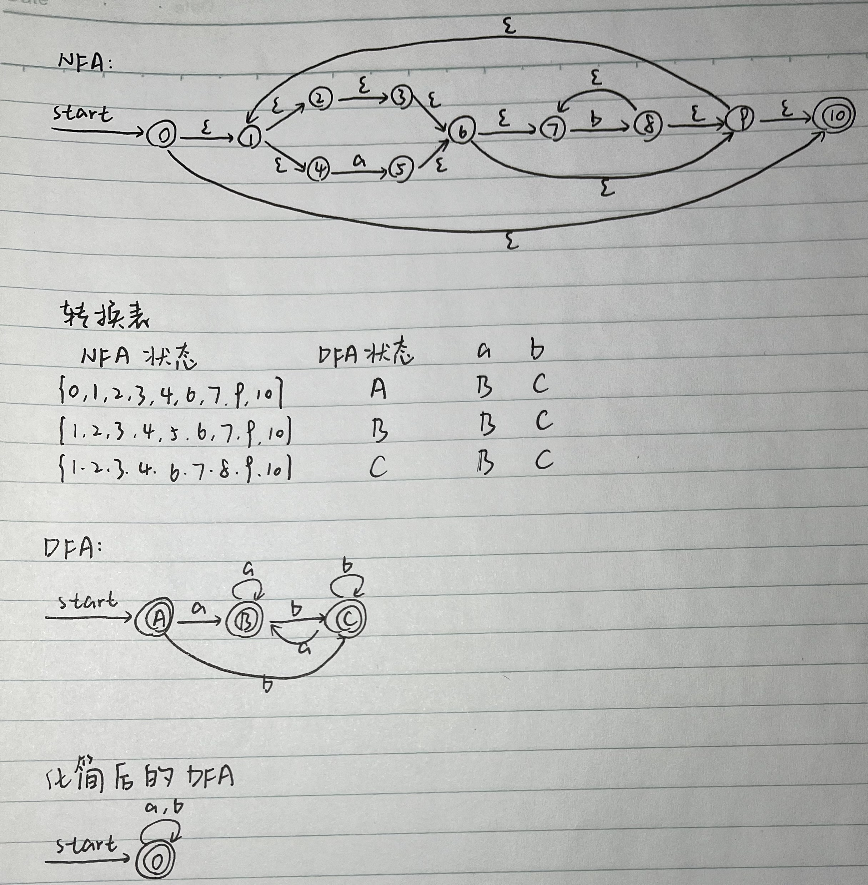

# 作业4

练习3.2.1：为下面的语言设计一个DFA或NFA
1) 包含5个元音的所有小写字母串，这些串中的元音按顺序出现
2) 以a开头且以a结尾，中间由零个或多个a或b的实例构成的串

答：

练习3.2.2：模拟下图所示NFA处理输入aabb的过程

答：
$start\rightarrow \{0\}\stackrel{a}{\rightarrow}\{0,1\}\stackrel{a}{\rightarrow}\{0,1\}\stackrel{b}{\rightarrow}\{0,2\}\stackrel{b}{\rightarrow}\{0,2,3\}$

练习3.2.3：使用算法3.23和3.20将下述正则表达式转换为DFA，并尝试化简该DFA
1) $((\epsilon|a)b*) *$
2) $(a | b)*abb(a | b)*$

答：
(1)

(2)

