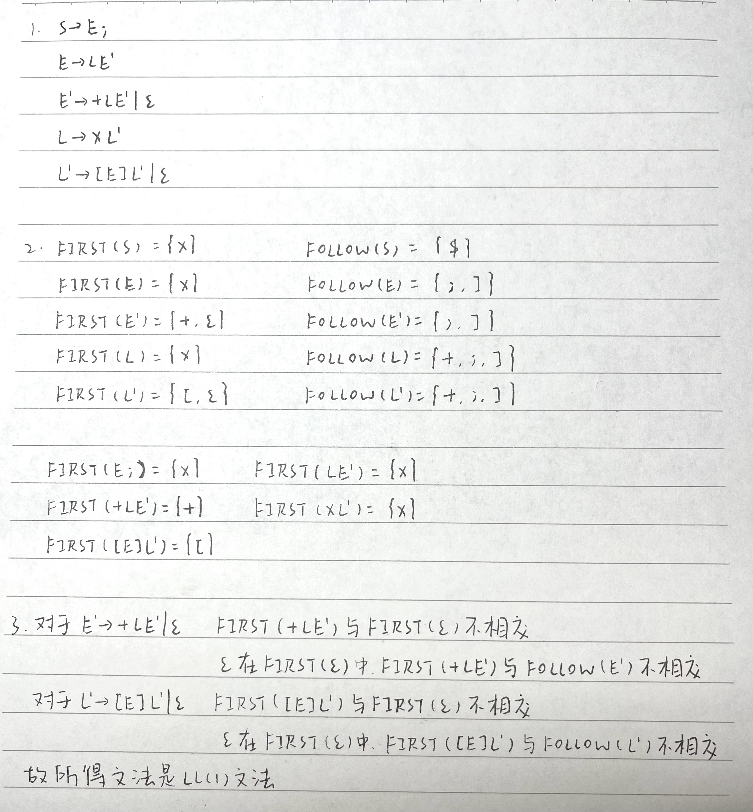
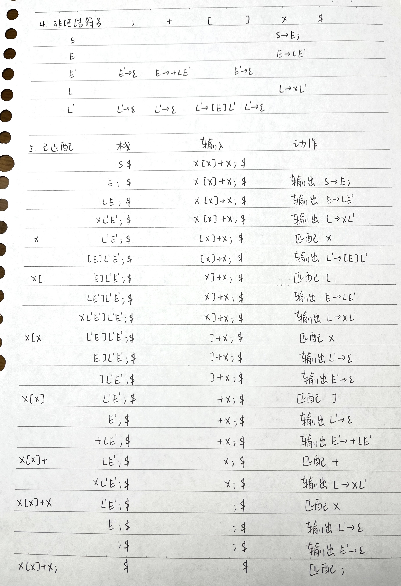

# 作业6

练习4.2.1：使得文法的预测分析产生回溯的原因是什么？仅使用 FIRST 集合可以避免回溯吗？为什么？

答：

回溯原因：某个非终结符 A 有多个产生式，匹配时无法确定选择哪个候选式，只能逐一进行试探，因此会引起回溯。

仅使用 FIRST 集合不能避免回溯。比如对于产生式 $A\rightarrow \alpha$，如果 $\epsilon$ 在 FIRST($\alpha$)，还需要把 $A\rightarrow \alpha$ 加入到 $M[A,b]$ 中，其中 $b$ 是 FOLLOW($A$)。如果没有 FOLLOW 集就会发生回溯。

练习4.2.2：考虑文法：

$S\rightarrow E;$

$E\rightarrow E+L\,|\,L$

$L\rightarrow L[E]\,|\,x$

1. 消除左递归
2. 求得该文法的FIRST集合和FOLLOW集合
3. 说明所得的文法是LL(1)文法
4. 为所得的文法构造LL(1)分析表
5. s对输入串 $x[x]+x;$ 给出相应得LL(1)分析程序的动作

答：

