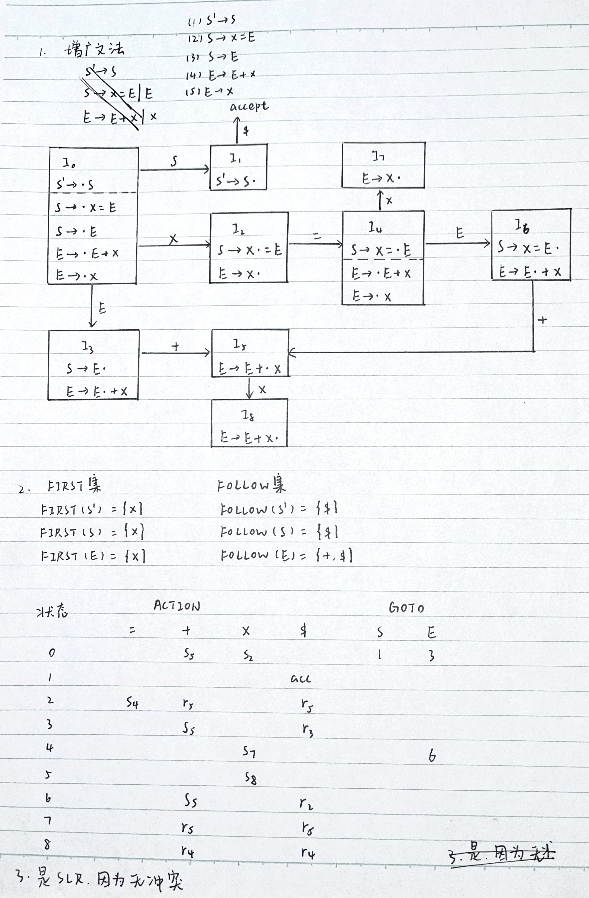
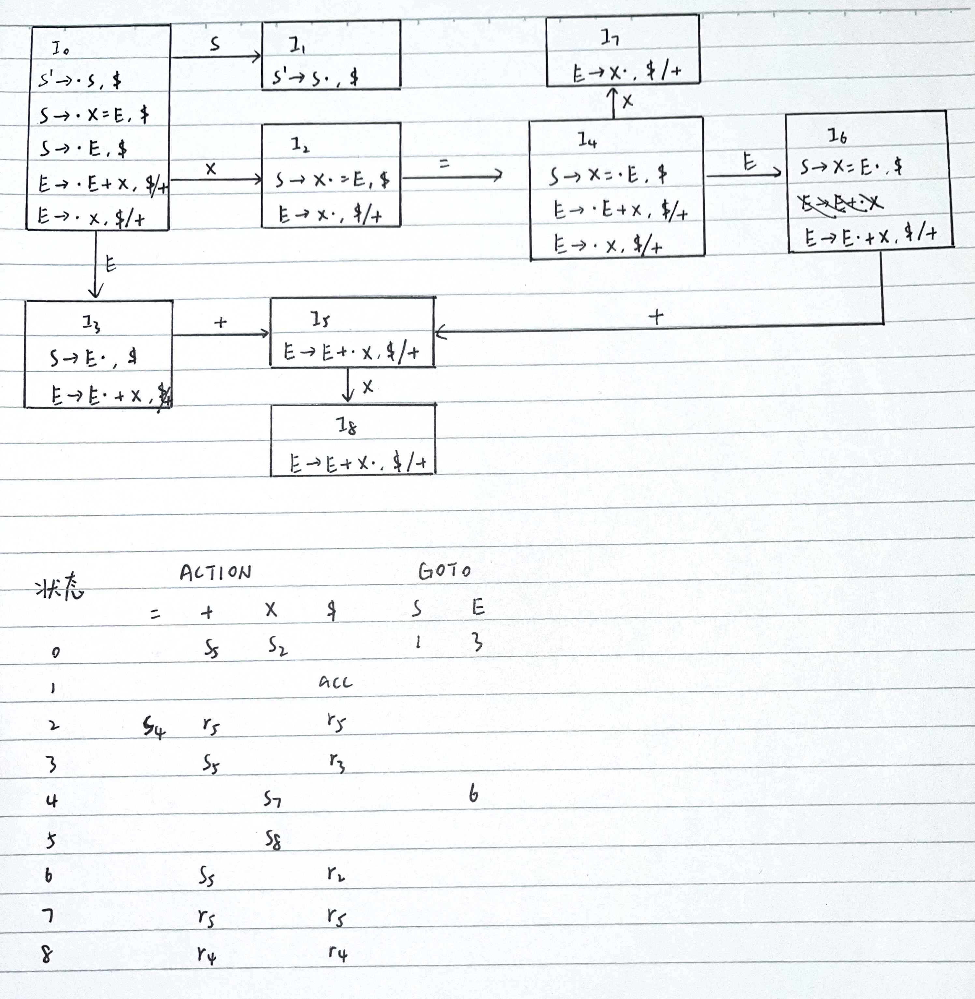

# 作业7

练习4.3.1：对于文法 $S\rightarrow SS+\,|\,S*\,|\,a$ ，指出下列最右句型归约时使用的句柄：
1. $aa*a++a+$
2. $SS+a*+$
3. $SS*+$

答：
|最右句型|句柄|归约所用产生式|
|---|---|---|
|$aa*a++a+$|$a$|$S\rightarrow a$|
|$Sa*+a++a+$|$a$|$S\rightarrow a$|
|$SS*a++a+$|$S*$|$S\rightarrow S*$|
|$SSa++a+$|$a$|$S\rightarrow a$|
|$SSS++a+$|$SS+$|$S\rightarrow SS+$|
|$SS+a+$|$SS+$|$S\rightarrow SS+$|
|$Sa+$|$a$|$S\rightarrow a$|
|$SS+$|$SS+$|$S\rightarrow SS+$|
|$S$|-|-|

|最右句型|句柄|归约所用产生式|
|---|---|---|
|$SS+a*+$|$SS+$|$S\rightarrow SS+$|
|$Sa*+$|$a$|$S\rightarrow a$|
|$SS*+$|$S*$|$S\rightarrow S*$|
|$SS+$|$SS+$|$S\rightarrow SS+$|
|$S$|-|-|

|最右句型|句柄|归约所用产生式|
|---|---|---|
|$SS*+$|$S*$|$S\rightarrow S*$|
|$SS+$|$SS+$|$S\rightarrow SS+$|
|$S$|-|-|

练习4.3.2：考虑文法  
$S\rightarrow x=E\,|\,E$  
$E\rightarrow E+x\,|\,x$

1. 增广该文法，构造 SLR 项目集和状态转化图
2. 计算项目集的 GOTO 函数和这个文法的语法分析表
3. 这个文法是不是 SLR 文法？为什么？

答：

练习4.3.3：对 4.3.2 中文法

1. 构造规范 LR 项目集和状态转化图
2. 构建语法分析表
3. 构建 LALR 项目集族

答：LR项目集，状态转化图和语法分析表如下

LALR 项目集族与LR项目集相同