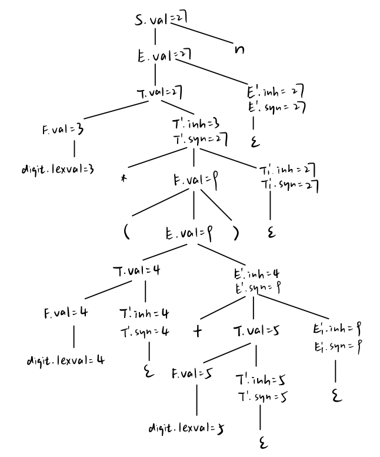

# 作业8

练习5.1.1：考虑文法
S → E n
E → E + T | T
T → T * F | F
F → ( E ) | digit
其中 S, E, T, F 为非终结符
1. 消除左递归
2. 对消除左递归后的文法，给出一个语法制导定义，使得 S.val 为表达式 S 的值。注：digit.lexval 表示数字字面量的值
3. 使用上面得到的 SDD，给出 $3*(4+5)n$ 的注释语法分析树

答：
S → E n
E → T E'
E' → + T E' | ε
T → F T'
T' → * F T' | ε
F → (E)
F → digit

| 产生式         | 语义规则             |
| -------------- | -------------------- |
| 1) $S\rightarrow En$ | $S.val=E.val$ |
| 2) $E\rightarrow TE'$ | $E'.inh=T.val$,  $E.val=E'.syn$ |
| 3) $E'\rightarrow +TE_1'$ | $E_1'.inh=E'.inh+T.val$, $E'.syn=E_1'.syn$ |
| 4) $E'\rightarrow ε$ | $E'.syn=E'.inh$ |
| 5) $T\rightarrow FT'$ | $T'.inh=F.val$, $T.val=T'.syn$ |
| 6) $T'\rightarrow *FT_1'$ | $T_1'.inh=T'.inh\times F.val$, $T'.syn=T_1'.syn$ |
| 7) $T'\rightarrow ε$ | $T'.syn=T'.inh$ |
| 8) $F\rightarrow (E)$ | $F.val=E.val$      |
| 9) $F\rightarrow digit$ | $F.val=digit.lexval$ |

练习5.1.2：考虑产生式 A→BCD，其中 A、B、C、D 四个非终结符各有综合属性 s 和继承属性 i 。对于下面的规则
a) B.i = A.i; A.s = B.i + C.s
b) B.i = A.i; A.s = B.i + C.s; D.i = A.i + B.s
c) A.s = B.s + C.s
分别讨论

1. 这些规则是否满足 S 属性的要求？
2. 这些规则是否满足 L 属性的要求？
3. 是否存在和这些规则一致的求值过程？若不存在，请说明理由

答：
1. S 属性：a) 和 b) 不满足，因为 B.i 是继承属性，c) 满足
2. L 属性：a) b) c) 均满足
3. 存在