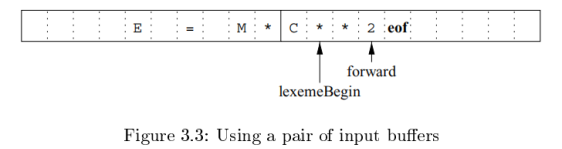
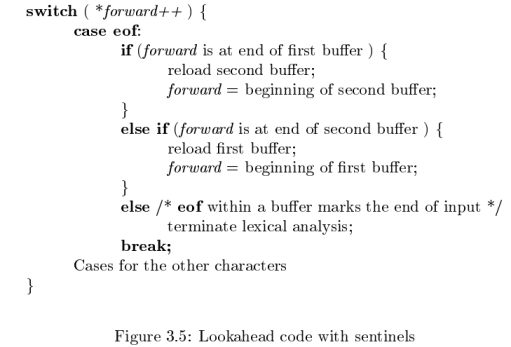

# 第3章 词法分析
## 3.1 词法分析的作用
### 3.1.1 词法分析及语法分析
划分词法分析和语法分析阶段的原因
1. 简化编译器的设计
2. 提高编译器的效率
3. 增强编译器的可以执行

### 3.1.2 词法单元、模式和词素

词法单元：词法单元名+可选的属性值  
模式：描述了一个词法单元的词素可能具有的形式  
词素：源程序中的一个字符序列，它和某个词法单元的模式匹配，并被词法分析器识别为该词法单元的一个实例

eg. 

C 语句 `printf("Total = %d\n", score);`  
`printf` 和 `score` 是和词法单元 **id** 的模式匹配的词素  
`"Total = %d\n"` 是和 **literal** 匹配的词素

下面的类别覆盖了大部分或所有的词法单元

1. 每个关键字都有一个词法单元，一个关键字的模式就是该关键字本身
2. 表示运算符的词法单元，可以表示单个运算符，也可以像 **comparison** 表示一类运算符
3. 一个表示所有标识符的词法单元
4. 一个或多个表示常量的词法单元，比如数字和字面值字符串
5. 每个标点符号都有一个词法单元，比如左右括号、逗号和分号

### 3.1.3 词法单元的属性

我们假设一个词法单元至多有一个相关的属性值，这个属性值可能是一个组合了多种信息的结构化数据

eg. **id**，通常会将很多信息和它关联  
和标识符有关的信息都保存在符号表，如词素、类型、第一次出现的位置  
一个标识符的属性值是一个指向符号表中该标识符对应条目的指针

eg. 

### 3.1.4 词法错误

错误情况：所有词法单元的模式都无法和剩余输入的某个前缀相匹配  
恐慌模式恢复：从剩余的输入中不断删除字符，直到词法分析器能够在剩余输入的开头发现一个正确的词法单元为止

可能采取的其他错误恢复动作：

1. 从剩余的输入中删除一个字符
2. 向剩余的输入中插入一个遗漏的字符
3. 用一个字符来替换另一个字符
4. 交换两个相邻的字符

## 3.2 输入缓冲

常常需要查看一个词素之后的若干字符才能够确定是否找到了正确的词素

### 3.2.1 缓冲区对

利用两个交替读入的缓冲区

每个缓冲区容量都是 N 个字符，通常 N 是一个磁盘块的大小，如 4096 字节  
可以一次将 N 个字符读入到缓冲区  
eof 标识源文件的结束

两个指针

1. lexemeBegin：指向当前词素的开始处
2. forward：一直向前扫描，直到发现某个模式被匹配为止

一旦确定了下一个词素，  

1. forward 指向该词素结尾的字符
2. 词法分析器将这个词素作为某个返回给语法分析器的词法单元的属性值记录下来
3. lexemeBegin 指向刚刚找到的词素之后的一个字符

forward指针前移要求我们首先检查是否已经到达某个缓冲区的末尾  
如果是，必须将 N 个新字符读到另一个缓冲区，且将 forward 指向这个新载入字符的缓冲区的头部

词素长度加上我们向前看的距离不能大于 N ，否则可能在识别词素之前覆盖掉尚在缓冲区的词素  
eg. 词素第一段在第一个缓冲区的末尾，第二段占据第二缓冲区，第三段被加载时又放到第一个缓冲区，这样就覆盖了词素的第一段

### 3.2.2 哨兵标记

上一节描述的方案，每次向前移动 forward指针时，都必须检查是否到达了缓冲区的末尾，若是，必须加载另一个缓冲区 

每读一个字符，必须做两次测试

1. 检查是否到达缓冲区的末尾
2. 确定读入的字符是什么

扩展每个缓冲区，使它们在末尾包含一个 “哨兵” 字符 eof，将对缓冲区末端的测试和对当前字符的测试合二为一

## 3.3 词法单元的规约

## 3.4 词法单元的识别

