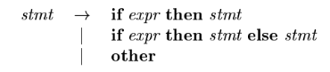
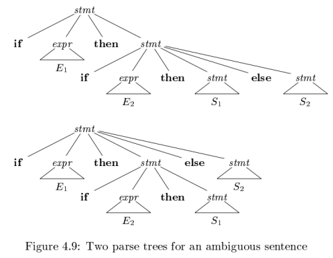
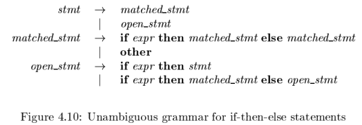
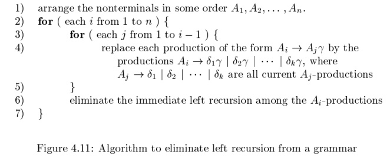
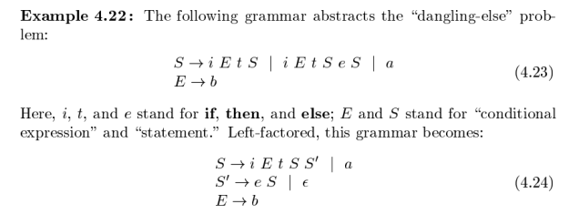
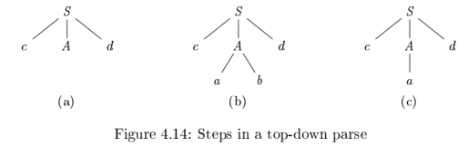
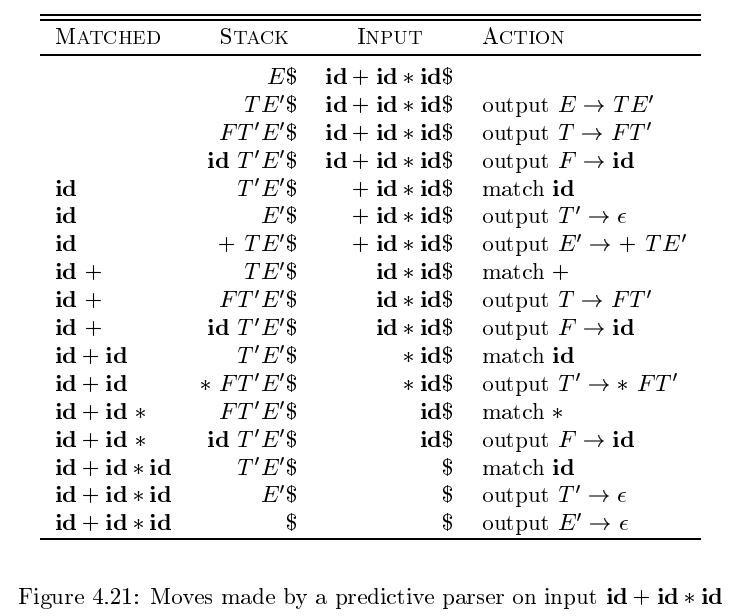

# 第4章 语法分析
## 4.1 引论
### 4.1.1 语法分析器的作用
语法分析器：从词法分析器获得一个由词法单元组成的串，并验证这个串可以由源语言的文法生成  
方法：构造出一棵语法分析树，并把它传递给编译器的其他部分进一步处理

自顶向下：从根结点向叶子结点构造语法分析树  
自底向上：从叶子结点向根结点构造语法分析树

两种分析方法中，语法分析器的输入总是按照从左向右的方式被扫描，每次扫描一个符号

### 4.1.2 代表性的文法
指明了运算符的结合性和优先级的文法  
$E\rightarrow E+T$ | $T$  
$T\rightarrow T*F$ | $F$  
$F\rightarrow(E)$ | $id$

无左递归  
$E\rightarrow TE'$  
$E'\rightarrow +TE'$ | $\epsilon$  
$T\rightarrow FT'$  
$T'\rightarrow *FT'$ | $\epsilon$  
$F\rightarrow (E)$ | $id$

二义性的文法  
$E\rightarrow E+E$ | $E*E$ | $(E)$ | $id$

### 4.1.3 语法错误的处理
1. 词法错误
2. 语法错误
3. 语义错误
4. 逻辑错误

### 4.1.4 错误恢复策略
1. 恐慌模式的恢复
2. 短语层次的恢复
3. 错误产生式
4. 全局纠正

## 4.2 上下文无关文法
### 4.2.1 上下文无关文法的正式定义
上下文无关文法（简称文法）由终结符号、非终结符号、一个开始符号和一组产生式组成

### 4.2.2 符号表示的约定
略

### 4.2.3 推导
如果 $S\stackrel{*}{\Rightarrow}\alpha$，其中 $S$ 是文法 $G$ 的开始符号，称 $\alpha$ 是 $G$ 的一个句型  
文法 $G$ 的句子是不包含非终结符的句型

最左推导：总是替换句型中最左非终结符号  
最右推导：总是替换句型中最右非终结符号

### 4.2.4 语法分析树和推导
语法分析树过滤了推导过程中对非终结符号应用产生式的顺序

语法分析树每个内部结点表示一个产生式的应用  
该内部结点的标号：此产生式头中的非终结符号 $A$  
该结点的子结点标号：从左到右组成了在推导过程中替换这个 $A$ 的产生式体

### 4.2.5 二义性
二义性：一个文法可以为某个句子生成多棵语法分析树  
二义性文法对同一个句子有多个最左推导或多个最右推导

eg. 

### 4.2.6 验证文法生成的语言
证明文法 $G$ 生成语言 $L$
1. 证明 $G$ 生成的每个串都在 $L$ 中
2. 证明 $L$ 中的每个串都确实能由 $G$ 生成

### 4.2.7 上下文无关文法和正则表达式
每个正则语言都是一个上下文无关语言，反之不成立

## 4.3 设计文法

### 4.3.1 词法分析和语法分析

略

### 4.3.2 消除二义性

eg. 悬空-else

$if$ $E_1$ $then$ $if$ $E_2$  $then$ $S_1$ $else$ $S_2$ 有两棵语法分析树

但是一般都会选择第一种语法分析树  
通用规则：每个 $else$ 和最近的尚未匹配的 $then$ 匹配

改写成无二义性  
基本思想：在一个 $then$ 和一个 $else$ 之间出现的语句必须是”已匹配的“

### 4.3.3 左递归的消除

自顶向下语法分析方法不能处理左递归的文法，因此需要一个转换方法来消除左递归

立即左递归  
$A\rightarrow A \alpha$ | $\beta$  
消除左递归后  
$A\rightarrow \beta A'$  
$A'\rightarrow \alpha A'$ | $\epsilon$  

立即左递归  
$A\rightarrow A \alpha_1$ | $A \alpha_2$ | ... | $A \alpha_m$ | $\beta_1$ | $\beta_2$ | ... | $\beta_n$  
消除左递归后  
$A\rightarrow \beta_1 A'$ | $\beta_2 A'$ | ... | $\beta_n A'$  
$A'\rightarrow \alpha_1 A'$ | $\alpha_2 A'$| ... | $\alpha_m A'$ | $\epsilon$

系统地消除左递归
输入：没有环或 $\epsilon$ 产生式的文法 $G$  
输出：一个等价的无左递归文法  
方法：

工作原理：

1. 通过 for 循环将所有产生式都变成 $A_k\rightarrow A_l \alpha$，$l\gt k$ 形式，即全部变成立即左递归
2. 消除立即左递归

eg. 文法  
$S\rightarrow Ab$ | $b$  
$A\rightarrow Ac$ | $Sd$ | $\epsilon$

经过 for 循环  
$S\rightarrow Ab$ | $b$  
$A\rightarrow  Ac$ | $Aad$ | $bd$ | $\epsilon$ 

消除立即左递归  
$S\rightarrow Ab$ | $b$  
$A\rightarrow bdA'$ | $A'$  
$A'\rightarrow cA'$ | $adA'$ | $\epsilon$ 

### 4.3.4 提取左公因子

提取左公因子可以产生适用于预测分析技术或自顶向下分析技术的文法  
不清楚应该在两个 A 产生式中如何选择时，可以通过改写产生式来推后这个决定，等读入了足够的输入后再做出正确选择

原产生式  
$A\rightarrow \alpha \beta_1$ | $\alpha \beta_2$  
提取左公因子  
$A\rightarrow \alpha A'$  
$A'\rightarrow \beta_1$ | $\beta_2$

原产生式  
$A\rightarrow \alpha \beta_1$ | $\alpha \beta_2$ | ... |$\alpha \beta_n$ | $\gamma$  
提取左公因子  
$A\rightarrow \alpha A'$ | $\gamma$  
$A'\rightarrow \beta_1$ | $\beta_2$ | ... | $\beta_n$ 

eg.

### 4.3.5 非上下文无关语言的构造

略

## 4.4 自顶向下的语法分析

自顶向下语法分析：为输入串从上到下，按先根次序构造语法分析树  
相当于寻找输入串的最左推导  
关键：对于一个非终结符号 A 应该选择哪个产生式

### 4.4.1 递归下降的语法分析

按照顺序逐个尝试产生式，如果失败了就回溯

eg. 文法   
$S\rightarrow cAd$  
$A\rightarrow ab$ | $a$  
输入串 $w=cad$  

左递归文法会使递归下降语法分析器无限循环

### 4.4.2 FIRST 和 FOLLOW

FIRST($\alpha$)：可以从 $\alpha$ 推导得到的串的首符号的集合，其中 $\alpha$ 是任意的文法符号串  
FOLLOW($A$)：可能在某些句型中紧跟在 $A$ 右边的终结符号的集合，其中 $A$ 是非终结符

**计算文法符号 $X$ 的 FIRST($X$)**

1. $X$ 是终结符号，那么 FIRST($X$) = $X$
2. $X$ 是非终结符号，且 $X\rightarrow Y_1Y_2\cdots Y_k$ 是一个产生式
   1. 如果 $\epsilon$ 在 FIRST($Y_1$)、...、FIRST($Y_{i-1}$) 中，$a$ 在 FIRST($Y_i$)，就把 $a$ 加入 FIRST($X$)
   2. 如果 $\epsilon$ 在 FIRST($Y_1$)、...、FIRST($Y_k$) 中，就把 $\epsilon$ 加入 FIRST($X$)
3. 如果 $X\rightarrow \epsilon$，就把 $\epsilon$ 加入 FIRST($X$)

**计算串 $X_1X_2\cdots X_n$ 的 FIRST 集合**

1. 加入 FIRST($X_1$) 的所有非 $\epsilon$ 符号
2. 如果 $\epsilon$ 在 FIRST($X_1$)，加入 FIRST($X_2$) 所有非 $\epsilon$ 符号
3. 如果 $\epsilon$ 在 FIRST($X_2$，加入 FIRST($X_3$) 所有非 $\epsilon$ 符号
4. 以此类推
5. 如果对所有的 $i$，$\epsilon$ 都在 FIRST($X_i$)，将 $\epsilon$ 加入FIRST($X_1X_2\cdots X_n$)中

**计算非终结符 $A$ 的 FOLLOW($A$) 集合**

1. 将 \$ 放到 FOLLOW($S$) 中，其中 $S$ 是开始符号
2. 如果 $A\rightarrow \alpha B \beta$，那么 FIRST($\beta$) 中非 $\epsilon$ 符号都在 FOLLOW($B$)
3. 如果 $A\rightarrow \alpha B$，或 $A\rightarrow \alpha B \beta$ 且 FIRST($\beta$) 包含 $\epsilon$，那么 FOLLOW($A$) 中所有符号都在 FOLLOW($B$)

### 4.4.3 LL(1) 文法

LL(1) 文法，可以构造预测分析器，不需要回溯  
L：从左向右扫描输入  
L：产生最左推导  
1：每一步向前看 1 个输入符号决定语法分析动作

LL(1) 文法条件：任意两个不同产生式 $A\rightarrow \alpha \beta$

1. FIRST($\alpha$) 和 FIRST($\beta$) 不相交
2. 如果 $\epsilon$ 在 FIRST($\beta$)，那么 FIRST($\alpha$) 和 FOLLOW($A$) 不相交，如果 $\epsilon$ 在 FIRST($\alpha$)，类似结论成立

预测分析表：对于文法 G 的每个产生式 $A\rightarrow \alpha$，

1. 对于 FIRST($\alpha$) 中的每个终结符号 $a$，将 $A\rightarrow \alpha$ 加入到 $M[A,a]$
2. 如果 $\epsilon$ 在FIRST($\alpha$)，对于 FOLLOW($A$) 中的每个终结符号 $b$（包括 \$)，将 $A\rightarrow \alpha$ 加入到 $M[A,b]$

### 4.4.4 非递归的预测分析

根据预测分析表选择产生式

### 4.4.5 预测分析中的错误恢复

语法错误

1. 栈顶的终结符号和下一个输入符号不匹配
2. 非终结符号 $A$ 处于栈顶，$a$ 是下一个输入符号，但是 $M[A,a]$ 为 error

恐慌模式

短语层次的恢复

## 4.5 自底向上的语法分析

