# 第5章 语法制导的翻译
## 5.1 语法制导的定义
语法制导定义 (Syntax-Directed Definition, SDD)：上下文无关文法和属性及规则的集合
属性和文法符号相关联
规则和产生式相关联

eg. 

|        产生式        |       语义规则        |
| :------------------: | :-------------------: |
| $E\rightarrow E_1+T$ | $E.val=E_1.val+T.val$ |

### 5.1.1 继承属性和综合属性
综合属性：在分析树结点N上的非终结符号A的综合属性是由N上的产生式所关联的语义规则定义的
产生式头一定是A
结点N上的综合属性只能通过N的子结点或N本身的属性定义
终结符的综合属性：词法分析器提供的词法值

eg.

|        产生式        |       语义规则        |
| :------------------: | :-------------------: |
| $E\rightarrow E_1+T$ | $E.val=E_1.val+T.val$ |

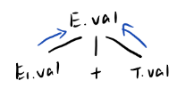

继承属性：在分析树结点N上的非终结符号B的继承属性是由N的父结点上的产生式所关联的语义规则定义的
产生式体必然包含B
结点N上的继承属性只能通过N的父结点、N本身和N的兄弟结点的属性定义
终结符无继承属性

eg.

|      产生式       |    语义规则    |
| :---------------: | :------------: |
| $D\rightarrow TL$ | $L.inh=T.type$ |

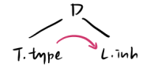

S属性的SDD：只包含综合属性的SDD
S属性的SDD中，每个规则都根据相应的产生式的产生式体中的属性值来计算头部非终结符号的一个属性。

eg.

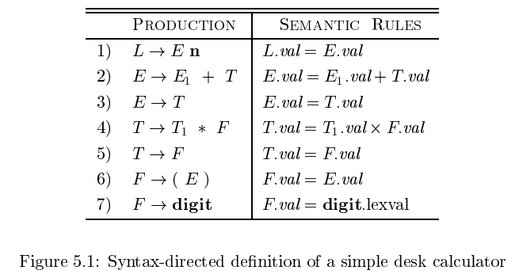

### 5.1.2 在语法分析树的结点上对SDD求值
注释语法分析树：带有各个属性值的语法分析树
如何构造注释语法分析树？必须求得各个结点的属性值。
如何求一个结点的属性值？必须首先求出该属性值所依赖的所有属性值。

对于综合属性的SDD，可以按照任何自底向上的顺序计算它们的值，如对语法分析树后序遍历
对于同时具有综合属性和继承属性的SDD，不能保证有一个顺序来对各结点上的属性进行求值

eg. 循环依赖

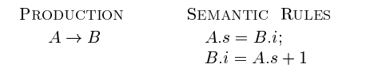

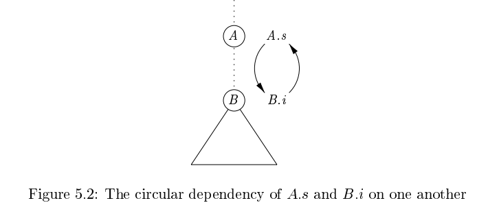

A.s 依赖 B.i，B.i 依赖 A.s

两个例子
eg1. 只有综合属性的SDD


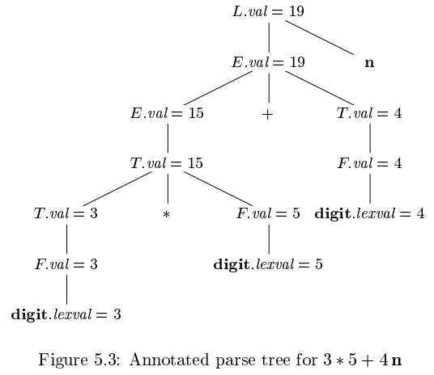

比如 $*$ 结点的父结点
1. 计算第一个和第三个子结点上的 T.val = 3 和 F.val = 5
2. 应用相应规则，指明 T.val 就是这两个值的乘积，即 15

eg2. 具有综合属性和继承属性的SDD

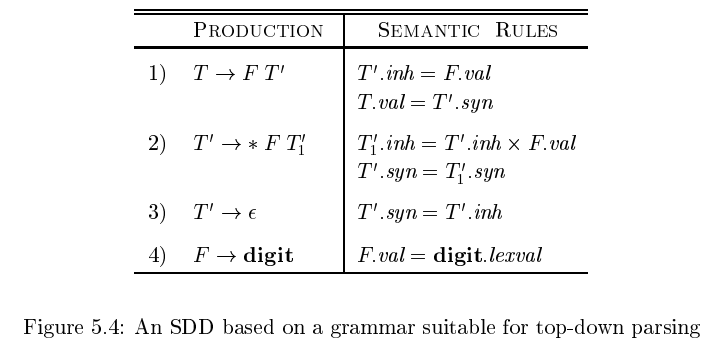

1. 非终结符号 T 和 F：综合属性 val
2. 终结符 digit：综合属性 lexval
3. 非终结符号 T'：继承属性 inh，综合属性 syn

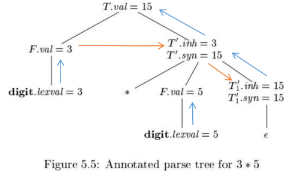

蓝线为继承属性，橙线为综合属性
1. 根结点左子树：
   - 最左边叶子：（综合属性）digit.lexval = 3，3由词法分析器提供
   - 叶子父结点：（综合属性）对应产生式 r4，根据 r4 关联的语义规则，F.val = digit.lexval = 3
2. 根结点右子树：
   - 根结点的第二个子结点：（继承属性）其父结点对应产生式 r1，根据 r1 关联的语义规则，T'inh = F.val = 3
   - 第二个子结点的第三个子结点：（继承属性）其父结点对应产生式 r2，根据 r2 关联的语义规则，T1'inh = T'inh × F.val = 15

这个SDD计算诸如 $3*5$ 和 $3*5*7$ 这样的项
基本思想：运算符 $*$ 的左运算分量是通过继承得到的，即产生式 $T'\rightarrow *FT_1'$ 的头 $T'$ 继承了产生式体中 $*$ 的左运算分量

eg. $x*y*z$
对应于 $*y*z$ 的子树的根结点继承了 x 的值
对应于 $*z$ 的子树的根结点继承了 $x*y$ 的值

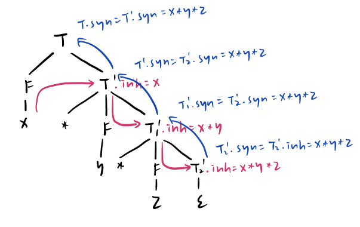


## 5.2 SDD的求值顺序
### 5.2.1 依赖图
依赖图：描述了某个语法分析树中属性实例之间的信息流
属性实例 --> 另一个属性实例：计算第二个属性实例时需要第一个属性实例的值

eg.

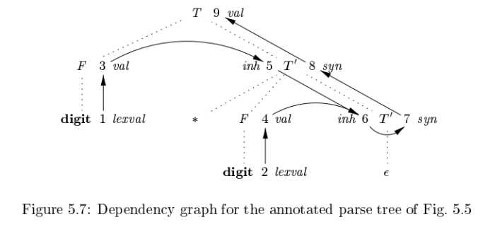

语法分析树的边：虚线
依赖图的边：实线

### 5.2.2 属性求值的顺序
依赖图中，M --> N，先对M对应的属性求值，再对N对应的属性求值

可行求值顺序：结点顺序 $N_1, N_2, \cdots, N_k$，如果有一条从结点 $N_i$ 到 $N_j$ 的边，那么 $i\lt j$
这样的排序将一个有向图变成了一个线性排序，这个排序称为这个图的拓扑排序

如果图中存在环，则无拓扑排序，无法对 SDD 求值
如果没有环，至少存在一个拓扑排序

### 5.2.3 S属性的定义
S 属性：如果一个 SDD 的每个属性都是综合属性，它就是 S 属性的
可以按照任何自底向上的顺序计算属性值，如对语法分析树后序遍历

```c
postorder(N)
{
	for(从左边开始，对N的每个子结点 C)
		postorder(C);
	对 N 关联的各个属性求值；
}
```

### 5.2.4 L属性的定义
L属性：在一个产生式体所关联的各个属性之间，依赖图的边总是从左到右，不能从右到左

每个属性必须是
1. 综合属性
2. 继承属性，且有限制：产生式 $A\rightarrow X_1X_2\cdots Xn$，继承属性 $Xi.a$
	1. 和产生式头 $A$ 关联的继承属性
	2. 位于 $X_i$ 左边的 $X_1,X_2,\cdots,X_{i-1}$ 相关的继承属性或综合属性
	3. 和 $X_i$ 本身相关的继承属性或综合属性，但其自身全部属性组成的依赖图无环

eg. 非L属性

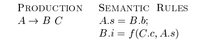

B.i 依赖 C.c，但产生式中 C 在 B 右边

### 5.2.5 具有受控副作用的语义规则
按照如下方法之一控制 SDD 中的副作用
1. 支持不会对属性求值产生约束的附带副作用：如果按依赖图的任何拓扑顺序进行属性求值，都可产生正确的翻译结果，运行副作用存在
2. 对允许的求值顺序添加约束，使得以任何允许的顺序求值都会产生相同的翻译结果

eg.

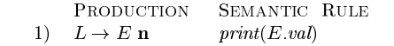

像 $print(E.val)$ 的语义规则的目的就是执行它们的副作用


## 5.3 语法制导翻译的应用
S 属性定义的 SDD：适合自下而上分析过程
L 属性定义的 SDD：适合自顶向下分析过程

### 5.3.1 抽象语法树的构造
使用具有适当数量的字段的对象来实现一个语法树的各个结点
每个对象都有一个 $op$ 字段，此外还有如下的其他字段：
1. 叶子结点：构造函数 `Leaf(op, val)` 创建对象，`val` 存放叶子结点的词法值
2. 内部结点：构造函数 `Node(op, c1, c2, ..., ck)`创建对象，k=子结点个数

eg. S 属性定义 SDD

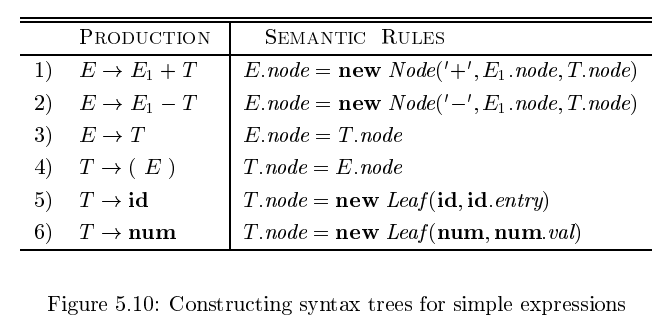

所有非终结符都有一个综合属性 node
产生式 r3 和 r4 不构建新的结点

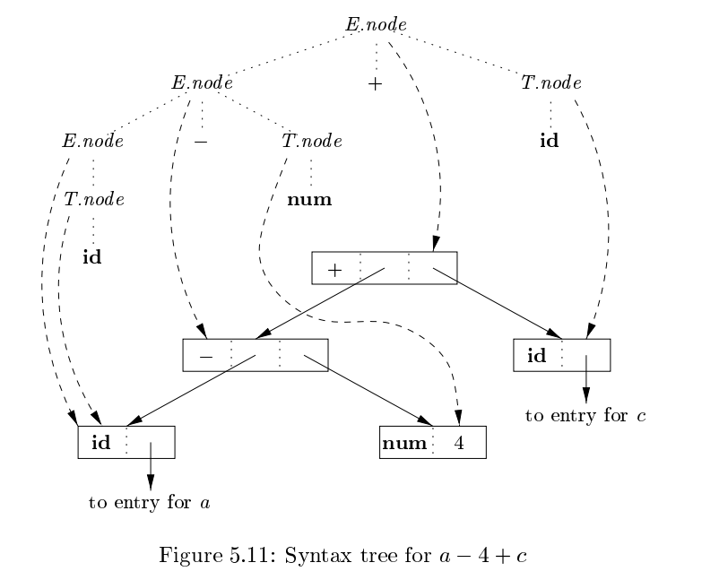

如果这些规则是在对语法分析树的后序遍历过程中求值的，或者是在自底向上分析过程中和归约动作中一起进行求值的，那么当图5-12中显示的一系列步骤结束时，p5指向构造得到的抽象语法树的根节点

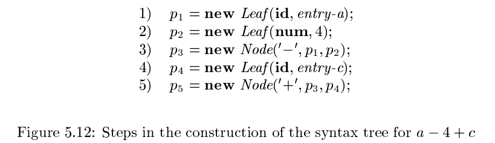

如果使用自顶向下语法分析而设计的文法，得到的抽象语法树相同，构造步骤相同
但语法分析树的结构和抽象语法树的结构有极大不同

eg. L 属性定义 SDD
图5-13中的 L 属性定义完成翻译工作与图5-10中 S 属性定义完成的工作相同
消除了左递归，引入继承属性

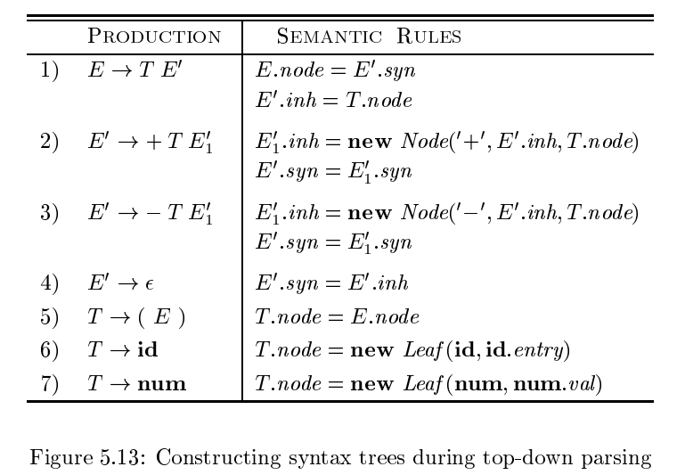

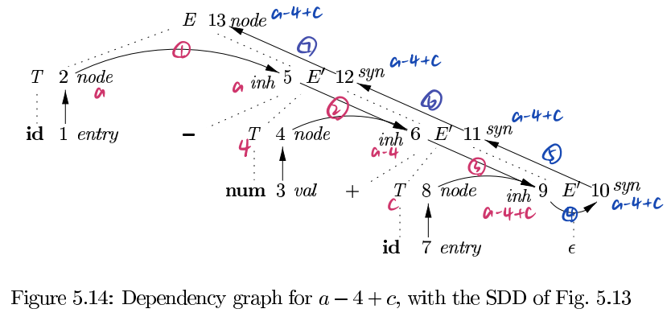

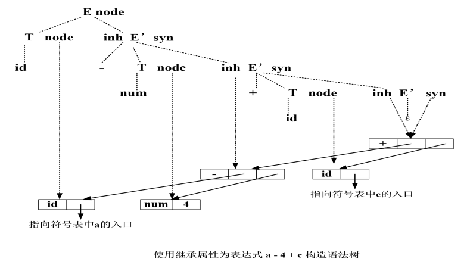

该抽象语法树与图5.11的抽象语法树相同，但语法分析树不同

### 5.3.2 类型的结构

C语言，`int[2][3]` 可读作：由2个数组组成的数组，子数组中有3个整数
相应的类型表达式 $array(2,array(3,integer))$ 可由下图表示

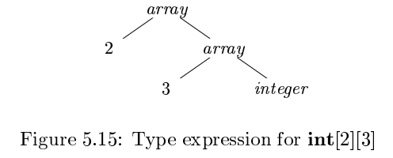

SDD如下

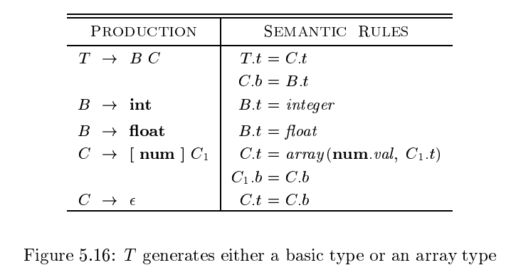

T：生成一个基本类型或一个数组类型
B：生成基本类型 int 或 float
C：生成由整数序列组成的数组描述分量

B，T：综合属性 t 表示类型
C：继承属性 b 将基本类型沿着树向下传播，综合属性 t 收集最终得到的结果

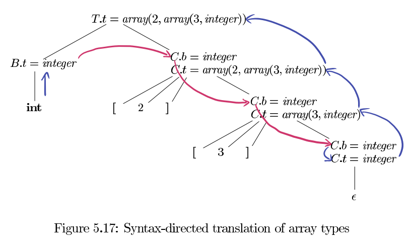

## 5.4 语法制导的翻译方案
语法制导的翻译方案 (syntax-directed translation scheme, SDT)：在其产生式体中嵌入了程序片段的一个上下文无关文法
程序片段：称为语义动作，可以出现在产生式体的任何地方；按照惯例，动作两边加花括号，如果花括号要作为文法符号出现，则要给它们加上引号

本课程主要关注如何用SDT实现两类重要的SDD
1. 基本文法可以用LR分析，且SDD是S属性的
2. 基本文法可以用LL分析，且SDD是L属性的

### 5.4.1 后缀翻译方案
最简单的实现 SDD 的情况：
1. 用自底向上方法分析
2. 且该 SDD 是 S 属性定义

这种情况，可以构造一个 SDT
1. 每个动作都放在产生式最后
2. 按产生式将产生式体归约为产生式头时执行动作

后缀翻译方案：所有动作都在产生式最右端的 SDT

eg. 桌上计算器 SDD 与 后缀 SDT


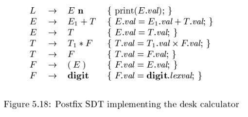

图5-18 只有一处改动：第一个产生式的动作是打印出结果值

### 5.4.2 后缀SDT的语法分析栈实现
后缀 SDT 可以在 LR 语法分析的过程中实现，当归约发生时执行相应的语义动作
最好将属性和文法符号（或表示文法符号的LR状态）一起放在栈中的记录里

将属性放在栈中
1. 扩大栈，把属性直接放在栈中
2. 把属性放在栈外，把指针放在栈中

可以把产生式体归约成产生式头时计算属性的条件：
1. 所有属性都是综合属性
2. 所有动作都位于产生式末端

eg. 

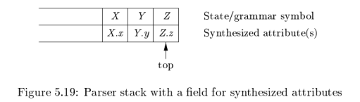

假如 $A\rightarrow XYZ$，此时归约，归约后 A 和属性位于栈顶

eg. 桌上计算器

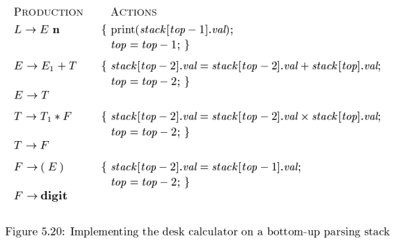

### 5.4.3 产生式内部带有语义动作的SDT
动作可以放置在产生式体的任何位置上
当一个动作左边的所有符号都被处理过后，该动作立刻执行

eg. $B\rightarrow X\{a\}Y$，识别 $X$ 后，动作 $a$ 就会执行，即
1. 自底向上语法分析：在 $X$ 出现在栈顶，执行 $a$
2. 自顶向下语法分析：
	1. $Y$ 非终结符：在试图展开 $Y$ 的本次出现之前执行 $a$
	2. $Y$ 终结符：在输入中检测 $Y$ 之前执行 $a$

将 SDT 改写为后缀 SDT 
1. 在文法中加入产生 $\epsilon$ 的标记非终结符
2. 每个嵌入动作用不同的标记非终结符 $M$ 代替
3. 把这个被代替的嵌入动作放在产生式 $M\rightarrow \epsilon$ 的右端

eg. 通过改写文法将嵌入产生式右部中间的动作移到产生式的右端

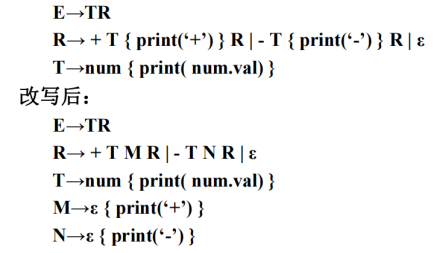

L属性 SDT 都可以伴随语法分析实现
但不是所有的 SDT 都可以在语法分析过程中实现
eg. 表达式前缀形式翻译的SDT

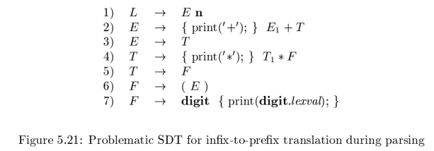

不能在自顶向下或自底向上语法分析过程中实现这个 SDT
因为语法分析程序须在它不知道输入中的运算符号是 $*$ 还是 $+$ 时，就执行打印符号的操作

在产生式 2 和 4 分别使用 $M_2$ 和 $M_4$ 替代相应的操作
移入-归约语法分析器在处理输入 $digit$ 时，会因为不能确定是使用 
$M_2\rightarrow \epsilon$ 归约，$M_4\rightarrow \epsilon$ 归约，还是移入输入数字而产生一个冲突

任何 SDT 都可以按照下列方法实现
1. 忽略语义动作，对输入进行语法分析，产生语法分析树
2. 检查每个内部节点 $N$，假设产生式 $A\rightarrow \alpha$，将 $\alpha$ 中的动作当作 $N$ 的附加子结点加入，使 $N$ 的子结点从左到右和 $\alpha$ 中的符号及动作完全一致
3. 对语法树前序遍历，访问到动作结点时执行动作

eg. 

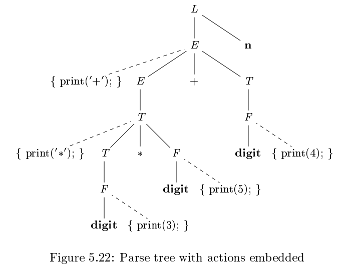

这是带有插入动作的表达式 $3*5+4$ 的语法分析树
前序遍历可得到前缀表达式 $+*354$

### 5.4.4 从SDT中消除左递归
自顶向下的语法分析要消除左递归
伴随自顶向下分析的SDT，需要考虑对应的语义动作如何处理

简单的情形
语义动作类似于打印字符串等（如后缀表达式的翻译），只要关注动作执行的顺序即可
将动作看成是终结符号，实施第三章介绍的消除左递归的算法

原产生式
$A\rightarrow A\alpha$ | $\beta$
消除左递归
$A\rightarrow \beta R$
$R\rightarrow \alpha R$ | $\epsilon$

eg.
原 SDT
$E\rightarrow E_1+T$   $\{print('+');\}$
$E\rightarrow T$
消除左递归
$E\rightarrow TR$
$R\rightarrow +T\{print('+');\}R$
$R\rightarrow \epsilon$

左递归消除的一般方法：可用于更复杂的 S 属性 SDD
原 SDT
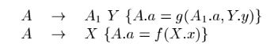

需要把基础文法改成
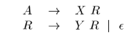

新的翻译方案
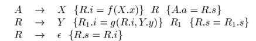

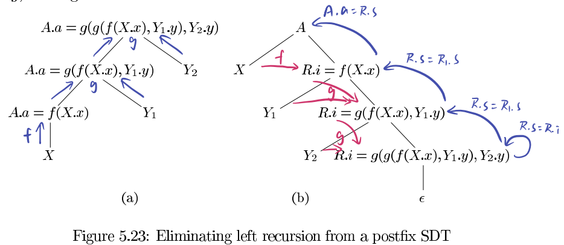

把文法从左递归改成右递归后会出现继承属性

### 5.4.5 L属性定义的SDT
将L属性的SDD转换为SDT的规则
1. 把计算某个非终结符A的继承属性的动作插入到产生式体中紧靠在A的本次出现之前的位置上。如果A的多个继承属性以无环的方式互相依赖，则这些属性的求值动作顺序要满足依赖约束
2. 将计算一个产生式头的综合属性的动作放置在这个产生式体的最右端

上述规则的本质是使得属性的计算满足属性间的依赖关系

eg. 排版语言
数学公式排版语言文法的抽象，每个B表示一个Box
$B\rightarrow B_1B_2$ | $B_1$ $sub$ $B_2$ | $(B_1)$ | $text$

上述文法的解释
1. r1：两个并列的 Box，其中第一个 B1 在另一个 B2 的左边
2. r2：一个 Box 和一个下标 Box，第二个尺寸小且位置低，位于第一个的右边
3. r3：用于 Box 和下标的分组
4. r4：一个文本串，可以是任意字符串

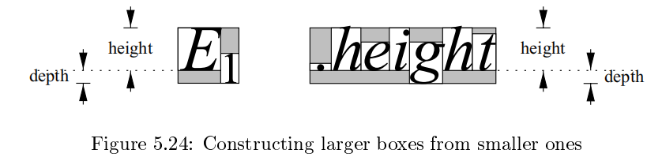

相关属性
1. 字体大小 (point size)
	1. 假设正常字体大小为10
	2. 如果一个 Box 的字体大小为 p，则其下标大小为 0.7p
	3. 用继承属性 ps 表示
2. 基线 (baseline)，表示了文本行底部的垂直位置，如图 5-24 中的点虚线
	1. 下标的基线向下移动父 Box 的字体大小的 25%
3. 高度 (height)，表示了 Box 顶部到基线的距离，用综合属性 ht 表示
4. 深度 (depth)，表示了基线到 Box 底部的距离，用综合属性 dp 表示

SDD

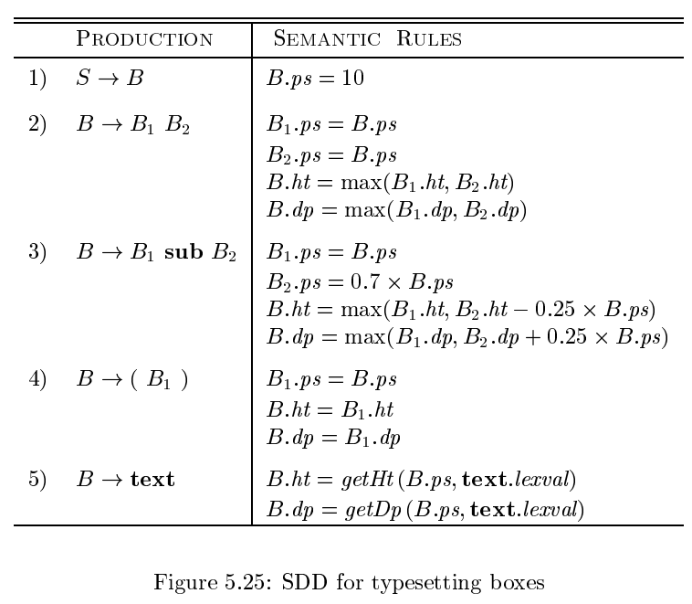

SDT

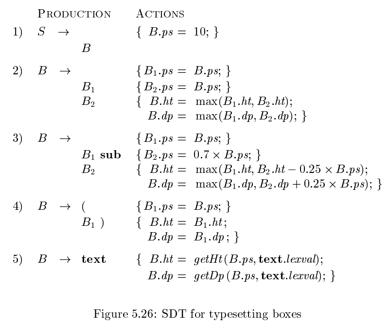

eg. 简单循环语句的例子
$S\rightarrow while$ $( C )$ $S_1$

属性
1. 继承属性 $S.next$：必须在 $S$ 执行结束之后执行的代码的开始处的标号
2. 综合属性 $S.code$：中间代码序列，实现了语句 $S$，并且其最后有一条跳转到 $S.next$ 的指令
3. 继承属性 $C.ture$：必须在 $C$ 为真时执行的代码的开始处的标号
4. 继承属性 $C.false$：必须在 $C$ 为假时执行的代码的开始处的标号
5. 综合属性 $C.code$：中间代码序列，实现了条件表达式 $C$，并且根据 $C$ 的值为真或假跳转到 $C.true$ 或 $C.false$

说明

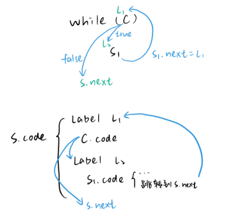

SDD

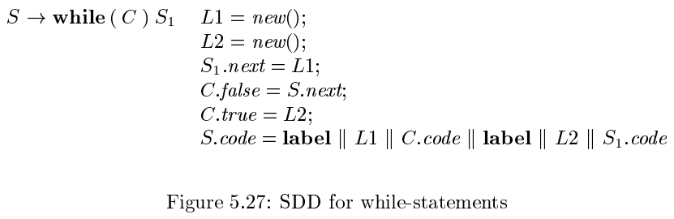

SDT

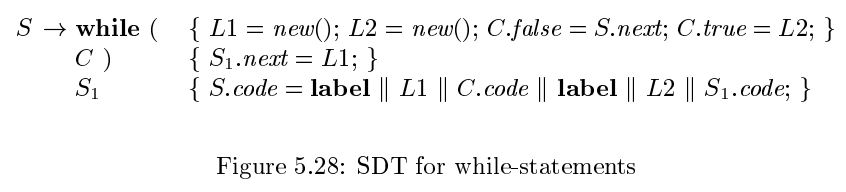


## 5.5 实现L属性的SDD