# 第6章中间代码生成
## 6.1 语法树的变体
### 6.1.1 表达式的有向无环图
$a + a * (b - c) + (b - c) * d$

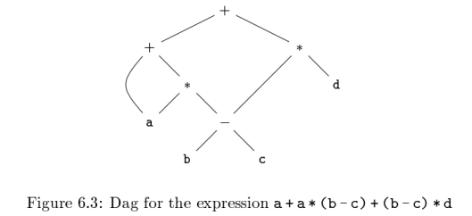

使用 SDD（语法制导定义）构造 DAG  
函数 Leaf 和 Node 构造新结点前首先检查是否已存在这样的结点，如果存在，就返回这个已有的结点，否则创建一个新结点

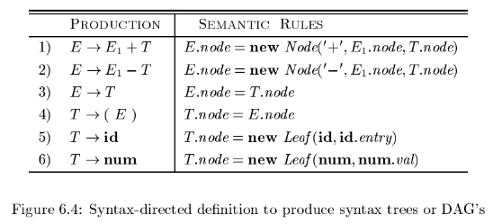

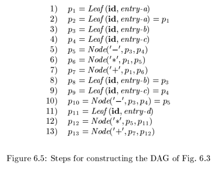

第 2 步调用 Leaf(id, entry-a) 时，函数返回的是之前调用生成的结点

### 6.1.2 构造 DAG 的值编码方式
语法树或 DAG 图中的结点通常存放在一个<font color="#d99694">记录数组</font>中
 
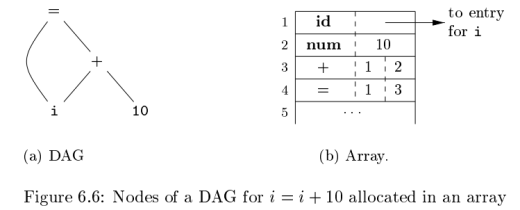

在这个数组中，只需给出一个结点对应的记录在此数组中的整数下标就可以引用该结点，这个整数称为结点的<font color="#d99694">值编码</font>

构造 DAG 结点的值编码方式：在数组中搜索标号为 op，左子结点为 l 且右子结点为 r 的结点 M 
1. 如果存在，返回结点 M 的值编码
2. 如果不存在，在数组中添加这个结点，返回其值编码

搜索结点需要遍历数组，开销大，可以利用散列表

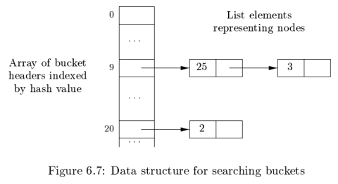

## 6.2 三地址代码
三地址代码：一条指令的右侧最多有一个运算符，不允许出现组合的算术表达式  
eg. $x+y*z$ 的三地址指令序列如下
```
t1 = y * z
t2 = x + t1
```

其中 $t1$ 和 $t2$ 是编译器产生的临时名字

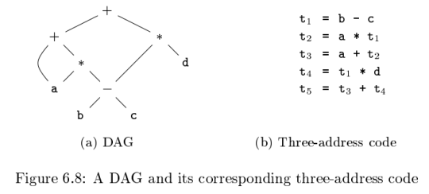

### 6.2.1 地址和指令
eg. `do i = i+1; while (a[i] < v);`

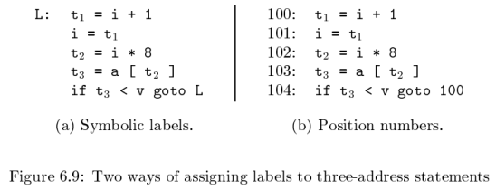

### 6.2.2 四元式表示

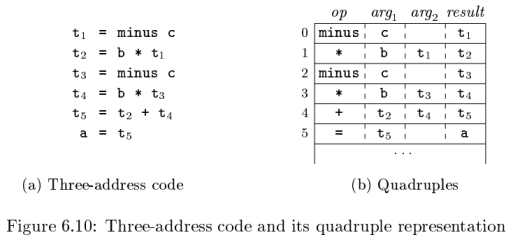

### 6.2.3 三元式表示
三元式只有三个字段，op，arg1 和 arg2  
1. 四元式的 result 主要用于临时变量名
2. 三元式用运算 x op y 的位置来表示结果，不是用一个显式的临时名字表示

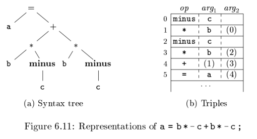

(n)：指向相应的三元式结构的指针

优化编译器时，<font color="#d99694">指令的位置常常会发生变化</font>
1. 四元式：移动了一个计算临时变量 t 的指令，使用 t 的指令不需要任何改变
2. 三元式：对于运算结果的引用是通过位置完成的，因此如果改变一条指令的位置，引用该指令的结果的所有指令都要做相应的修改，从而引入间接三元式来解决这个问题

间接三元式：包含一个指向三元式的指针的列表，而不是列出三元式序列本身

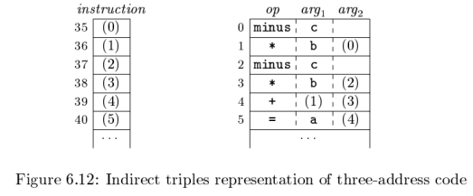

优化编译器可以通过对 instruction 列表的重新排序来移动指令的位置，但不影响三元式本身

### 6.2.4 静态单赋值形式
所有赋值都是针对具有不同名字的变量

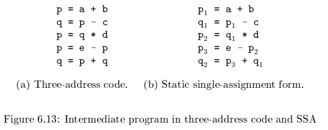

对于分支，使用 $\phi$ 函数将两处值合并

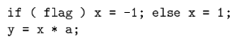

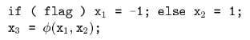

## 6.3 类型和声明


### 6.3.1 类型表达式
类型自身也有结构，使用<font color="#d99694">类型表达式</font>来表示这种结构，类型表达式：
1. 可能是<font color="#d99694">基本类型</font>
2. 也可能通过把称为<font color="#d99694">类型构造算子</font>的运算符作用于类型表达式而得到

基本类型的集合和类型构造算子根据被检查的具体语言而定

数组类型 `int[2][3]`：由两个数组组成的数组，其中每个数组包含 3 个数  
类型表达式：$array(2,array(3,integer))$

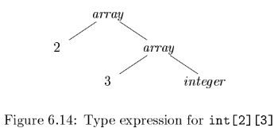

使用如下的类型表达式的定义 
1. 基本类型是类型表达式，如 $boolean,char,integer,float,void$
2. 类名是类型表达式
3. 将类型构造算子 $array$ 作用于一个数字和一个类型表达式可以得到一个类型表达式
4. 将类型构造算子 $record$ 作用于字段名和相应的类型可以得到一个类型表达式
5. 使用类型构造算子 $\rightarrow$ 可以得到一个函数类型的类型表达式
6. 如果 $s$ 和 $t$ 是类型表达式，则笛卡尔积 $s \times t$ 也是类型表达式
7. 类型表达式可以包含取值为类型表达式的变量

### 6.3.2 类型等价
当用图来表示类型表达式时，两种类型之间结构等价当且仅当下列某个条件为真
1. 它们是相同的基本类型
2. 它们是将相同的类型构造算子应用于结构等价的类型而构造得到的
3. 一个类型是另一个类型表达式的名字

### 6.3.3 声明
研究类型及其声明时将使用一个经过简化的文法，这个文法一次只声明一个名字  
eg. 处理基本类型和数组类型的文法

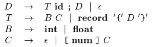

D：生成一系列声明  
T：生成基本类型，数组类型或记录类型  
B：生成基本类型 int 和 float 之一  
C：产生零个或多个整数，每个整数用方括号括起来

一个数组类型包含一个由 B 指定的类型，后面根一个由 C 指定的数组分量  
一个记录类型由各个记录字段的声明序列构成，并被花括号括起来

### 6.3.4 局部变量名的存储布局
从变量类型我们可以知道该变量在运行时刻需要的内存数量  
在编译时刻，我们可以使用这些数量为每个名字分配一个相对地址  
名字的类型和相对地址信息保存在相应的符号表条目中  
对于字符串这样的变长数据，以及动态数组这样的只有在运行时刻才能确定其大小的数据，处理方法是为指向这些数据的指针保留一个已知的固定大小的存储区域

类型的宽度：类型的一个对象所需的存储单元的数量

如下 SDT 计算了基本类型和数组类型以及它们的宽度

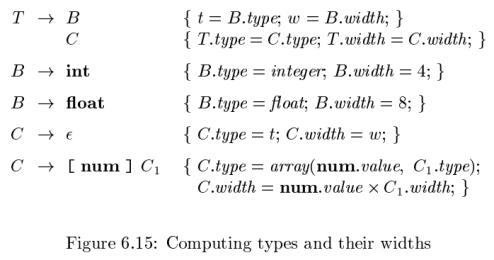

`int[2][3]` 的语法分析树如下

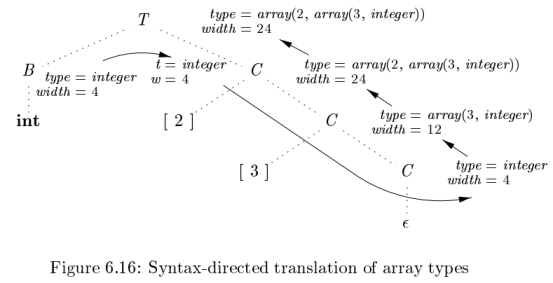

### 6.3.5 声明的序列
如下的翻译方案处理形如 `T id` 的声明的序列，其中 T 如图 6-15 所示产生一个类型

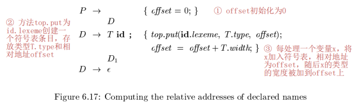

### 6.3.6 记录和类中的字段
图 6-17 中对声明的翻译方案还可以用于处理记录和类中的字段  
要把记录类型加入到图 6-15 的文法中，只需加上下面的产生式
$$
T \rightarrow record '\{'D'\}'
$$
图 6-17 中的方法可以用来确定这些字段的类型和相对地址，需要注意如下两点
1. 一个记录中各个字段的名字必须互不相同，即在由 D 生成的声明中，同一个名字最多出现一次
2. 字段名的偏移量，或者说相对地址，是相对于该记录的数据区字段而言的

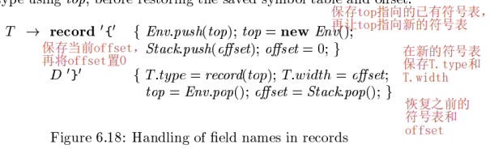

## 6.4 表达式的翻译
### 6.4.1 表达式中的运算
为赋值语句生成三地址代码

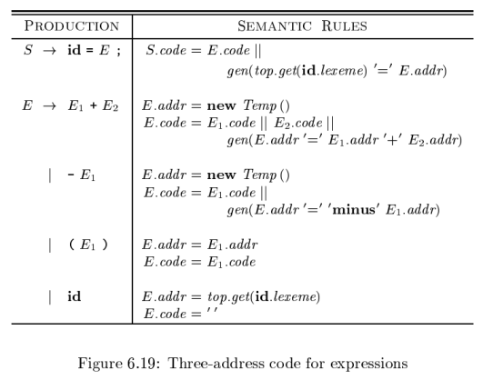

eg. `a=b+-c;`  语法制导定义将其翻译成如下的三地址代码
```
t1 = minus c
t2 = b + t1
a = t2
```

### 6.4.2 增量翻译
gen 不仅要构造出一个新的三地址指令，还要将它添加到至今为止已生成的指令序列之后

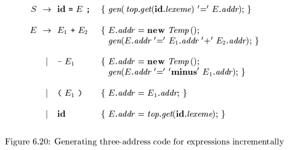

### 6.4.3 数组元素的寻址
将数组元素存储在一块连续的存储空间里就可以快速地访问它们

### 6.4.4 数组引用的翻译

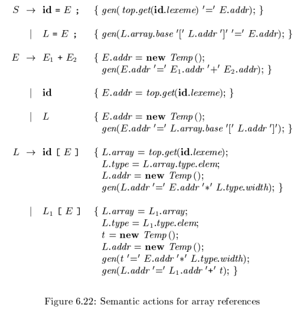

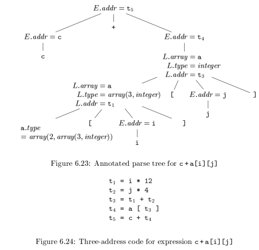

## 6.5 类型检查
### 6.5.1 类型检查规则
类型检查有两种形式：综合和推导  

**类型综合**  
根据子表达式的类型构造出表达式的类型，要求名字先声明再使用  
典型的类型综合规则
```
if f的类型为s->t且x的类型为s
then 表达式f(x)的类型为t
```

**类型推导**  
根据一个语言结构的使用方式来确定该结构的类型  
典型的类型推导规则
```
if f(x)是一个表达式
then 对某些α和β，f的类型为α->β且x的类型为α
```

### 6.5.2 类型转换
拓宽：在该层次结构中位于较低层的类型可以被拓宽为较高层的类型（6.25 a）  
窄化：如果存在一条从 s 到 t 的路径，则可以将类型 s 窄化为类型 t（6.25 b）

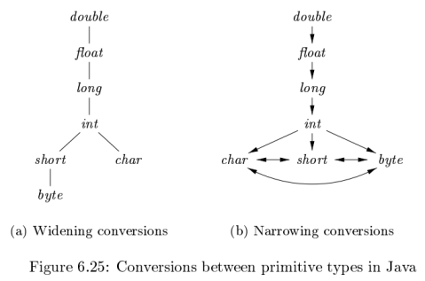

隐式转换：类型转换由编译器自动完成  
显示转换：程序员必须写出某些代码来引发类型转换运算

检查 $E \rightarrow E_1 + E_2$ 的语义动作使用了两个函数
1. $max(t_1,t_2)$：接受 $t_1$，$t_2$ 两个类型的参数，返回拓宽层次结构中这两个类型的最大者
2. $widen(a,t,w)$：将地址 a 中的内容，从类型 t 转换成类型 w，结果存放于临时变量

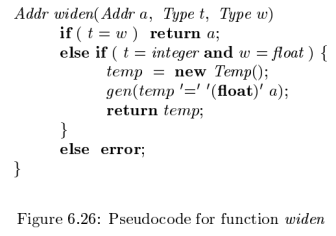

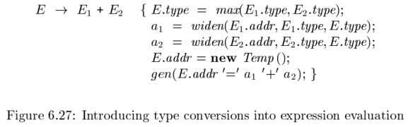

### 6.5.3 函数和运算符的重载
依据符号所在的上下文不同，被重载的符号会有不同的含义  
重载函数的类型综合规则如下

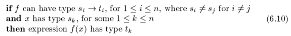

### 6.5.4 类型推导和多态函数
术语“多态”指的是任何可以在不同的参数类型上运行的代码片段  
本节考虑“参数多态”，这种多态通过参数和类型变量来刻画

eg. 计算一个列表长度的 ML 程序

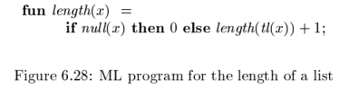

length 函数的类型可以写作 $\forall \alpha.$ $list( \alpha) \rightarrow integer$

### 6.5.5 一个合一算法

## 6.6 控制流
### 6.6.1 布尔表达式

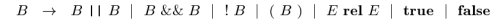

### 6.6.2 短路代码
在短路（跳转）代码中，布尔运算符 &&、|| 和 ! 被翻译成跳转指令  
运算符本身不出现在代码中，布尔表达式的值通过代码序列中的位置来表示

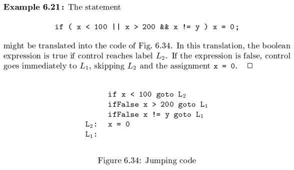

### 6.6.3 控制流语句
考虑在按下列文法生成的语句的上下文中，如何把布尔表达式翻译成三地址代码


### 6.6.4 布尔表达式的控制流翻译


### 6.6.5 避免生成冗余的 goto 指令


### 6.6.6 布尔值和跳转代码


## 6.7 回填
### 6.7.1 使用回填技术的一趟式目标代码生成


### 6.7.2 布尔表达式的回填


### 6.7.3 控制转移语句


### 6.7.4 break 语句、continue 语句和 goto 语句


## 6.8 switch 语句


## 6.9 过程的中间代码