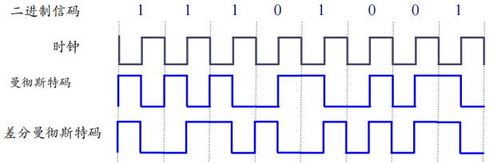
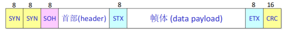
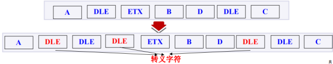
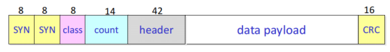
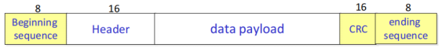
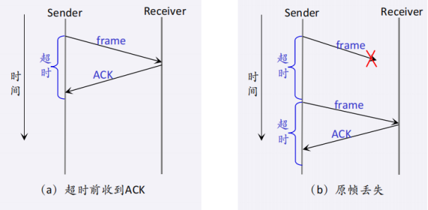
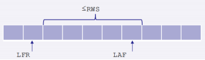
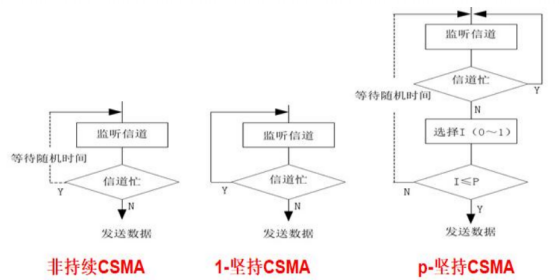
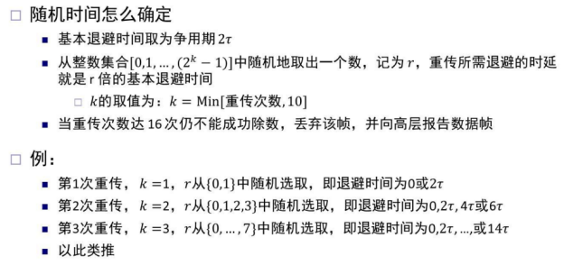
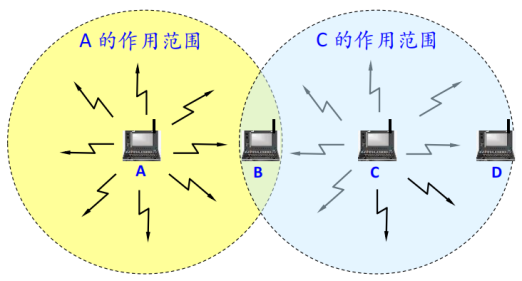

# 第2章 直连网络
## 2.1 数据通信的基本概念
基带信号：来自信源的原始信号，未经过调制  
特点：频率较低，信号频谱从零频附近开始，具有低通形式  
类别：数字基带信号，模拟基带信号

近距离，基带信号的衰减不大，可以采用基带传输  
eg. 计算机到监视器、打印机等外设，以太网等局域网  
长距离或无线信道中，需要进行调制  
eg. 声音传送距离有限，调制为高频电磁信号，可以实现远距离的声音传送

### 编码
发送端把二进制数据（比特）编码为数字基带信号，接收端再解码为比特  
1 个 n 进制码元（码元有 n 种）需要 $log_2k$ 个 bit 表示，即携带 $log_2k$ 比特信息  
eg. 1 个 16 进制码元需要 4 个 bit 表示，即携带 4bit 信息

曼彻斯特编码：将一个码元分成两个相等的间隔，前高后低为 1，反之则 0  
差分曼彻斯特码：相邻周期的方波反相为 1，同相为 0

在每个码元的中间出现电平跳变，既作为时钟信号（用于同步），又作为数据信号  
频带加倍：比特率为波特率的一半，编码效率仅 50%（信号变 2 次传 1 个 bit）  
差分曼彻斯特编码，第 1 个码元无法判断 0 还是 1，但可以根据后面的信号波形求出之后的码元

### 调制
使用载波，把基带信号的频率搬到高频，转换为模拟信号，称为带通调制/载波调制
1. 数字信号调制：幅度键控，频移键控，相移键控
2. 模拟信号调制：调幅

### 信道容量与计算
香农公式：带宽受限且有高斯白噪声干扰情况下信道极限  
即无差错的信息传输速率上限（信道容量）
$$
C=Wlog_2(1+S∕N)
$$
C：信道容量 (bps)，W：信道带宽 (Hz)，S：信号平均功率，N：高斯白噪声功率  
S/N：信噪比，常表示为 SNR (dB 或分贝)，$SNR=10log_{10}(S/N)$

## 2.2 网络构件
### 网络结点
被连接的计算机/其它硬件
1. 主机（端系统）：传统 PC、服务器、智能手机、传感设备等
2. 网络内部交换结点：二层交换机、AP、基站、路由器等

### 网络适配器/网络接口卡
将结点连接到链路上的硬件  
实现大部分数据链层和物理层功能：调制编码、组帧、错误检测、可靠传输、介质访问控制等

### 网络链路
物理层之下的传输媒体，数据（信号）传输的物理通道
1. 导引型传输媒体（有线链路）
	- 双绞线，同轴电缆，光缆
2. 非导引型传输媒体（无线链路）

## 2.3 组帧
### 面向字节的协议
#### 起止标记法
特定字符表示帧的开始与结束

字符填充法：引入转义符 DLE，将数据负载中所有的 ETX，用 DLE 进行转义

#### 字节计数法
帧中的字节数放在首部的一个字段中

缺点：若 Count 出错，可能会产生累计多个错误

### 面向比特的协议
不关心字节的边界，它只是把帧看成比特集

Beginning Sequence 和 Ending Sequence：01111110（标志字段）  
在链路空闲时，也发送这个序列，以保证发方、收方的时钟同步  
问题：01111110 可能出现在帧的任何地方

比特填充法  
发送方：对于数据部分，发现 5 个连续的 1，就填入一个 0  
eg. 发方发送 011111111110，则实际发送 01111101111100

接收方：先找到开始点 01111110，然后再定结束点，在接收了连续的 5 个 1 之后，下一位为：  
0，必为填充的 0，丢弃此位；  
1，再看下一位：若为 0，则为帧结束；若为 1，则出错（表示出现连续 7 个 1）

## 2.4 差错检测
### 奇偶校验
奇数个比特差错，可检测出；偶数个，检查不出来

### 校验和
发送端：将传输的所有字加起来，相加的结果作为校验和，一起传输  
接收端：执行同样计算，结果与收到的校验和比较，不同则判断出错

发送方：
1. 把数据分为许多 16 位字的序列，将所有 16 位字相加（最高位有进位，回卷到最低位）
2. 对结果取反码，即为校验和

接收方：将所有 16 比特字（包括校验和），结果为全 1，认为无差错

一对单比特错，1 个使某个字增加1，另一个使另一个字减少 1，校验和不变

### 循环冗余校验 (Cyclic Redundancy Check, CRC)
1. 零扩展
2. 除法（异或）得余数

## 2.5 可靠传输
差错检测技术只能做到无差错接受  
可靠传输必须能以某种方式恢复被丢弃或丢失的帧

可靠传输基本机制：确认+超时  
自动请求重发（Automatic Repeat Request，ARQ）

### 停等 (stop-and-wait) 算法
发送方传输一帧之后，在传输下一帧之前等待一个 ACK  
如果在某段时间之后 ACK 没有到达，则发送方超时，重发原始帧

只允许链路上有一个未确认的帧，这可能远远低于链路的容量

### 滑动窗口 (sliding-window) 算法
允许多个在途传输（未收到 ACK）的数据帧  
通过窗口大小 (window) 限制在途传输的数据帧个数

当数据帧丢失时
1. 回退 N 机制 (Go-Back-N) 恢复丢包
	- 接收方只对连续收到的数据帧回复 ACK
	- 发送方，由于接收不到新的 ACK，超时后重传 LAR+1 与 LFS 之间的数据帧
2. 选择确认机制 (Selective Acknowledgments) 恢复丢包
	- 接收方准确地确认每个已接受的数据帧，发送方根据这些信息更快重传
	- 传输效率更高，但实现更复杂

SWS = RWS  
(SWS+RWS) ≤ MaxSeqNum  (MaxSeqNum = 2^n，n 为序列号使用的比特数)  
即 SWS = RWS ≤ 2^{n−1}  
发送窗口大小不能大于可用序列号数的一半 ^16ae4a

## 2.6 媒体共享
广播通信，多个结点共享广播信道，如果不加控制，那么两对结点间的通信可能会因为互相干扰而失败

### 2.6.1 静态划分信道
1. 频分复用
2. 时分复用、统计时分复用
4. 波分复用
5. 码分复用

码分复用：发送 1，则发送 m bit 码片序列；发送 0，则发送码片的反码  
每个站的码片序列各不相同，相互正交

### 2.6.2 动态媒体接入控制
随机接入
1. 结点按需随机接入，接入后以信道的全部速率进行发送
2. 发生碰撞时，相关结点反复重发，直到无碰撞成功发送
3. 各结点在重发前独立选择一个随机时延

典型方案
1. ALOHA
2. 时隙 ALOHA
3. 载波侦听多点接入 (Carrier Sense Multiple Access, CSMA)
4. 带碰撞检测 (Collision Detection) 的 CSMA (CSMA/CD)
5. 带碰撞避免 (Collision Avoidance) 的 CSMA (CSMA/CA)

受控接入：用户接入服从一定控制，如令牌环网

#### ALOHA
1. 帧首次到达（从网络层传递下来）时，立即发送该帧
2. 若碰撞，结点立即以概率 p 重传该帧，以概率 1-p 等待一个帧传输时间
3. 若不成功，在下一个阶段以概率 p 重传该帧，以概率 1-p 等待一个帧传输时间

#### 时隙 ALOHA
为避免一个帧快传完时被别的结点发送的帧碰撞  
把时间划分成等长的时隙，1 个时隙为传输一个帧的时间，只能在时隙开始时发送帧

#### 载波侦听多点接入
结点在发送前先检测信道，是否有其他结点也在发送，若有，则暂时不要发送数据，以免发生碰撞

非持续 CSMA：一个结点要发送数据时，首先监听信道
1. 若信道空闲，立即发送数据
2. 若信道忙，放弃监听，等待一个随机时间重复上述过程

1-坚持 CSMA：一个结点要发送数据时，首先监听信道
1. 若信道空闲，立即发送数据
2. 若信道忙，继续监听直到信道空闲

p-坚持 CSMA：一个结点要发送数据时，首先监听信道
1. 若信道空闲，以概率 p 发送数据，以概率 1-p 推迟到下一个时隙
2. 若信道忙，继续监听直到信道空闲

非持续 CSMA：可减少碰撞，会导致信道利用率降低，较长的延迟  
1-坚持 CSMA：会导致较多的碰撞，导致性能降低  
p-坚持 CSMA：通过调节 p 在减少碰撞和高信道利用率之间取得平衡

#### 带碰撞检测的 CSMA (CSMA/CD)
1-坚持 CSMA+碰撞检测

当结点检测到的信号电压摆动值超过一定的门限值时，认为总线上至少有两个结点同时在发送数据，表明产生了碰撞，一旦发送碰撞，进行碰撞处理
1. 强化碰撞
2. 指数退避

碰撞窗口/争用期：端到端往返时延 $2\tau$  
必须让发送方在发送结束之前检测到冲突，帧长/数据传输率 > $2\tau$ 

强化碰撞  
发生碰撞时，立即停止发数据，并发送人为干扰信号，通知所有结点现在发生了碰撞

指数退避  
发生碰撞的结点停发数据后，推迟一个随机时间再发送数据

#### 带碰撞避免的 CSMA (CSMA/CA)
非持续 CSMA+碰撞避免

为什么冲突避免，而非冲突检测？  
碰撞检测的能力要求结点同时具有发送（自己的信号）和接收（检测其它结点是否在发送）的能力  
无线网络适配器上，接收信号强度远小于发送信号，制造具有碰撞检测能力的硬件代价过大；即使硬件支持，无线网络特有的隐藏终端等问题也使得很多碰撞难以检测

隐藏终端问题

结点 A 和结点 C 相互检测不到对方的信号，可能同时向 B 发送数据，引发碰撞

发送数据时，先侦听信道是否空闲
1. 若信道忙，等待，再次侦听（非持续 CSMA）
2. 若信道空闲
	1. 第一次尝试发送，在一段时间（分布式帧间间隔，DIFS）后，立即发送
	2. 非第一次尝试发送，执行碰撞避免操作，发送数据
3. 成功发送后等待对端回复 ACK，等待超时，重传该帧

碰撞避免  
1. 信道空闲一段时间（分布式帧间间隔，DIFS）后，进入竞争窗口，延迟接入
	- 结点按照指数退避算法选择随机退避时间，退避完成发送数据；
	- 若退避未完成时检测到信道忙，则冻结退避计时器，等到信道空闲持续 DIFS 时间后继续退避，直至退避完成后继续发送数据
2. 发送、接收结点通过 RTS/CTS 短帧预约信道，避免碰撞

## 2.7 以太网
#### 两种链路类型
点对点链路
1. 高级数据链路控制协议 (High-level Data Link Control, HDLC)
2. 点对点协议 (Point-to-Point Protocol, PPP)

 广播链路
1. 以太网 (Ethernet), IEEE 802.3
2. 无线局域网 (Wireless Lan, WLAN), IEEE 802.11

#### 网络分类
1. 广域网 WAN (Wide Area Network)
2. 城域网 MAN (Metropolitan Area Network)
3. 局域网 LAN (Local Area Network)
4. 个域网 PAN (Personal Area Network)

局域网特点：覆盖范围小，距离≤25 k  
典型技术：以太网 (Ethernet)

#### 以太网帧结构
为什么最小帧长 64 字节？  
为了冲突检测：以太网最大长度 2500 m，往返时延 51.21 微秒，10 Mbps，512 bits

每个适配器有一个唯一的以太网地址，称为硬件地址、网卡的物理地址、MAC 地址  
MAC 地址：由冒号分隔的 6 个数  
每个数对应于 6 字节地址的 1 个字节，由一对 16 进制数给出，而且去掉前导 0  
eg. 8 : 0 : 2b : e4 : b1 : 2  
00001000  00000000  00101011  11100100  10110001  00000010

#### 以太网评价
以太网基本上统治了有线局域网  
以太网的优点：便宜，高速，易于使用、管理和扩展  
总线型以太网的缺点
1. 数据包越小，传输单位数据的代价越大
2. 用户数增加时，更容易发生碰撞
3. 链路变长时，需要更长时间来检测碰撞
4. 网络负载越大，传输性能越低