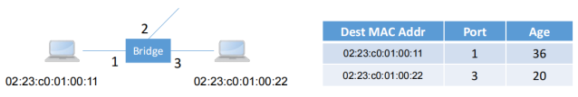
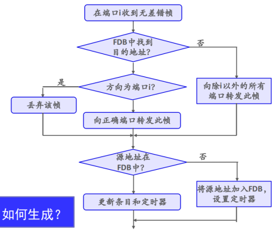
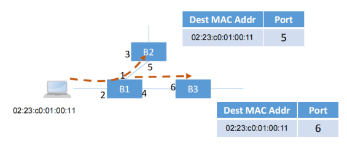
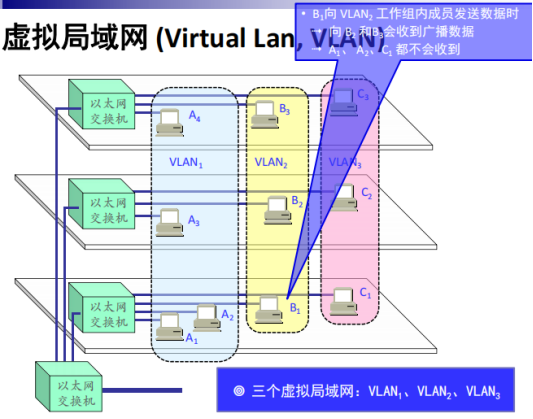

# 第3章 交换网络
## 3.1 网桥及数据帧转发
### 网桥  
在数据链路层扩展局域网  
解决共享介质的分组转发问题，扩展 LAN 的物理范围

工作方式
1. 过滤：根据帧的目的地址决定一个帧应该转发到某个接口还是丢弃，目的结点处于接收端口所连接的网段，丢弃
2. 转发：根据帧的目的地址决定该将其导向哪个接口，将帧发送出去

基于转发表/转发数据库 (Forwarding DataBase, FDB) 实现

网桥使各网段成为隔离开的碰撞域  
连接异质链路：互连不同物理层、不同速率的局域网  
消除碰撞、增加网络带宽：单个网段 100Mbps，一个网桥能传输 100nMbsp (n 为网桥端口数） 

### 数据帧转发
转发表/转发数据库 (Forwarding DataBase, FDB)：目的 MAC 地址-端口的映射关系 

对每个数据帧，在 FDB 中查找目的 MAC 地址对应的端口号
1. 若存在对应端口号，且与接收端口一致，丢弃
2. 若存在对应端口号，且不同于接收端口，从该端口将数据转发（单播）
3. 如果 FDB 中不存在对应条目，将该数据包从所有端口转发（广播）退化

FDB 条目如何生成？

## 3.2 结点位置自学习 (生成转发表)
每收一个新的数据帧，记录其源 MAC 地址和输入端口，将该映射关系写入 FDB 表自学习 

## 3.3 生成树协议
问题：网络中存在冗余链路和环路  
解决：为网络中每对源目的节点分配唯一确定的一条路径，这些路径构成了一棵树 (生成树，Spanning Tree)

1. 选择一个网桥作生成树的根
	- 如选一个最小序号的网桥，根网桥总在它所有端口上转发分组
2. 其它结点确定根端口
	- 每个网桥计算到根的最短路径，并记下路径经过它的哪个端口，将这个端口作为到根的优先路径
3. 为每个局域网选指派网桥
	- 指派网桥负责向根网桥转发帧（网桥之间通过算法确定）

扩展局域网中的网桥不能看到整个网络的拓扑结构，怎么选根和选指派网桥？  
网桥彼此之间交换配置消息，包括三部分内容
1. 本网桥认定的根网桥的标识符根小的优先
2. 从本网桥到根网桥的距离，以跳数来衡量
3. 正在发送信息的网桥的标识符

当系统稳定时，只有根网桥在发配置信息，而其余网桥仅在指派端口上转发这个消息

## 3.4 二层交换机 (多接口网桥)
以太网交换机 (switch)  
通常都有十几个接口，实质上是一个多接口的网桥  
工作在数据链路层，常称为二层交换机  
每个接口都直接与主机相连，并且一般都工作在全双工方式，主机独占带宽  
能同时连通许多对的接口，使每一对相互通信的主机都能像独占通信媒体那样，进行无碰撞地传输数据   
使用专用的交换结构芯片，其交换速率较高

## 3.5 虚拟局域网 (Virtual Lan, VLAN)
VLAN 是由一些局域网网段构成的与物理位置无关的逻辑组  
这些网段具有某些共同的需求  
每一个 VLAN 的帧都有一个明确的标识符，指明发送这个帧的工作站是属于哪一个 VLAN  
VLAN 只是局域网给用户提供的一种服务，而并不是一种新型局域网

