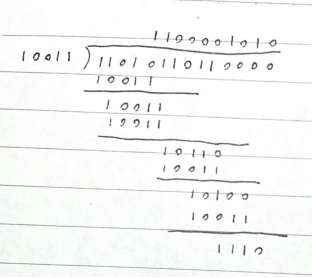
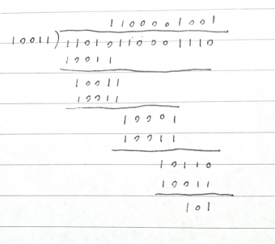

# 第一次作业
2020K8009929017 侯昱帆

1
计算机网络体系结构是层次化的细腰结构，请回答以下两个问题：  
（1）细腰结构有什么好处？  
（2）如何理解 IP 协议是网络体系结构的细腰？

2
分别描述电路交换和分组交换的基本原理，并分析说明计算机网络不采用电路交换的原因。

3
计算机网络中的时延分为哪几种？每种的意义是？

4
主机甲通过 1 个路由器（存储转发方式）与主机乙互联，两段链路的数据传输速率均为 10Mbps，主机甲分别采用报文交换和分组大小为 10kb 的分组交换向主机乙发送 1 个大小为 7Mb 的数据。若忽略链路传播延迟、头部开销和分组拆装时间，则两种交换方式完成该数据传输所需的总时间分别为多少？

5
直连网络是节点之间通过点对点/多路访问链路互联而形成的网络形态。构建直连网络的关键技术包括：信道编码、组帧、错误检测、可靠传输、介质访问控制，请回答以下问题：  
（1）分别简要描述上述各项关键技术的目的；  
（2）针对每项关键技术，给出 1 种典型的解决方案的名称并简要描述其设计原理。

6
对于带宽为 40kHz 的信道，若有 4 种不同的物理状态来表示数据，信噪比为 30dB。按香农定理，信道的最大传输数据速率是多少？  

信噪比 $30dB$，则 $S/N=1000$
$C=Wlog_2(1+S/N)=40000log_2(1+1000)=400kbps$

7
采用循环冗余校验技术作为差错检测方案，要发送的数据为 1101011011，CRC 生成多项式是 $P(X)=X^4+X+1$  
（1）求应添加在数据后面的余数。  
（2）若数据在传输过程中数据部分的最后两个 1 都变成了 0，问接收端能否发现？  
（3）采用 CRC 检验后，数据链路层的传输是否就变成了可靠的传输？  

（1）余数 1110  

（2）此时，接收端收到的消息为 11010110001110，不能被 1110 整除，故可以发现。

（3）不是，采用 CRC 检验只能做到无差错接收，而可靠传输还要求能以某种方式恢复被丢弃或丢弃的帧。

8
停等算法（stop and wait）和滑动窗口算法（sliding window）是实现可靠传输的典型机制，请回答以下问题：
（1）描述停等算法的基本原理；  
（2）分析停等算法在数据传输效率方面存在的问题；  
（3）描述滑动窗口算法的基本原理，并分析滑动算法能够提升数据传输效率的原因。  

（1）发送方传输一帧之后，在传输下一帧之前等待一个 ACK；如果在某段时间之后 ACK 没有到达，则发送方超时，重发原始帧。  
（2）停等算法只允许链路上有一个未确认的帧，这可能远远低于链路的容量。  
（3）滑动窗口算法的基本原理：发送方和接收方分别维护一个发送窗口和一个接收窗口。发送方收到一个确认，就把发送窗口向前滑动；接收方一般采用累积确认，即收到几个分组后，对按序到达的最后一个分组发送确认，然后将接收窗口向前滑动。  
提升数据传输效率的原因：滑动算法允许多个在途传输的数据帧，能够增加单位时间传输数据帧的数目，从而提升数据传输效率。

9
假设需要为卫星站的一条 1Mbps 的点到点链路设计一个滑动窗口协议，卫星在 3×10^4 km 的高度绕地球同步旋转。假设每帧携带 1KB 数据，发送窗口大小和接收窗口大小一样（SWS = RWS），请问需要多少比特作为标识数据帧的序号？（光速为 3×10^8 m/s）

$RTT=(2 \times 3 \times 10^4 \times 10^3 m) / (3 \times 10^8 m/s)=0.2s$
时延带宽积为 $0.2s \times 1Mbps = 200Kb = 25KB$
每帧携带 1KB 数据，故滑动窗口可以有 25 个帧
$2^{n-1} \gt 25$，n=6 
因此需要 6 比特作为标识数据帧的序号

10
共有 4 个节点进行码分多址 CDMA 通信。假设 4 个节点的码片序列分别为 ：
S（－1＋1－3＋3＋1－1－1＋1）
A（－1＋1－1－1－1－1＋1－1）
B（－1－1－1＋1＋1－1＋1＋1）
C（－1－1＋1－1＋1＋1＋1－1）
D（－1＋1－1＋1＋1＋1－1－1）
现收到这样的码片序列 S（－1＋1－3＋3＋1－1－1＋1），请问节点 A、B、C、D 发送数据的情况？

$A \cdot S = \frac{1}{8} \times (1+1+3-3-1+1-1-1)=0$
$B \cdot S = \frac{1}{8} \times(1-1+3+3+1+1-1+1)=1$
$C \cdot S = \frac{1}{8} \times(1-1-3-3+1-1-1-1)=-1$
$D \cdot S = \frac{1}{8} \times(1+1+3+3+1-1+1-1)=1$
故 A 未发送数据，B 发送 1，C 发送 0，D 发送 1

11
假定1km 长的 CSMA/CD 网络的链路带宽为1Gb/s，设信号在链路上的传播速率是200000km/s，请问能够使用此协议的最短帧长为多少？

$RTT=(2 \times 1km)/(200000 km/s)=1 \times 10^{-5}s$
最短帧长 $1Gb/s \times 1 \times 10^{-5}s = 1 \times 10^4 b$

12
某局域网采用 CSMA/CD 协议实现介质访问控制，数据传输速率为 5Mbps，主机甲和乙之间的距离为 4KM，信号传播速度是 400000KM/S。请回答下列问题，并给出计算过程：
（1）若主机甲和主机乙发送数据时发生冲突，则从开始发送数据时刻起，到两台主机均检测到冲突时刻止，最短需经多长间？最长需经过多长时间？（假设主机甲和主机乙发送数据过程中，其他主机不发送数据）
（2）若网络不存在任何冲突与差错，主机甲总是以标准的最长以太网数据帧（1518 字节）向主机乙发送数据，主机乙每成功收到一个帧后，立即发送下一个数据帧，此时主机甲的有效数据传输速率是多少？（不考虑以太网帧的前导码）

（1）$(4KM) / (400000KM/S) = 10\mu s$
最短时间：甲乙同时发送，$10\mu s$ 后检测到错误
最长时间：甲先发送，经过 $10\mu s$ 达到乙，此时乙再发送，乙立即会检测到错误，再经过
$10 \mu s$ 后，甲会检测到错误，总共 $20 \mu s$
（2）

13
下图中包含三类网络节点：集线器、交换机、路由器，请回答以下问题：  
（1）简述交换机和路由器分别工作于网络体系结构中的哪一层，其基本功能是什么？  
（2）这个网络中有几个冲突域，几个广播域？

（1）交换机：数据链路层，能同时连通许多对的接口，使每一对相互通信的主机都能像独占通信媒体那样，进行无碰撞地传输数据
路由器：网络层，连接异构网络并完成路由转发
（2）4 个冲突域，2 个广播域

14
直连网络、交换网络、互联网络是三种不同的网络形态，请回答以下问题：
（1）描述三种网络形态的基本组网形式及所采用的典型网络设备；
（2）分析直连网络发展到交换网络、以及交换网络发展到互联网络的原因。

（1）直连网络：基本组网形式是以太网，典型网络设备是集线器
交换网络：基本组网形式是虚拟局域网，典型网络设备是交换机
互联网络：基本组网形式连接异构网络，典型网络设备是路由器
（2）直连网络是一种广播网络，共享链路，可扩展性很差，所以引入交换网络。交换网络扩展能力也有限，并且存在多种类型的异构网络，所以发展到互联网络

15
假设网络中某路由器维护如下所示的路由表，现该路由收到目的地址为 206.0.71.128 的数据包，请问路由器应该将数据包转发到哪一个下一跳节点（请给出简单的过程）。

16
网络中路由器 A 的路由表如下表所示：

现路由器 A 收到路由器 C 发来如下的路由信息：

请给出路由器 A 更新后的路由表。

17
在如下图所示的以太网链路上有 7 台主机，假设 ARP 缓存的有效期为 15 分钟，初始阶段各主机的 ARP 缓存表为空。现假设第 2 分钟，H2 主动向 H5 发起了一次通信；第 7 分钟，H2 主动向 H6 发起了一次通信；第 12 分钟，H3 主动向 H2 发起了一次通信，请采用如下表格方式给出第 15 分钟时，各主机中的 ARP 缓存表。（假设通信过程中各节点的 IP 地址和 MAC 地址均不会发生改变，通信过程本身没有任何延时）。

18
某公司网络拓扑图如下所示，路由器 R1 通过接口 E1、E2、E3、E4 分别连接局域网 1、局域网 2、局域网 3、局域网 4，通过接口 L0 连接路由器 R2，并通过路由器 R2 连接域名服务器与互联网。R1 的 L0 接口的 IP 地址是 202.203.2.1；R2 的 L0 接口的 IP 地址是 202.203.2.2，L1 接口的 IP 地址是 120.111.12.1，E0 接口的 IP 地址是 202.203.3.1；域名服务器的 IP 地址是202.203.3.2。
（1）将 IP 地址空间 202.203.1.0/24 划分为 4 个子网，分别分配给局域网 1、局域网 2、局域网 3、局域网 4，每个局域网需分配的 IP 地址数不少于 60 个。请给出子网划分结果，说明理由或给出必要的计算过程。
（2）请给出 R1 的路由表，使其明确包括到局域网 1、局域网 2、局域网 3、局域网 4 的路由、域名服务器的主机路由和互联网的路由。
（3）请采用路由聚合技术，给出 R2 到局域网 1、局域网 2、局域网 3、局域网 4 的路由。

R1 和 R2 的路由表结构为：

