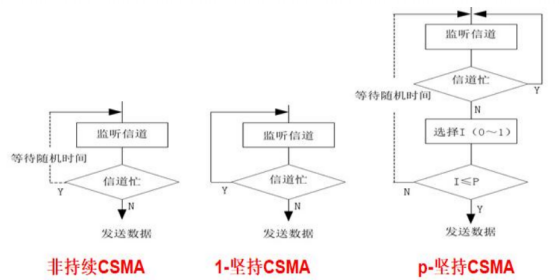
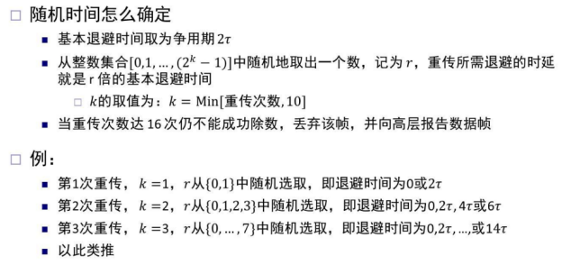
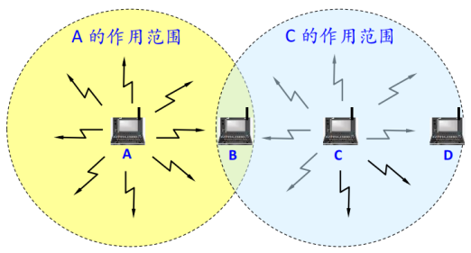

# 第2章 直连网络
## 2.1 数据通信的基本概念

## 2.2 网络构件

## 2.3 组帧

## 2.4 差错检测

## 2.5 可靠传输

## 2.6 媒体共享
广播通信，多个结点共享广播信道，如果不加控制，那么两对结点间的通信可能会因为互相干扰而失败

### 2.6.1 静态划分信道
1. 频分复用
2. 时分复用、统计时分复用
4. 波分复用
5. 码分复用

码分复用：发送 1，则发送 m bit 码片序列；发送 0，则发送码片的反码  
每个站的码片序列各不相同，相互正交

### 2.6.2 动态媒体接入控制
随机接入
1. 结点按需随机接入，接入后以信道的全部速率进行发送
2. 发生碰撞时，相关结点反复重发，直到无碰撞成功发送
3. 各结点在重发前独立选择一个随机时延

典型方案
1. ALOHA
2. 时隙 ALOHA
3. 载波侦听多点接入 (Carrier Sense Multiple Access, CSMA)
4. 带碰撞检测(Collision Detection)的 CSMA (CSMA/CD)
5. 带碰撞避免(Collision Avoidance)的CSMA (CSMA/CA)

受控接入：用户接入服从一定控制，如令牌环网

#### ALOHA
1. 帧首次到达（从网络层传递下来）时，立即发送该帧
2. 若碰撞，结点立即以概率 p 重传该帧，以概率 1-p 等待一个帧传输时间
3. 若不成功，在下一个阶段以概率 p 重传该帧，以概率 1-p 等待一个帧传输时间

#### 时隙 ALOHA
为避免一个帧快传完时被别的结点发送的帧碰撞  
把时间划分成等长的时隙，1 个时隙为传输一个帧的时间，只能在时隙开始时发送帧

#### 载波侦听多点接入
结点在发送前先检测信道，是否有其他结点也在发送，若有，则暂时不要发送数据，以免发生碰撞

非持续 CSMA：一个结点要发送数据时，首先监听信道
1. 若信道空闲，立即发送数据
2. 若信道忙，放弃监听，等待一个随机时间重复上述过程

1-坚持 CSMA：一个结点要发送数据时，首先监听信道
1. 若信道空闲，立即发送数据
2. 若信道忙，继续监听直到信道空闲

p-坚持 CSMA：一个结点要发送数据时，首先监听信道
1. 若信道空闲，以概率 p 发送数据，以概率 1-p 推迟到下一个时隙
2. 若信道忙，继续监听直到信道空闲

非持续 CSMA：可减少碰撞，会导致信道利用率降低，较长的延迟  
1-坚持 CSMA：会导致较多的碰撞，导致性能降低  
p-坚持 CSMA：通过调节 p 在减少碰撞和高信道利用率之间取得平衡

#### 带碰撞检测的 CSMA (CSMA/CD)
1-坚持 CSMA+碰撞检测

当结点检测到的信号电压摆动值超过一定的门限值时，认为总线上至少有两个结点同时在发送数据，表明产生了碰撞，一旦发送碰撞，进行碰撞处理
1. 强化碰撞
2. 指数退避

碰撞窗口/争用期：端到端往返时延 $2\tau$  
必须让发送方在发送结束之前检测到冲突，帧长/数据传输率 > $2\tau$ 

强化碰撞  
发生碰撞时，立即停止发数据，并发送人为干扰信号，通知所有结点现在发生了碰撞

指数退避  
发生碰撞的结点停发数据后，推迟一个随机时间再发送数据

#### 带碰撞避免的 CSMA (CSMA/CA)
非持续 CSMA+碰撞避免

为什么冲突避免，而非冲突检测？  
碰撞检测的能力要求结点同时具有发送（自己的信号）和接收（检测其它结点是否在发送）的能力  
无线网络适配器上，接收信号强度远小于发送信号，制造具有碰撞检测能力的硬件代价过大；即使硬件支持，无线网络特有的隐藏终端等问题也使得很多碰撞难以检测

隐藏终端问题

结点 A 和结点 C 相互检测不到对方的信号，可能同时向 B 发送数据，引发碰撞

发送数据时，先侦听信道是否空闲
1. 若信道忙，等待，再次侦听（非持续 CSMA）
2. 若信道空闲
	1. 第一次尝试发送，在一段时间（分布式帧间间隔，DIFS）后，立即发送
	2. 非第一次尝试发送，执行碰撞避免操作，发送数据
3. 成功发送后等待对端回复 ACK，等待超时，重传该帧

碰撞避免  
1. 信道空闲一段时间（分布式帧间间隔，DIFS）后，进入竞争窗口，延迟接入
	- 结点按照指数退避算法选择随机退避时间，退避完成发送数据；
	- 若退避未完成时检测到信道忙，则冻结退避计时器，等到信道空闲持续 DIFS 时间后继续退避，直至退避完成后继续发送数据
2. 发送、接收结点通过 RTS/CTS 短帧预约信道，避免碰撞

## 2.7 以太网
点对点链路
¨ 高级数据链路控制协议 (High-level Data Link Control, HDLC)
¨ 点对点协议(Point-to-Point Protocol, PPP)

 广播链路
¨ 以太网(Ethernet), IEEE 802.3
¨ 无线局域网(Wireless Lan, WLAN), IEEE 802.11

网络分类(不同作用范围)
广域网 WAN (Wide Area Network)
n 城域网 MAN (Metropolitan Area Network)
n 局域网 LAN (Local Area Network)
n 个域网 PAN (Personal Area Network)

以太网帧结构

扩展以太网

#### 以太网评价
以太网基本上统治了有线局域网

以太网的优点：便宜，高速，易于使用、管理和扩展

总线型以太网的缺点
1. 数据包越小，传输单位数据的代价越大
2. 用户数增加时，更容易发生碰撞
3. 链路变长时，需要更长时间来检测碰撞
4. 网络负载越大，传输性能越低