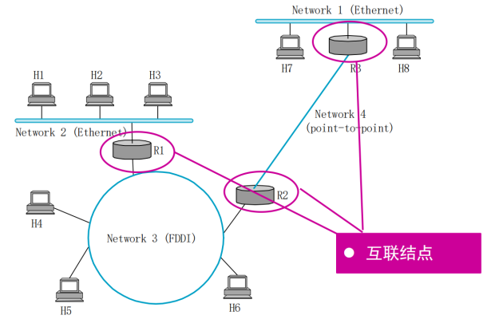
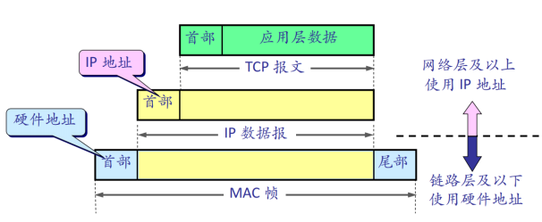
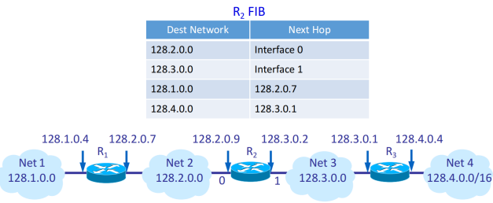
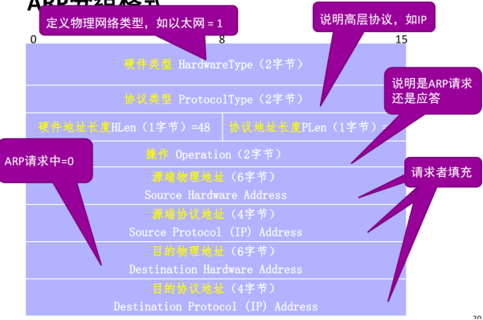

# 第3章网络互联
## 4.1 网际协议 IP
### 4.1.1 IP 概述
#### IP 设计思路  
向上提供最基本的、简单的、灵活的数据报传输服务
1. 无连接
	- 网络发送分组时不需要先在源和目的结点间建立连接
	- 每一个分组(IP 数据报) 独立发送，不进行编号，与其前后的分组无关
2. 尽最大努力交付 (best-effort delivery)
	- 网络层不提供服务质量的承诺
	- 传送的分组可能出错、丢失、重复和乱序，也不保证分组传送的时限
	- 如果主机（即端系统）中的进程之间的通信需要可靠传输，由主机中的传输层负责（包括差错处理、流量控制等），与网络结点（路由器）无关

#### IP 优点
1. 中间转发设备功能简单，成本低
2. 协议设计简单，适应性强，扩展性强

#### 互联网络

#### 网络层功能
通过逐跳的分组转发实现源、目的结点间的数据传输，基于两种重要的网络层功能实现

转发（动作、局部）  
分组到达路由器的一条输入链路时，路由器必须将该分组移动到适当的输出链路  
如：来自主机 H1到达路由器 R1 的分组，必须向能到达 H8 的路径上的下一台路由器，即 R2 转发

路由选择（决策、全局）  
分组从源结点流向接收方时，网络层必须决定这些分组所采用的路由或路径，计算这些路径的算法称为路由选择算法

#### IP 及相关协议
网际协议 IP  
TCP/IP 体系中两个最主要的协议之一  
编址规则、数据包格式、分组处理规则

与之配套使用的协议
1. 路由选择协议：路径选择
2. 地址解析协议 ARP (Address Resolution Protocol)：实现 IP 地址与硬件地址的映射
3. 网际控制报文协议 ICMP (Internet Control Message Protocol)：网络控制与诊断
4. 网际组管理协议 IGMP (Internet Group Management Protocol)：IP 多播

### 4.1.2 分类的 IP 地址
#### IP 地址及其表示方法
点分十进制：将 32 位 IP 地址以每 8 位为组，共分为 `4` 组，每组以「 `.` 」隔开，再将每组转换成十进制

#### IP 地址的编址方法
1. 分类的 IP 地址：最基本的编址方法，其标准于1981年制定
2. 子网划分：对基本编址方法的改进，其标准于 1985 年制定
3. 构成超网：无类编址方法，其标准于1993 年提出

#### 分类的 IP 地址
IP 地址 = 网络号+主机号
1. 网络号 (net-id)：指出结点（ 主机或路由器）连在哪个网络上，由 ICANN 分配
2. 主机号 (host-id)：指出结点在网络内的标识，主机号由网络管理员分配

分类的 IP 地址
1. A 类、B 类、C 类地址为单播地址 (Unicast)
2. D 类为组播地址 (Multicast)
3. E 类为保留地址以备特殊用途 (Reversed)

有一些特定地址没有被分配，被称为私有地址

#### IP 地址的重要特点
特点一：IP 地址为两级的层次结构
- 方便 IP 地址管理
	- IP 地址管理机构只分配网络号，主机号由得到该网络号的单位自行分配
- 减小路由表存储空间
	- 路由器仅根据目的主机所连接的网络号来转发分组（而不考虑目的主机号），使路由表中的项目数大幅度减少

特点二：IP 地址实际标识的是一个结点和一条链路的接口
- 当一个结点（主机或路由器）同时连接到两个网络上时，必须同时具有两个相应的 IP 地址，其网络号 net-id 必须是不同的
- 路由器至少应当有两个不同的 IP 地址，因为其至少应同时连接到两个网络，才能将 IP 数据包从一个网络转发到另一个网络

特点三：同一个网络上的结点的 IP 地址的网络号必须一样
- 用中继器或网桥连接起来的若干个局域网仍为一个网络，具有同样的网络号 net-id

特点四：所有分配到网络号 net-id 的网络都是平等的
- 无论范围很小的局域网，还是可能覆盖很大地理范围的广域网

#### IP 地址与硬件地址的区别

源 IP 地址和目标 IP 地址在传输过程中是不会变化的（前提：没有使用 NAT 网络）  
只有源 MAC 地址和目标 MAC 一直在变化

### 4.1.3 IP 分组转发
#### 路由表
路由器将转发信息存储在路由表中 (Forwarding Information Base, FIB)  
FIB 表中存储的是网络号与下一跳地址的映射关系  
查找路由表，根据目的网络地址确定下一跳路由器  
分组到达目的网络后，最后一个路由器才试图根据目的主机号 host-id，将数据包向目的主机进行直接交付

#### 特定/默认主机路由
特定主机路由  
这种路由是为特定的目的主机指明一个路由  
采用特定主机路由可使网络管理人员能更方便地控制网络和测试网络，同时也可在需要考虑某种安全问题时采用这种特定主机路由

默认路由(default route)  
当某地址在路由表中找不到匹配的地址时，采用此出口  
对仅有一个网卡的主机，其缺省路由就是与网卡相连的那个路由器

#### 分组转发规则
1. 从数据包的首部提取目的主机的 IP 地址 D，得到目的网络地址为 N
2. 若 N 是与此路由器直接相连的某个网络地址（N 与自己某接口的网络地址相同），则把数据包直接交付目的主机 D；否则是间接交付，执行 3
3. 若 FIB 表中有目的地址为 D 的特定主机路由，则把数据包传送给路由表中所指明的下一跳路由器；否则，执行 4
4. 若 FIB 表中有到达网络 N 的路由，则把数据包传送给路由表指明的下一跳路由器；否则，执行 5
5. 若 FIB 表中有一个默认路由，则把数据包送给路由表中所指明的默认路由器；否则，执行6
6. 报告转发分组出错（ICMP，目的不可达）

### 4.1.4 IP 地址与硬件地址映射 -- 地址解析协议 ARP
在传输一个 IP 数据报的时候，确定了源 IP 地址和目标 IP 地址后，就会通过主机「路由表」确定 IP 数据包下一跳。然而，网络层的下一层是数据链路层，所以我们还要知道「下一跳」的 MAC 地址

由于主机的路由表中可以找到下一跳的 IP 地址，所以可以通过 ARP 协议，求得下一跳的 MAC 地址。

#### IP 地址解析为硬件地址的可能方法
直接对应：将结点的硬件地址编码到 IP 地址的主机部分（直接从 IP 地址中抽取出硬件地址）  
例如：硬件地址为 00100001 01010001，对应 IP 地址为 128.96.**33.81**  
限制：硬件地址长度有限制，C 类网络中不超过 8 比特   
然而，以太网的硬件地址 48 比特

每个结点保留一张对照表：IP 地址 -> 硬件地址  
地址解析协议 (Address Resolution Protocol, ARP)

#### 地址解析协议
ARP：根据目标主机的 IP 地址，查询其硬件地址  
每个三层结点中都有一个 ARP 高速缓存 (ARP Cache)，存储结点所在局域网内各结点的 IP 地址到其硬件地址的映射表

结点 A 向局域网内另一结点 B 发送 IP 报文
1. 在其 ARP Cache 中查看有无 B 的 IP 地址，有则查出其对应的硬件地址，将此硬件地址写入 MAC 帧，通过局域网将该 MAC 帧发往此硬件地址
2. 否则，A 向局域网内广播 ARP 请求，询问 B 的 IP 地址对应的硬件地址
	1. B 收到该请求后，单播回复自己的硬件地址
	2. A 和 B 都会将对方地址的映射关系写入 ARP Cache

APR 缓存中的条目有生命期，超时会被删除，一般每15分钟一次

#### ARP 分组格式

### 4.1.5 IP 报文格式

具体见 ppt

### 4.1.6 IP 分片 -- 连接异构网络
不同网络拥有各自不同的最大传输单元长度 Maximum Transmission Unit, MTU  
注：链路层报头不计算在 MTU 中，IP 报头计算在 MTU 中  
发送方不知道每个中间网络的 MTU 值  
解决方案：IP 分片与重组

分片：当分组经历网络的 MTU 比分组长度小，路由器把该分组分片后放进物理帧  
1. 每片的长度必须为8的倍数，最后一个可任意小  
2. 每个分段都含一个 IP 数据报头  
3. 除报头中的长度(Length) 、标志(Flag) 、片偏移(Offset)、校验和(Checksum)字段，其它字段与原始 IP 数据报头相同

重组：分片的反过程，所有分片数据包到达目的主机后，目的主机负责还原原始 IP 报文

#### IP 头部有关分片的三个字段
标识 (Identification)  
一个计数器，用来产生 IP 数据报的标识号  
IP 协议每发送一个数据报则该项加1，作为下一数据报的标识符  
形成的数据报分片具有与原始数据报相同的源、目的地址和标识号  
16 位，保证重复使用一个分组标识符时，具有该标识符的上一分组的所有分段已消失

标志 (Flag)  
3 位，目前仅低 2bit 有用  
MF (More Fragment)：置 1 表示后面还有分片；置 0 表示最后一个分片  
DF (Don‘t Fragment)：置 0 才允许分片

片偏移 (Offset)  
13 位，指明分片在分组中的位置，采用 8 字节为偏移单位，分片必须是 8 字节的倍数  
偏移量字段长度只有 13 位，比全长字段的 16 位少了 3 位，因此必须以 8 字节为单位，不然表示范围不够

#### IP 分片举例

#### IP 分片的缺点
1. 不能充分利用网络资源：网络转发代价与包数目相关，与大小无关
2. 端到端性能很差：当一个分片丢失时，接收端会丢弃同一报文的其他分片
3. 可被利用来生成 DoS 攻击：攻击者向目标主机发送小片的流，没有一个片的 Offset 是0，重组数据时崩溃

解决方案  
路径 MTU 发现机制：IPv6 废止了分片，而是在数据传输过程中探测沿途网络的最小 MTU，然后发方发送足够小的分组，使其能够在沿途不必分段

## 4.2 划分子网和构造超网

## 4.3 网络控制与诊断--ICMP 协议

## 4.4 IP 路由协议