# 第4章 网络互联
## 4.1 网际协议 IP
### 4.1.1 IP 概述
#### IP 设计思路  
向上提供最基本的、简单的、灵活的数据报传输服务
1. 无连接
	- 网络发送分组时不需要先在源和目的结点间建立连接
	- 每一个分组（IP 数据报）独立发送，不进行编号，与其前后的分组无关
2. 尽最大努力交付 (best-effort delivery)
	- 网络层不提供服务质量的承诺
	- 传送的分组可能出错、丢失、重复和乱序，也不保证分组传送的时限
	- 如果主机（即端系统）中的进程之间的通信需要可靠传输，由主机中的传输层负责（包括差错处理、流量控制等），与网络结点（路由器）无关

#### IP 优点
1. 中间转发设备功能简单，成本低
2. 协议设计简单，适应性强，扩展性强

#### 互联网络

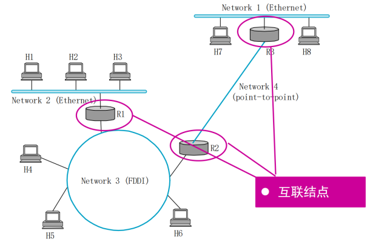

#### 网络层功能
通过逐跳的分组转发实现源、目的结点间的数据传输，基于两种重要的网络层功能实现

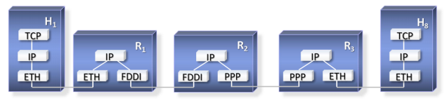

转发（动作、局部）  
分组到达路由器的一条输入链路时，路由器必须将该分组移动到适当的输出链路  
如：来自主机 H1到达路由器 R1 的分组，必须向能到达 H8 的路径上的下一台路由器，即 R2 转发

路由选择（决策、全局）  
分组从源结点流向接收方时，网络层必须决定这些分组所采用的路由或路径，计算这些路径的算法称为路由选择算法

#### IP 及相关协议
网际协议 IP  
TCP/IP 体系中两个最主要的协议之一  
编址规则、数据包格式、分组处理规则

与之配套使用的协议
1. 路由选择协议：路径选择
2. 地址解析协议 ARP (Address Resolution Protocol)：实现 IP 地址与硬件地址的映射
3. 网际控制报文协议 ICMP (Internet Control Message Protocol)：网络控制与诊断
4. 网际组管理协议 IGMP (Internet Group Management Protocol)：IP 多播

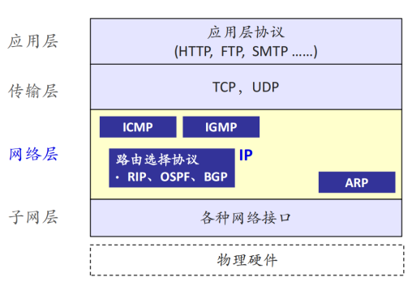

### 4.1.2 分类的 IP 地址
#### IP 地址及其表示方法
点分十进制：将 32 位 IP 地址以每 8 位为组，共分为 `4` 组，每组以「 `.` 」隔开，再将每组转换成十进制

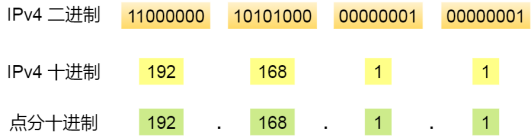

#### IP 地址的编址方法
1. 分类的 IP 地址：最基本的编址方法，其标准于1981年制定
2. 子网划分：对基本编址方法的改进，其标准于 1985 年制定
3. 构成超网：无类编址方法，其标准于1993 年提出

#### 分类的 IP 地址
IP 地址 = 网络号+主机号
1. 网络号 (net-id)：指出结点（ 主机或路由器）连在哪个网络上，由 ICANN 分配
2. 主机号 (host-id)：指出结点在网络内的标识，主机号由网络管理员分配

分类的 IP 地址
1. A 类、B 类、C 类地址为单播地址 (Unicast)
2. D 类为组播地址 (Multicast)
3. E 类为保留地址以备特殊用途 (Reversed)

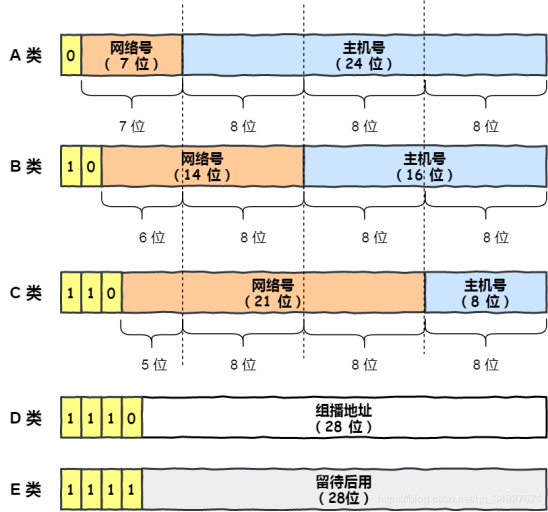

有一些特定地址没有被分配，被称为私有地址

#### IP 地址的重要特点
特点一：IP 地址为两级的层次结构
- 方便 IP 地址管理
	- IP 地址管理机构只分配网络号，主机号由得到该网络号的单位自行分配
- 减小路由表存储空间
	- 路由器仅根据目的主机所连接的网络号来转发分组（而不考虑目的主机号），使路由表中的项目数大幅度减少

特点二：IP 地址实际标识的是一个结点和一条链路的接口
- 当一个结点（主机或路由器）同时连接到两个网络上时，必须同时具有两个相应的 IP 地址，其网络号 net-id 必须是不同的
- 路由器至少应当有两个不同的 IP 地址，因为其至少应同时连接到两个网络，才能将 IP 数据包从一个网络转发到另一个网络

特点三：同一个网络上的结点的 IP 地址的网络号必须一样
- 用中继器或网桥连接起来的若干个局域网仍为一个网络，具有同样的网络号 net-id

特点四：所有分配到网络号 net-id 的网络都是平等的
- 无论范围很小的局域网，还是可能覆盖很大地理范围的广域网

#### IP 地址与硬件地址的区别

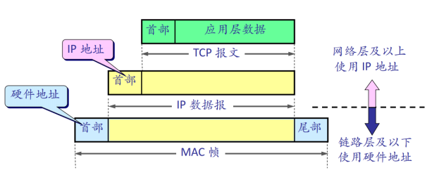

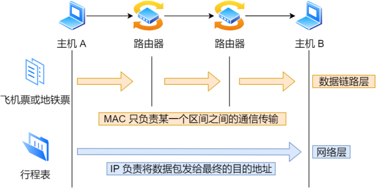

源 IP 地址和目标 IP 地址在传输过程中是不会变化的（前提：没有使用 NAT 网络）  
只有源 MAC 地址和目标 MAC 一直在变化

### 4.1.3 IP 分组转发
#### 路由表
路由器将转发信息存储在路由表中 (Forwarding Information Base, FIB)  
FIB 表中存储的是网络号与下一跳地址的映射关系  
查找路由表，根据目的网络地址确定下一跳路由器  
分组到达目的网络后，最后一个路由器才试图根据目的主机号 host-id，将数据包向目的主机进行直接交付

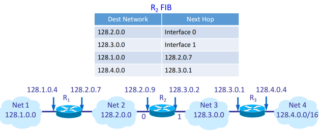

#### 特定/默认主机路由
特定主机路由  
这种路由是为特定的目的主机指明一个路由  
采用特定主机路由可使网络管理人员能更方便地控制网络和测试网络，同时也可在需要考虑某种安全问题时采用这种特定主机路由

默认路由(default route)  
当某地址在路由表中找不到匹配的地址时，采用此出口  
对仅有一个网卡的主机，其缺省路由就是与网卡相连的那个路由器

#### 分组转发规则
1. 从数据包的首部提取目的主机的 IP 地址 D，得到目的网络地址为 N
2. 若 N 是与此路由器直接相连的某个网络地址（N 与自己某接口的网络地址相同），则把数据包直接交付目的主机 D；否则是间接交付，执行 3
3. 若 FIB 表中有目的地址为 D 的特定主机路由，则把数据包传送给路由表中所指明的下一跳路由器；否则，执行 4
4. 若 FIB 表中有到达网络 N 的路由，则把数据包传送给路由表指明的下一跳路由器；否则，执行 5
5. 若 FIB 表中有一个默认路由，则把数据包送给路由表中所指明的默认路由器；否则，执行6
6. 报告转发分组出错（ICMP，目的不可达）

### 4.1.4 IP 地址与硬件地址映射 -- 地址解析协议 ARP
在传输一个 IP 数据报的时候，确定了源 IP 地址和目标 IP 地址后，就会通过主机「路由表」确定 IP 数据包下一跳。然而，网络层的下一层是数据链路层，所以我们还要知道「下一跳」的 MAC 地址

由于主机的路由表中可以找到下一跳的 IP 地址，所以可以通过 ARP 协议，求得下一跳的 MAC 地址。

#### IP 地址解析为硬件地址的可能方法
直接对应：将结点的硬件地址编码到 IP 地址的主机部分（直接从 IP 地址中抽取出硬件地址）  
例如：硬件地址为 00100001 01010001，对应 IP 地址为 128.96.**33.81**  
限制：硬件地址长度有限制，C 类网络中不超过 8 比特   
然而，以太网的硬件地址 48 比特

每个结点保留一张对照表：IP 地址 -> 硬件地址  
地址解析协议 (Address Resolution Protocol, ARP)

#### 地址解析协议
ARP：根据目标主机的 IP 地址，查询其硬件地址  
每个三层结点中都有一个 ARP 高速缓存 (ARP Cache)，存储结点所在局域网内各结点的 IP 地址到其硬件地址的映射表

结点 A 向局域网内另一结点 B 发送 IP 报文
1. 在其 ARP Cache 中查看有无 B 的 IP 地址，有则查出其对应的硬件地址，将此硬件地址写入 MAC 帧，通过局域网将该 MAC 帧发往此硬件地址
2. 否则，A 向局域网内广播 ARP 请求，询问 B 的 IP 地址对应的硬件地址
	1. B 收到该请求后，单播回复自己的硬件地址
	2. A 和 B 都会将对方地址的映射关系写入 ARP Cache

若其他结点的 ARP cache 中也有 A 的条目，则更新内容和生命周期，否则忽略  
APR 缓存中的条目有生命期，超时会被删除，一般每15分钟一次

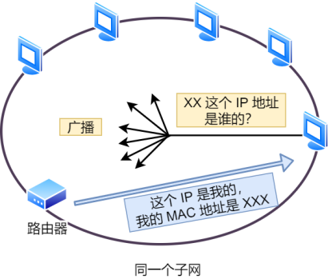

#### ARP 分组格式

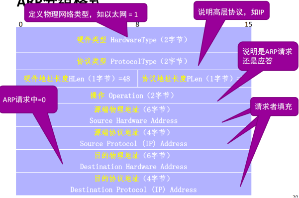

### 4.1.5 IP 报文格式

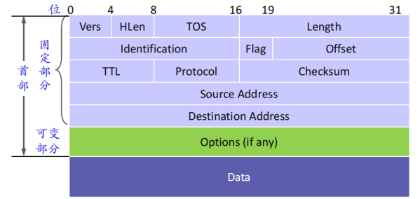

具体见 ppt

### 4.1.6 IP 分片 -- 连接异构网络
不同网络拥有各自不同的最大传输单元长度 Maximum Transmission Unit, MTU  
注：链路层报头不计算在 MTU 中，IP 报头计算在 MTU 中  
发送方不知道每个中间网络的 MTU 值  
解决方案：IP 分片与重组

分片：当分组经历网络的 MTU 比分组长度小，路由器把该分组分片后放进物理帧  
1. 每片的长度必须为 8 的倍数，最后一个可任意小  
2. 每个分段都含一个 IP 数据报头  
3. 除报头中的长度 (Length) 、标志 (Flag) 、片偏移 (Offset)、校验和 (Checksum) 字段，其它字段与原始 IP 数据报头相同

重组：分片的反过程，所有分片数据包到达目的主机后，目的主机负责还原原始 IP 报文

#### IP 头部有关分片的三个字段
标识 (Identification)  
一个计数器，用来产生 IP 数据报的标识号  
IP 协议每发送一个数据报则该项加1，作为下一数据报的标识符  
形成的数据报分片具有与原始数据报相同的源、目的地址和标识号  
16 位，保证重复使用一个分组标识符时，具有该标识符的上一分组的所有分段已消失

标志 (Flag)  
3 位，目前仅低 2bit 有用  
MF (More Fragment)：置 1 表示后面还有分片；置 0 表示最后一个分片  
DF (Don‘t Fragment)：置 0 才允许分片

片偏移 (Offset)  
13 位，指明分片在分组中的位置，采用 8 字节为偏移单位，分片必须是 8 字节的倍数  
偏移量字段长度只有 13 位，比全长字段的 16 位少了 3 位，因此必须以 8 字节为单位，不然表示范围不够

#### IP 分片举例

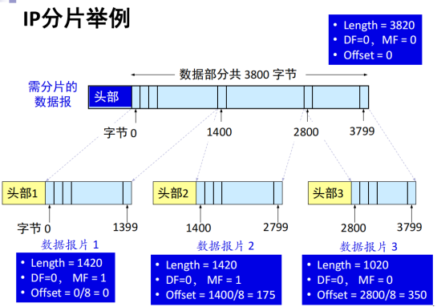

注意数据部分才分片，首部和原始数据包相同  
首部长度单位 4B，总长度单位 1B，片偏移单位 8B

#### IP 分片的缺点
1. 不能充分利用网络资源：网络转发代价与包数目相关，与大小无关
2. 端到端性能很差：当一个分片丢失时，接收端会丢弃同一报文的其他分片
3. 可被利用来生成 DoS 攻击：攻击者向目标主机发送小片的流，没有一个片的 Offset 是0，重组数据时崩溃

解决方案  
路径 MTU 发现机制：IPv6 废止了分片，而是在数据传输过程中探测沿途网络的最小 MTU，然后发方发送足够小的分组，使其能够在沿途不必分段

## 4.2 划分子网和构造超网
### 4.2.1  划分子网
从主机号借用若干个位作为子网号 subnet-id，不改变原来的网络号 net-id  
IP 地址 = 网络号+子网号+主机号

子网应当离得很近，从因特网其余部分看来，它们是一个单一网络，仅一个网络号  
划分子网纯属一个机构内部的事情，对外仍表现为未划分子网的网络

IP 数据报从其它网络到子网内某主机的路由
1. 仍然是根据 IP 数据报的目的网络号 net-id，先找到连接在本单位网络上的路由器
2. 此路由器再按目的网络号 net-id 和子网号 subnet-id 找到目的子网
3. 将 IP 数据报直接交付目的主机

已知 IP 和子网掩码，求网络号：IP 地址与子网掩码逐位相与

如何划分子网
1. 确定默认掩码，确定主机号位数 (从主机号借位)
	- eg. 203.33.18.0：C 类地址，默认掩码 255.255.255.0，主机号为最后 1 字节
2. 根据需要划分的子网数和每个子网的主机数，确定需要借几位

划分子网情况下路由器转发分组的算法
1. 从数据报的首部提取目的主机的 IP 地址 D
2. 用本结点的各个网络的子网掩码与 D 逐位相与，看是否与相应的网络地址匹配：
	- 匹配，则将分组直接交付；
	- 否则是间接交付，执行 (3)
3. 若路由表中有目的地址为 D 的特定主机路由，则把数据报传送给路由表中所指明的下一跳路由器；否则，执行 (4)
4. 对路由表中的每一行的子网掩码和 D 逐位相与，若其结果与该行的目的网络地址匹配，则将分组传送给该行指明的下一跳路由器；否则，执行 (5)
5. 若路由表中有默认路由，则把数据报传送给路由表中所指明的默认路由器；否则，执行 (6)
6. 报告转发分组出错（ICMP，目的不可达）

子网划分的特点
本质上，允许将一些类别的地址在多个子网内分拆
1. 实现多个物理网络共用一个网络地址：减少地址空间的浪费
2. 互联网络不同部分看到不同的路由，远端只看到单一网络：实现路由聚合
3. 子网划分在一个（逻辑）网络内部进行：便于组织内部网络扩展与管理

### 4.2.2  构造超网
无分类域间路由 CIDR (Classless Inter-Domain Routing)  
IP 地址 = 网络前缀 (network prefix) + 主机号  
斜线记法（CIDR 记法）：在 IP 地址后面加上一个斜线 “/”，写上网络前缀所占的位数  
这个数值对应于三级编址中子网掩码中 1 的个数  
a.b.c.d/x，其中 /x 表示前 x 位属于网络号

使用 CIDR，在查找路由表时可能会得到不止一个匹配结果  
最长前缀匹配 (longest-prefix matching)：从匹配结果中选择具有最长网络前缀的路由  
网络前缀越长，其地址块就越小，因而路由就越具体

## 4.3 网络控制与诊断--ICMP 协议

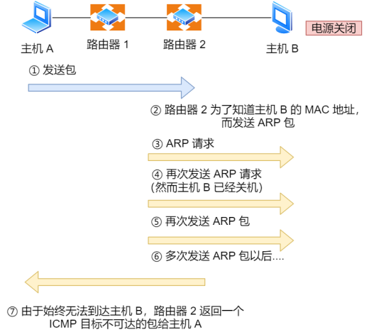

ICMP 报文种类
1. 查询报文：用于诊断的查询消息
2. 差错报文：通知出错原因的错误消息

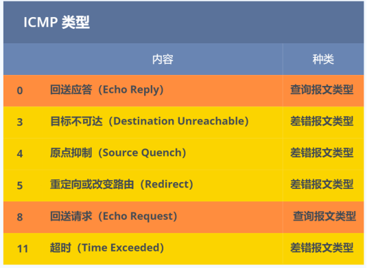

**查询报文类型的使用**  
PING (Packet InterNet Groper)：测试主机之间的连通性  
使用 ICMP 回送请求和应答报文

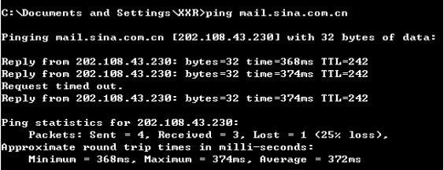

**差错报文类型的使用**  
Tracerout/tracert：跟踪分组从源点到终点的路径
1. 第一个分组 TTL 设为 1，第 1 个路由器收到，将 TTL 减 1 后丢弃，回复 ICMP 超时报文
2. 第二个分组 TTL 设为 2，第 2 个路由器收到，将 TTL 减 1 后丢弃，回复 ICMP 超时报文

以此类推，得到想要的路由信息：经过的路由器 IP 地址及往返时间  
注：路由路径在分钟级别会保持稳定，这些数据报文会沿同一路径传输

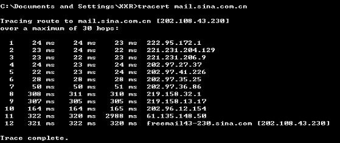

路径 MTU 发现  
源主机向目的主机连续发送多个长度不同的数据报文  
发送 “大号” 数据包，将 Flag 设置为 "do not fragment"  
如果超过 MTU，路由器返回 "Destination unreachable: Fragmentation needed"  
注：路由路径在分钟级别会保持稳定，这些数据报文会沿同一路径传输

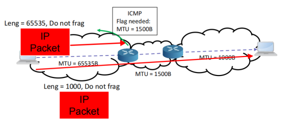

## 4.4 IP 路由协议
### 4.4.1  路由器工作原理
路由器 (Router)
转发分组：将路由器某个输入端口收到的分组，按照分组要去的目的地（即目的网络），把该分组从某个合适的输出端口转发给下一跳路由器，下一跳路由器也按照这种方法处理分组，直到该分组到达

### 4.4.2  路由协议基本概念
目的：找到一条从源路由器（网络）到目的路由器（网络）的 “好” 路径
通常是寻找两节点间代价最小的路径
传输路径保存在路由器的路由表（FIB/RIT）中

静态路由选择  
集中式，非自适应路由选择  
手工配置/简单直观，开销较小；但网络规模大时，管理负担过重，不能及时适应网络状态的变化 

动态路由选择  
分布式，自适应路由选择  
由路由协议动态更新，运行路由协议算法的路由器之间相互主动交换路由信息，建立完整的路由表，并据此转发数据分组  
特点是能较好地适应网络状态变化，但实现较为复杂，开销较大

分层的路由体系
1. 域内路由 (Intra-Domain) 
	- 使用内部网关协议 (Interior Gateway Protocol, IGP) 在 AS 内路由数据包
	- 性能目标导向的，全网有统一目标
1. 域间路由 (Inter-Domain) 
	- 使用外部网关协议 (Exterior Gateway Protocol, EGP) 将数据包路由到其它 AS
	- 策略和经济目标导向的，每个 AS 有自己的策略

### 4.4.3  内部网关协议 RIP
RIP (Routing Information Protocol)  
基于距离向量算法
1. 每一个路由器维护从它自己到其他每一个目的网络的距离记录
2. 仅与相邻路由器交换信息，交换的信息是当前本路由器所知道的全部信息，即自己的路由表 
3. 定期，或者触发交换路由信息
	- 按固定的时间间隔交换路由信息，例如，每隔 30 秒
	- 当一个结点的路由表改变时，就给其相邻结点发送一条更新消息，这会引起相邻结点的路由表改变，而这些相邻结点又给它们的相邻结点发送更新消息

#### 距离向量算法
每个结点保存到目的结点的
1. 已知最优路径的开销（如果不可达，用 $\infty$ 表示）
2. 对应下一跳结点

初始化
1. 每个结点仅有到相邻结点的信息
2. 将自己的整个向量信息发送给相邻结点

迭代：距离向量更新
1. 收到相邻结点的消息后，比较选择更优的开销和下一跳结点，更新自己的向量
2. 若有更新，向邻居结点发送

距离：在 RIP 中，即跳数 (hop count)，每经过一个路由器，距离加 1  
RIP 允许距离的最大值为 15，大于 15 视为不可达

链路故障  
结点发现故障的方式有两种
1. 结点连续发送一个控制分组给其它结点，看是否能接收到应答，测试与其它结点的链路是否正常
2. 在最近几次更新周期中，收不到预期的定期更新，则判断该链路（或链路另一端的结点）发生故障

#### Count -to-Infinity 问题  

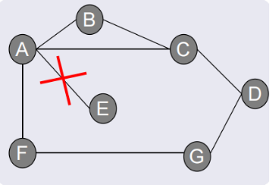

1. A 通知到 E 的距离值为无穷大，但此时 B 和 C 仍对外通知到 E 的距离为2
2. B 收到 A 的消息，将到 E 的距离更新为无穷
3. B 收到 C 的消息（尚未根据 A 的消息更新），知道从 C 可以 2 跳点的距离到达 E，B 断定可以 3 跳点到达 E，且把这条更新信息传送给 A
4. A 就可得出结论，它可以 4 跳点到达 E，并把这条信息送给 C
5. C 就可知道它能够以 5 跳点到达 E
6. 如此下去，只有当距离值达到一个足以被认为是无穷大的值 16 时，循环才会停止 

观察：B 通过 A 连接到 E，且 B 向 A 通告该路径，该通告对路由没有任何意义

解决方案
1. 水平分割 (Split Horizon)
	- 当一个结点把路由选择的更新信息发送给相邻结点时，它并不把从其相邻结点处学到的路由再回送到那些相邻结点
	- B 的表中有 (E, 2, A)，则 B 知道该路由从 A 处学到，因此任何时候向 A 发更新消息时，都不包括到 E 的路由
2. 反向抑制 (Poison Reverse)
	- B 把来自 A 的路由回送给 A，但在该路由表中加入否定信息（标志位）来确保 A 最终不会使用 B 到达 E 的路由

#### RIP 协议
两种报文  
请求：路由器刚启动时或由某些记录超时的路由器发出，分组中对应“命令”位置为 1  
应答：用于答复一个请求，或每隔 30 s 定时发送（整个路由信息），分组中对应“命令”位置为 2

RIP 协议的工作过程
1. RIP 协议刚启动时
	1. 检测路由器的各个接口的状态和地址信息
	2. 若某接口状态正常，在路由表中增加一条路由，表示可以到达该接口所在的网络，距离值为 0，即路由器将它所连接的几个网络互连起来，在它们之间转发信息
2. 初始化后
	1. 主动向各个网络接口以广播方式发送 RIP 请求
	2. 该请求的 RIP 数据部分只包含一项路由信息，且全部域为 0，表示要得到相连的网络上的路由器所拥有的路由表中的全部信息
3. 收到请求的路由器回复应答包
4. 最后，各相邻节点之间交换路由信息，各节点获取到全网路由信息

RIP 路由信息的发送  
通过应答包发送，包含：到达某目标网络的跳数  
回复请求包，或周期性发送

RIP 路由信息的接收：当收到相邻路由器（其地址为 X）的一个 RIP 报文
1. 修改此 RIP 报文中的所有项目
	1. 下一跳地址都改为 X
	2. 距离加 1
2. 对修改后的 RIP 报文中的每一个项目，重复以下步骤：
	1. 若路由表中没有目的网络 N，则把该项目加到路由表中
	2. 若路由表中有目的网络 N，则查看下一跳路由器地址
		1. 若下一跳相同，则把收到的项目替换原路由表中的项目
		2. 若下一跳不同
			1. 若收到项目中的距离小于路由表中的距离，则进行更新
			2. 否则，什么也不做
3. 若 3 分钟还没有收到相邻路由器的更新路由表，则把此相邻路由器记为不可达路由器，即将距离置为 16
4. 返回

### 4.4.4  内部网关协议 OSPF
OSPF (Open Shortest Path First)

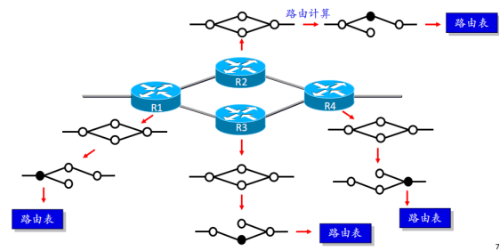

链路：相邻路由器一对接口之间的互联  
链路状态：接口及其与邻近路由器之间关系的描述
- 接口的 IP 地址、掩码
- 链路类型
- 到连接路由器的开销等

所有这些链路状态集中构成了链路状态数据库  
链路状态信息通过链路状态分组 LSP (Link State Packet) 传播，内容包含

#### 可靠扩散
各结点从域内所有结点获取信息，建立完整的网络图——链路状态数据库  
向本自治系统中所有路由器发送信息  
发送的信息只是与本路由器相邻的路由器之间的链路状态  
触发交换路由信息：只有当链路状态发生变化时，路由器才用洪泛法向所有路由器发送此信息

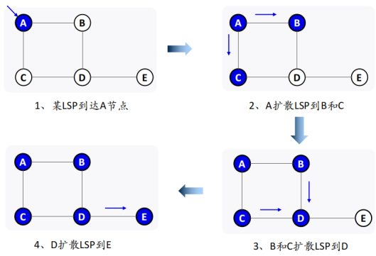

可靠扩散链路状态信息
1. 节点 x 收到来自 y 的 LSP 副本后
	1. 如果之前没有保存对应 ID 的 LSP，则保存
	2. 如果之前有保存，新副本的序列号更大，则更新
2. 保存或更新后，向除 y 以外的所有结点继续扩散
3. 在两个邻接路由器之间的 LSP 的发送使用确认和重传来保证可靠性

确保旧信息被新信息替代  
LSP 携带序号：结点每产生 1 个新的 LSP，序列号加 1；为防止序号回绕，用 64位  
用 TTL 保证 LSP 最终从网上清除掉：结点在将新收到的 LSP 扩散到邻居之前，对其 TTL 减 1

#### 路由计算
各结点根据链路状态数据库单独计算它到其它结点的最短路径，生成路由表  
用 Dijkstra 最短路径算法进行路由计算，得到一个以自己为根的树型结构

|                  | 距离向量方法                                     | 链路状态方法                                       |
| ---------------- | ------------------------------------------------ | -------------------------------------------------- |
| 路由信息扩散范围 | 相邻节点间交换信息                               | 所有节点间都需要交换信息                           |
| 路由信息内容     | 发送节点所知道的全部信息（自己的整个路由表内容） | 仅发送节点确切知道的信息（与其直接相连的链路状态） |
| 空间开销         | 只保存邻居距离信息                               | 需要保存全网拓扑信息                               |
| 收敛速度         | 较慢                                             | 较快                                               |
| 可扩展性         | 较差                                             | 较好                                               |
| 路由环路         | 可能会出现环路，Count-to-Infinity 问题           | 可能会出现短暂环路                                 |
| 路由协议         | RIP                                              | OSPF                                               |

### 4.4.5  外部网关协议 BGP
分层的路由选择协议

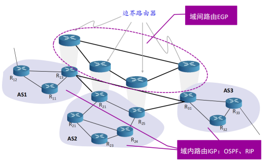

BGP (Border Gateway Protocol, 边界网关协议)  
域间路由：不同自治系统的路由器之间交换路由信息的协议  
力求寻找一条能够到达目的网络且比较好的路由（不能兜圈子），而并非要寻找一条最佳路由

BGP 发言人 (BGP speaker)  
AS 的管理员要选择至少一个路由器作为 “BGP 发言人”：一般是 BGP 边界路由器  
交换路由信息：不同 AS 的 BGP 发言人建立 TCP 连接，在此连接上交换 BGP 报文以建立 BGP 会话 (session)，利用 BGP 会话交换路由信息

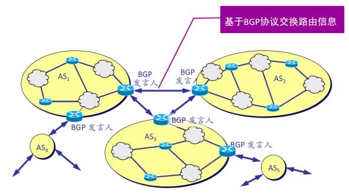

路径向量 (path-vector)
- 每个路由更新中携带整条路径信息（只有携带完整路径才能进行策略控制）  
	- 路径是指途经的 AS 的集合，在 BGP 中可以认为图中的每个点是一个 AS
- 当收到至某 AS X 的路由通告
	- 根据本地策略，选择到 X 的较好路径
	- 根据本地策略，决定向哪些 AS 通告该路由更新

检查环路
当 AS 收到路由更新消息后，检查自己是否在对应路径中
1. 如果在，存在环路，丢弃该更新消息
2. 如果不在，将自己添加至路径中，通告该路由更新

优点
1. 度量指标不需要全局统一
2. AS 可根据自己的策略选择路径
3. 协议检查避免可能的环路

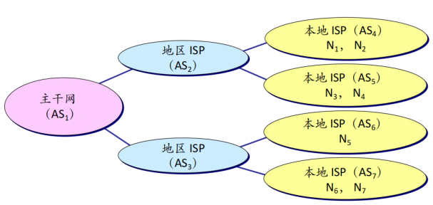

自治系统 AS 2 的 BGP 发言人通知主干网的 BGP 发言人：  
要到达网络 N1，N2，N3 和 N4 可经过 AS 2 

主干网可发出通告：  
要到达网络 N1，N2，N3 和 N4 可经过（AS 1，AS 2）  
要到达网络 N5，N6 和 N7 可沿路径（AS 1，AS 3）
